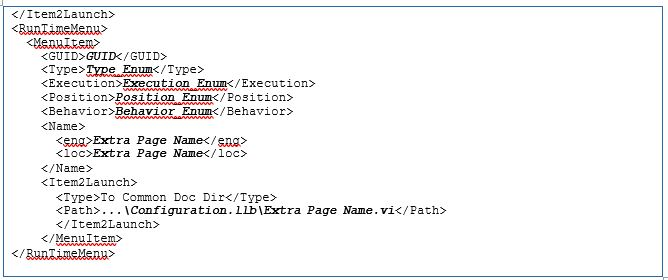

## Custom Device Tips and Tricks

Use the following information to help you develop custom devices.

### Using Custom Device Engine Events

After deploying a custom device, internal channels exchange data. If the channels are insufficient or overly cumbersome, you can implement your own communication mechanism.

VeriStand provides access to its own TCP pipe. You do not have to maintain the connection. This pipe facilitates readable text and byte array data.

In LabVIEW, navigate to **NI VeriStand** » **Custom Device API** » **Driver Functions** to find *NI VeriStand - Register Custom Device Engine Events.vi*. This VI provides three dynamic events that can be registered in any VI with a reference to the custom device.

1.	Shut Down
2.	Message (Byte Array)
3.	Message (String)

The following image displays the VI interface for registering VeriStand Dynamic Events.

<br />


The two message events activate when *NI VeriStand – Send Custom Device Message.vi* is called. The following LabVIEW code displays how to send information to VeriStand’s Dynamic Message Events.

<br />


To view an example of the dynamic event pipe, navigate to the `<LabVIEW>\examples\NI VeriStand\Custom Devices\Communication Example\` directory and open *Communication Example Custom Device Project.lvproj*.

### Processing Channel Data in Blocks

For inline hardware and inline model custom devices with many channels, it is more efficient to read and write channel data using block data references.

In LabVIEW, navigate to **NI VeriStand** » **Custom Device API** » **Driver Functions** » **Data References** to find the following VIs to work with block data references.

* Get Channel Block Data References
* Get Channel Values by Block Data Reference
* Set Channel Values by Block Data Reference

The following initialization code generates a list of output channel references.


Instead of output channel references, modify the state data cluster to obtain block references to the output channels.


The original version of the custom device automatically creates an index of each channel data reference.


You should modify this code to write the block reference. In the following example, the channel block data references are written together outside the loop rather than channel-by-channel within the loop.


### Working with String Constants

While developing custom devices, property names and GUIDs are represented as strings.

These case-sensitive strings can be difficult to use. GUIDs in particular are long and likely to produce typo errors. Use  [LabVIEW global variables](https://zone.ni.com/reference/en-XX/help/371361R-01/lvconcepts/glob_variables/) or a [type definition combo box](https://zone.ni.com/reference/en-XX/help/371361R-01/lvhowto/creating_type_defs/) control instead.

These alternatives have the following considerations.

* Global Variable - Ensure that you have set the correct default value for the control.
* Type Definition Combo Box - On the Properties dialog box, use the Edit Items tab to disable **Values match Items**. This control type does not auto-update from its type definition. You must completely populate the control before using it on a block diagram.

### Creating Custom Error Codes

You can define custom error codes in LabVIEW and distribute them to VeriStand with a custom device.
1. Copy a custom *errors.txt* file to VeriStand in the `<Base>\National Instruments\Shared\Errors\English` directory.
1. Add the file as a dependency in the custom device.
1. Add the file as a dependency in the [custom device XML file](https://www.ni.com/documentation/en/veristand/latest/manual/custom-device-xml/).
1. **(Optional)** For real-time targets, deploy the *errors.txt* file to the error directory on target. Error messages will display in Console Viewer.

For more information, refer to [Defining Custom Error Codes to Distribute throughout Your Application](https://zone.ni.com/reference/en-XX/help/371361R-01/lvhowto/def_custom_error_text/).

### Using Utility VIs

In LabVIEW, navigate to **NI VeriStand** » **Custom Device API** » **Utilities** for useful custom device development VIs.

For information on the VIs in this palette, refer to the context help documentation.

### Sort Channels by FIFO Location

In LabVIEW, navigate to **NI VeriStand** » **Custom Device API** » **Utilities** to find the *Get Channel FIFO Buffer Index.vi*. This VI returns the FIFO buffer index for the input or output channel reference.

Use this function for Asynchronous Custom Device channels to determine what index to read or write in the FIFO arrays. The VI also returns which FIFO Buffer (Input or Output) the channel will be located in.

**Note:** This function is only intended for Asynchronous Custom Devices.

You can use this VI in a custom device to read a list of DAQmx thermocouple inputs.  
1. Sort the channel references in the order they appear in the custom device FIFO.


1. Configure the DAQmx task so the thermocouple channels are read in the same order as they appear in the FIFO.
<br />

There are several advantages to this architecture. The operator is free to add, remove, and reorder channels. Only the desired channels are configured. This makes writing data to the custom device FIFO efficient.

The following code writes multiple hardware channels directly to the custom device FIFO.


The hardware data returns from the DAQmx driver in the same order as the channel references in the asynchronous custom device FIFO.

### Triggering Within the Custom Device

You can set up a custom device to run code when a specified event occurs. Implementing value-triggering is as simple as comparing *AEEnCh<1..8>* channel values to the previous iteration.

In LabVIEW, navigate to **Signal Processing** » **Point by Point** » **Other Functions** to find the [Boolean Crossing Point by Point](https://zone.ni.com/reference/en-XX/help/371361R-01/ptbypt/boolean_crossing_ptbypt/) VI. This VI is useful for triggering events.

Recall the *Write Data to HW* state that reads VeriStand Channels. Add the following code to check the software trigger.


Check the SWTrig channel and handle any transition accordingly.


The triggering VI is useful in asynchronous custom devices that do not execute in line with the primary control loop (PCL). An asynchronous device might iterate multiple times in a single iteration of the PCL. This triggering VI will only assert on the desired edge of the transition.

### Adding Extra Pages After Creating the Custom Device Project

If your Custom Device requires additional pages for sections or channels, you can specify their names before generating the LabVIEW project for the device.

Use the [niveristand-custom-device-wizard's](https://github.com/ni/niveristand-custom-device-wizard/releases) **Custom Device Extra Page Names** control. This tool ensures the following.
* The appropriate references are available to the page.
* The necessary declarations go into the Custom Device XML file.
* The Build Specification deploys the page to the correct location.

There are two signs that an extra page has not been added correctly to a custom device.
1. The default section or channel page loads into System Explorer instead of the expected extra page.
1. A System Explorer error message appears. </br> ```Custom Device Page Error: The following Custom Device page VI is not executable. The VI might not be found at the correct location, or it is missing dependencies that it requires to run. Please contact the Custom Device vendor for more information on this problem.```

To add a new page after the framework has been generated, you must manually perform all steps the niveristand-custom-device-wizard takes.
Use LabVIEW Project Explorer to perform the operations.
1. Ensure the device gets the appropriate device reference.
1. Create the page section in the custom device XML file.
1. Modify the configuration build specification.

**Note:** Incorrect changes to the Custom Device's XML file can corrupt the system definition.

#### Ensure Device Has Appropriate Reference

The VeriStand API requires the correct Node Reference input. The VeriStand system is responsible for passing this reference to the page.

Navigate to `Custom Device API.lvlib\Templates\Subpanel Page VI\` for a Page Template VI.

**Note:** You can copy a page generated by the niveristand-custom-device-wizard, such as the Main page.

#### Create a XML Page Section

The Custom Device's XML file tells System Explorer how to load the device files.

1. In Project Explorer, open the custom device XML file.
2. Copy the information between Main Page’s `<Pages>` and `</Pages>` declarations.
3. Paste the section immediately below the `</Page>` declaration that closes the *Main Page* section.
4. Update the `<eng>`, `<loc>`, and `<Path>` tags for the new page.
5. Update the `<GUID>` to match the GUID of the extra page you created.
6. Save and close the XML file.

#### Modify the Configuration Build Specification

The niveristand-custom-device-wizard scripts two Build Specifications that put the custom device files in the necessary format and location for System Explorer.

1. Open the Configuration Release’s build specification dialog box.
2. In *Source Files*, expand the LabVIEW library for your device.
3. Make sure the new page is part of the <strong>Always Included</strong> section.
4. In *Source Files Settings*, ensure the new page in the *Project Files* tree has the destination set to **Custom Device &lt;Name&gt; Folder**.
5. Click **OK**.
6. Save the LabVIEW project.

You must rebuild the *Configuration Release* and *Engine Release* build specifications to deploy changes. You can then use the extra page as if it were generated by the niveristand-custom-device-wizard.

**Note:** The **[niveristand-custom-device-wizard](https://github.com/ni/niveristand-custom-device-wizard)** is open source. You can examine the code like any other VI.

### Updating Custom Device XML

[XML Tags](https://www.ni.com/documentation/en/veristand/latest/manual/custom-device-xml-tags/) define the settings for a custom device. These elements, and [non-standard element types](https://www.ni.com/documentation/en/veristand/latest/manual/custom-device-xml-element-types/), are defined in the *Custom Device.xsd* schema. You can locate this file by navigating to the `<Common Data>\Custom Devices` [directory](https://www.ni.com/documentation/en/veristand/latest/manual/veristand-directories-aliases/). Open the file in an XML or text editor to view the schema hierarchy.

The following example line is from the *Custom Device.xsd* file.

`<xs:element minOccurs="0" name="ActionVIOnDelete" type="Path" />`

The name of this tag is *ActionVIOnDelete*. Adding the tag to the custom device XML runs a VI when the operator deletes the item from System Explorer.

**Note:** Experimenting with an XML schema is easier in an empty custom device.

For examples on implementing XML features, refer to VeriStand’s built-in components. These components are found in the `<Application Data>\System Explorer\System Explorer Definition Files` directory.

If a tag is opened, use the format `</tag_name>` to close the tag. If a tag must be specified but has no value, use the format `<tag_name />` to open and close the tag at the same time. This format has the same effect as `<tag_name>tag value</tag_name>`.

#### Delete Protection

Add `<DeleteProtection>true<DeleteProtection>` to any section in the [custom device XML](https://www.ni.com/documentation/en/veristand/latest/manual/custom-device-xml-tags/) to block users from deleting that item from the System Explorer configuration tree.

#### Limit Max Custom Device Occurrences

Add `<MaxOccurrence>N</MaxOccurrence>` to the [XML](https://www.ni.com/documentation/en/veristand/latest/manual/custom-device-xml-tags/) underneath the device type to limit the number of instances of a custom device in a single System Definition.

#### Rename Protection

Add `<DisallowRenaming>true</DisallowRenaming>` below the `<Name>` tag for any page to prevent the operator from renaming the item.

### Using Action VIs

VeriStand contains eight action VI templates that are triggered by different actions.

The following action VI templates are provided by VeriStand in the **[Custom Device API library](https://www.ni.com/documentation/en/veristand/latest/manual/custom-device-api-library/)**.

**ActionVIOnLoad**

Executes when VeriStand loads a custom device item into memory. This template helps create action VIs that launch background processes.

For example, if your custom device requires large amounts of data, you can customize this template to start a daemon that runs processes or gathers data in the background.

**ActionVIOnDeleteRequest**

Executes when a user tries to delete an item from the custom device. This template helps create action VIs that prevent a user from deleting a custom device item or warn a user of the implications of deleting a custom device item.

This template has the following unique parameters.

* **Item Ref**—A reference to the custom device item whose XML declaration calls this action VI.
* **Refs that are about to get deleted**—A 1D array of references to the items to be deleted. The 1D array will only contain one reference. Users can only delete one item at a time in System Explorer.
* **Discard reason**—An output that captures the user's reason for deleting the item.
* **Discard delete request?**—A Boolean to discard the delete request after the action VI finishes executing. If `True`, VeriStand will not delete the item. If `False`, VeriStand will delete the item.
* **Additional items to delete**—An array of references to additional items to delete. For example, if other custom device items depend on the item the user wants to delete, you can use this output to automatically delete those items as well.

**ActionVIOnDelete**

Executes after a user deletes an item from the custom device. You can use this template to alert users which channel mappings break when they delete the custom device item. You can also customize the template to reconfigure hardware.

For example, if the user deletes a page that specifies custom configuration data for your hardware, you can have the VI return the configuration to default settings.

**ActionVIOnSystemShutdown**

Executes when System Explorer closes. You can customize this template to close hardware connections or to close daemons you launch from an ActionVIOnLoad VI.

The template has the following unique parameters.

* **Device Item Ref**—Reference to the custom device item whose XML declaration calls this action VI.
* **Unload SDF?**—Indicates whether or not the system definition was unloaded. Unload SDF? is always `True`.
* **Saved?**—Indicates whether or not a user saved the system definition file before closing System Explorer.
* **Path**—Disk path to the system definition file.
* **System Explorer Shutdown?**—Indicates whether or not System Explorer closed. This parameter is always True.

**ActionVIOnSave**

Executes when a user saves the system definition. For example, you can customize this template to log each time the custom device is saved.

**ActionVIOnDownload**

Executes when a user deploys the system definition containing the custom device to a real-time target.

**Note:** This action VI does not execute if a user deploys the system definition to a Windows target.

This template helps create action VIs that finalize the target configuration after you deploy the system definition.

You can also customize this template to deploy any additional files or dependencies your custom device requires. For example, if your custom device reads and writes to shared variables, you can deploy those variables.

The template has the following unique parameters.

* **Device Item Ref in**—A reference to the custom device item whose XML declaration calls this action VI.
* **ftp session**—The Open FTP session used to download the system definition to the target. You can use this open session to move additional files to the target.
* **System Definition Dir**—A path to the system definition file on disk.
* **IP Address**—The IP address of the target.
* **ftp session out**—An open FTP session used to download the system definition file to the target.

**ActionVIOnPaste**

Executes when a user pastes a custom device item. This template helps create action VIs that check channel properties. For example, if the user pastes a page that configures a target, you can create an action VI to ensure that the new page does not attempt to reconfigure the target.

You can also customize this template to prompt a user to enter new values for the pasted item. For example, if a user pastes a page that will conflict with existing pages, you can prompt the user to enter new values for the page.

The template has the following unique parameters.

* **Ptr in**—A reference to the custom device item whose XML declaration calls this action VI.
* **Parent**—A reference to the parent of the custom device item whose XML declaration calls this action VI.
* **All Ptrs**—An array of references to the items the user pasted. You can only select one item to copy. This array only contains one reference that matches the Ptr in reference.

**ActionVIOnCompile**

Executes when VeriStand compiles the system definition file.

**Note:** If you deploy, undeploy, and redeploy a system definition without making changes, this template does not execute.

You can customize this template to finish configuring your hardware. The system definition file compiles when a user deploys the system definition. This means you can configure your hardware based on the final settings from the system definition.

You can also customize the template to quickly gather host-side settings. For example, often the custom device RT Engine VI uses properties set in the system definition. You can customize this template to read the values on the host side. This is faster than reading them from the real-time target.

You can then gather the properties into a single cluster, convert that cluster to a data variant, and write the variant as a single item property.

### Adding Toolbar buttons

A *Toolbar button* appears in the toolbar of **System Explorer**. These buttons only appear when displaying the configuration page associated with the button.

Within the `<Page>` tags for an item, you can use the `<ButtonList>` tag to configure the toolbar buttons that appear with the item's configuration page. Each `<Button>` must include a unique `<ID>` string that identifies the button. The toolbar button displays by default.

In each page VI, you can use the Disable Dynamic Button VI and the Enable Dynamic Button VI to dynamically disable and enable a button for that page based on its unique ID. These VIs are useful when you want the toolbar button to appear only when certain conditions are true.

These VIs are located in the `labview\vi.lib\NI VeriStand\Custom Device API` directory.

The following XML schema is an example framework you can use to implement a toolbar button.


### Adding shortcut menus

A *shortcut menu* for an item appears when you right-click the item in System Explorer.

Within the `<Page>` tags for an item, you can use the `<RunTimeMenu>` tag to configure the shortcut menu for the item. Each `<MenuItem>` you add under `<RunTimeMenu>` includes an `<Item2Launch>` section. This section specifies a VI to run when an operator selects the menu item.

The Custom Device API library includes a template for this VI. Navigate to the `labview\vi.lib\NI VeriStand\Custom Device API` directory and open *RunTimeMenu Custom Item 2 Launch.vit*.

The following XML schema is an example framework you can use to implement a shortcut menu.


