## Custom Device Tips and Tricks

This section contains a hodgepodge of tips and tricks when developing custom devices.

### Custom Device Engine Events

After a custom device has been deployed, data is exchanged via custom device channels. If channels are insufficient or overly cumbersome, you may implement your own communication mechanism. NI VeriStand also provides access to its own TCP pipe so you don’t have to maintain the connection. NI VeriStand’s pipe facilitates readable text and byte array data.
In the custom device API you’ll find NI VeriStand - Register Custom Device Engine Events VI. This VI provides three dynamic events that may be registered in any VI with a reference to the custom device.

1.	Shut Down
2.	Message (Byte Array)
3.	Message (string)

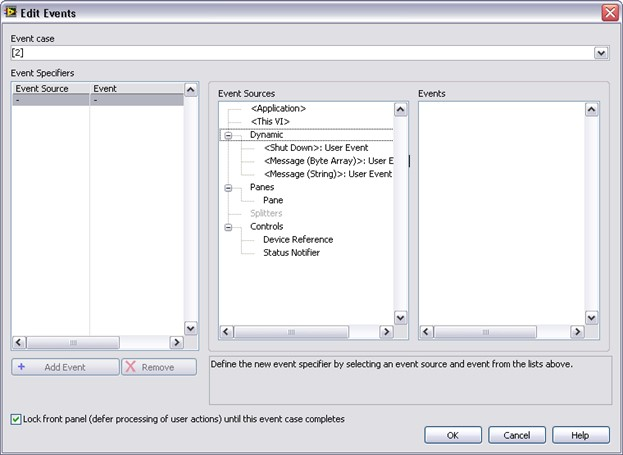 
**Figure: Registering for NI VeriStand Dynamic Events**

The two message events fire when some code calls NI VeriStand – Send Custom Device Message VI.

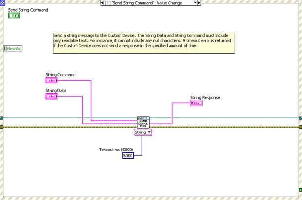 

**Figure: Sending a Message to NI VeriStand’s Dynamic Message Events**

There is an example of using the dynamic event pipe in <labview>\Examples\NI VeriStand\Custom Devices\Communication Example\Communication Example Custom Device Project.lvproj.

### Block Writing and Reading

For inline hardware and inline model custom devices with a large number of channels, it’s more efficient to read and write channel data using block data references. Use the following VIs to work with block data references. Custom Device API.lvlib » Templates » RT Driver VIs » Inline» Inline Driver Utilities » Channel Data References » NI VeriStand…

•	Get Channel Block Data References 
•	Get Channel Values by Block Data Reference 
•	Set Channel Values by Block Data Reference 

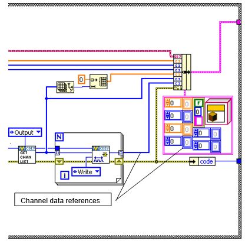
Recall the Initialization code that generates a list of output channel references.

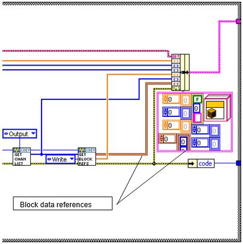
Instead of output channel references, obtain block references to the output channels. Modify the state data cluster accordingly.

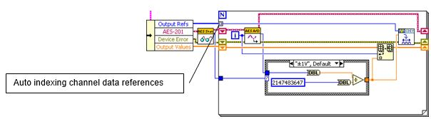
In the first version of the custom device, we auto-indexed each channel data reference.
Auto indexing channel data references

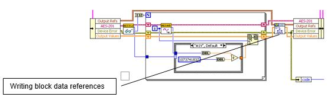
Modify the code to write the block reference instead. Notice the channel block data references are written en-mass outside the loop rather than channel-by-channel within the loop.

### Working with String Constants

During custom device development, strings are used for property names and GUIDs. These strings are case-sensitive and, in the case of GUIDs, long and prone to typos. To facilitate working with these, consider using either **[LabVIEW Global Variables](https://zone.ni.com/reference/en-XX/help/371361R-01/lvconcepts/glob_variables/)** or a **[type definition Combo Box](https://zone.ni.com/reference/en-XX/help/371361R-01/lvhowto/creating_type_defs/)** control. When using the global variable, ensure that you have set the correct default value for the control. When using the Combo Box control, uncheck the Values match Items box on the Edit Items tab of the Properties dialog box.

The Combo Box control does not auto-update from its type definition. Completely populate the control before using it on the block diagram.

### Custom Error Codes

You may build custom error codes for your custom device by using the General Error Handler VI or the Error Code File Editor. See **[LabVIEW 2018 Help](https://zone.ni.com/reference/en-XX/help/371361R-01/)**: **[Defining Custom Error Codes in Test Files](https://zone.ni.com/reference/en-XX/help/371361R-01/lvhowto/def_custom_error_text/)** for more information. If you use an error file, you must move the file to NI VeriStand’s error folder. By default, this folder is located at <Program Files>\National Instruments\VeriStand 2010\project\errors\English. You should add the error file as a project dependency. If applicable, deploy the file to the error directory on the RT system, located at \NI-RT\SYSTEM\errors\english for PharLap and VxWorks targets.

### Utility VIs

The NI VeriStand developers have assembled a library of useful utility VIs in <vi.lib>\NI Veristand\Custom Device Tools\Custom Device Utility Library\Custom Device Utility Library.lvlib. The VIs in this library are documented in LabVIEW’s Context Help window. Here is a list of the utility VIs.

•	Add Sections Recursively by Relative Path 
•	Advanced Browsing Dialog 
•	Get All Channels 
•	Get Channel FIFO Buffer Index 
•	Get Item Ref by Relative Path 
•	Get Multiple Dependent Node Refs 
•	Get Next Unique Label 
•	Get Target Ref 
•	Highlight Node in System Explorer 
•	Not a Ref 
•	Ref Constants 
•	Report Final Error Status 
•	Search for All Items by GUID 
•	Search for All Items by Name 
•	Search for All Items by Property 
•	Search for Item by GUID 
•	Search for Item by Name 
•	Search for Item by Property 
•	Search for Item 
•	Set Multiple Dependent Node Refs 

### Sort Channels by FIFO Location

NI VeriStand – Get Channel FIFO Buffer Index VI returns the FIFO buffer index for the input or output channel reference. Use this function for Asynchronous Custom Device channels to determine what index to read or write in the FIFO arrays. The VI also returns which FIFO Buffer (Input or Output) the channel will be located in. This function is only intended for Asynchronous Custom Devices.
Consider a custom device to read an arbitrary list of DAQmx thermocouple inputs. One way to accomplish the task would be to read all the hardware channels, cycle through the list of custom device channels looking for the channel property, and write the associated hardware channel value that corresponds to the custom device channel.
A superior way to accomplish the task is to sort the channel references in the order they appear in the custom device FIFO, and configure the DAQmx task so the thermocouple channels are read in the same order as they appear in the FIFO.

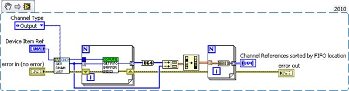 
**Figure: Sorting Asynchronous Custom Device Channels by their Order in the FIFO**

 
**Figure: Adding Channels to a DAQmx Task by their Order in the Custom Device FIFO**

There are several advantages of this architecture. The operator is free to add/remove/reorder channels how he pleases, only the desired channels are configured, and writing data to the custom device FIFO becomes naturally efficient.

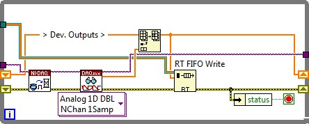 
**Figure: Writing Multiple Hardware Channels Directly to the Custom Device FIFO**

The hardware data returns from the DAQmx driver in the same order as the channel references in the asynchronous custom device FIFO.

### Triggering Within the Custom Device

There are many cases where you want to run code in the custom device when an event occurs. By comparing the AEEnCh<1..8> channel values to the previous iteration, we implemented simple value-triggering.

A useful VI for triggering is **[Signal Processing](https://zone.ni.com/reference/en-XX/help/371361R-01/lvanls/signal_processing_vis/)** » **[Point by Point](https://zone.ni.com/reference/en-XX/help/371361R-01/ptbypt/ptbypt_vi_help/)** » **[Other Functions](https://zone.ni.com/reference/en-XX/help/371361R-01/ptbypt/other_point_by_point_vis/)** » **[Boolean Crossing Point by Point](https://zone.ni.com/reference/en-XX/help/371361R-01/ptbypt/boolean_crossing_ptbypt/)**.

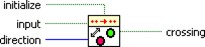 
**Figure: Boolean Crossing PtByPt VI**

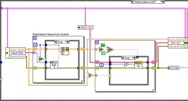 
Recall the Write Data to HW state that reads NI VeriStand Channels. Add code to check the software trigger.

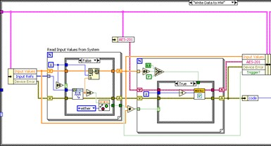 
Check the SWTrig channel for a transition and handle the transition accordingly.

This triggering VI is most useful in asynchronous custom devices that do not execute in line with the PCL. An asynchronous device might iterate multiple times in a single iteration of the PCL, but this triggering VI will only assert on the desired edge of the transition.

### Adding Extra Pages After Creating the Custom Device Project

If your Custom Device requires additional pages for sections or channels, you should specify their names in the **Extra Page Names** control of the Custom Device Template Tool before you generate the LabVIEW project for the device. The tool ensures that the appropriate references are available to the page, the necessary declarations go into the Custom Device XML file, and the Build Specification deploys the page to the correct location.
There are two telltale signs that an extra page has not been added correctly to a custom device. The first is the default section or channel page loads into System Explorer instead of the expected extra page. The second is an error from System Explorer similar to Custom Device Page Error: The following Custom Device page VI is not executable. The VI might not be found at the correct location, or it is missing dependencies that it requires to run. Please contact the Custom Device vendor for more information on this problem.
In order to add a new page after the framework has been generated, you must manually perform all the actions the tool performs.

Perform the following operations from the LabVIEW Project Explorer.
Incorrect changes to the Custom Device's XML file can corrupt the System Definition in NI VeriStand.

•	Ensure the device gets the appropriate device reference. The NI VeriStand API requires the correct Node Reference input. The NI VeriStand system is responsible for passing this reference to the page. There’s a VI Template in Custom Device API.lvlib\Templates\Subpanel Page VI\Page Template.vit for this purpose. Another way to ensure the new page gets the correct Node Reference is to copy a page generated by the Custom Device Template Tool, such as the Main page.

•	Create the page section in the custom device XML file. The Custom Device's XML file tells the System Explorer how to load the device's files.
1.	Open the XML file from the Project Explorer window.
2.	Locate the Pages section.
3.	Copy the information between Main Page’s Page and /Page declarations.
4.	Paste the section immediately below the /Page declaration that closes the Main Page section.
5.	Change the eng, loc, and Path tags for the new page.
6.	Change the GUID to match the extra page’s GUID you created.
7.	Save and close the XML file.

•	Modify the configuration build specification. The Custom Device Template Tool scripts two Build Specifications that put the custom device files in the necessary format and location for System Explorer.
1.	Open the configuration’s build specification dialog box.
2.	In **Source Files**, expand the lvlib for your device.
3.	Add the new page to the **Always Included** section.
4.	In **Source Files Settings**, select the new page in the **Project Files** tree and change the **Destination to Custom Device <Name> Folder**.
5.	Click **OK** to close the build specification.
6.	Save the LabVIEW project.

You must rebuild the Configuration and Engine build specifications to deploy the changes. You may then use the extra page as if it were generated by the Custom Device Template Tool.
The Custom Device Template Tool is open source. If you have any questions about what the tool does, you can refer to the code as you would any other VI.

### Custom Device XML

The full set of features that can be implemented with custom device XML tags are undocumented. Refer to the XML schema file (<common data>\Custom Devices) to discover what features may exist. Features are shown as tag names. Consider the following example line from the Custom Device.xsd file.

<xs:element minOccurs="0" name="ActionVIOnDelete" type="Path" />

**A Line from the Custom Device XML Schema File**

The name of this tag is ActionVIOnDelete. Adding this tag to the custom device XML runs a VI when the operator deletes the item from System Explorer. While these features are undocumented, the XML is fairly intuitive. You may find experimenting with the custom device XML easier in an empty custom device. Assistance implementing the features may be obtained by contacting National Instruments VeriStand technical support.

It may be helpful to explore NI VeriStand’s built-in components for examples on implementing XML features. The built-in components are found in <application data>\System Explorer\System Explorer Definition Files.
If a tag is opened, use the format </tag_name> to close the tag. If a tag must be specified but has no value, you may use the format <tag_name /> to open and close the tag at the same time. This format has the same effect as <tag_name>tag value</tag_name>.

### Delete Protection

You can add <DeleteProtection>true</DeleteProtection> to any section in the custom device XML to disallow deleting the item from the configuration tree in System Explorer.

### Limiting Occurrences of the Custom Device

If it doesn’t make sense to have more than N instances of the custom device in a single System Definition, you can limit the number of instances by adding
<MaxOccurrence>N</MaxOccurrence> to the custom device XML underneath the device type.

### Rename Protection

There may be cases when you depend on a custom device item to have a certain name, and you’d like to prevent the operator from renaming the item. Add
<DisallowRenaming>true</DisallowRenaming> below the </Name>tag for any page to prevent the operator from renaming the item.

### Action VIs

There are a variety of actions that can trigger a VI to run. 
•	OnDelete 
Executes on the deletion of a node in the system definition 
•	OnLoad 
Executes on the creation of a new node or load of an existing nod in the system definition 
•	OnSystemShutdown 
Executes on system explorer close or current system definition close 
•	OnSave 
Executes on save of system definition 
•	OnDownload 
Executes when the system definition is downloaded to the target. This VI is called after compile is complete and binary files have been created. Writing to memory should not be performed in this VI. The VI can be used to read from memory and download additional files as needed 
•	OnPaste 
Executes when a node is pasted within the system definition 
•	OnTargetTypeChange 
Executes on change of target type in the system definition 
•	OnDeleteRequest 
Executes on the delete request before deletion of node in system definition 
•	OnCompile 
Executes when the system definition is compiled during deployment. The system definition will only be compiled during deployment if there is not a good compile cache available on the host. This happens when the system definition file has been moved on disk or when changes have been made. 

These VIs are useful if you need to make checks or perform cleanup operations after something happens. The template VIs for these actions are found in the Custom Device API library.

### Run-Time Right-click Menu

You can add right-click functionality in System Explorer to any custom device item. Underneath the </Item2Launch> tag for any page, add the following framework.

 
**Custom Device XML Right-Click Framework**

•	**GUID** 
A unique GUID for the extra page 
•	**Type_Enum** 
Describes the type of right-click item 
•	Action (default) runs the VI silently in the background, i.e. carry out a pre- configured task and exit 
•	VI runs the VI in interactive mode displaying the front panel 
•	**Execution_Enum** 
•	silent runs the VI silently in the background 
•	modal runs the VI as a modal window 
•	floating runs the VI as a floating window 
•	**Position_Enum** 
•	centered (default) centers the window on the default monitor on launch 
•	mouse pointer puts the font panel origin at the mouse pointer on launch 
•	**Behavior_Enum** 
•	None 
•	OpenFrontPanel (default) 

### Dynamic Buttons

Dynamic buttons are tied to the page and are displayed in the menu area of System Explorer. One the page goes out of memory and a different page (with a different GUID) is loaded, dynamic buttons disappear. Underneath the </RunTimeMenu> tag for any page, add the following framework.

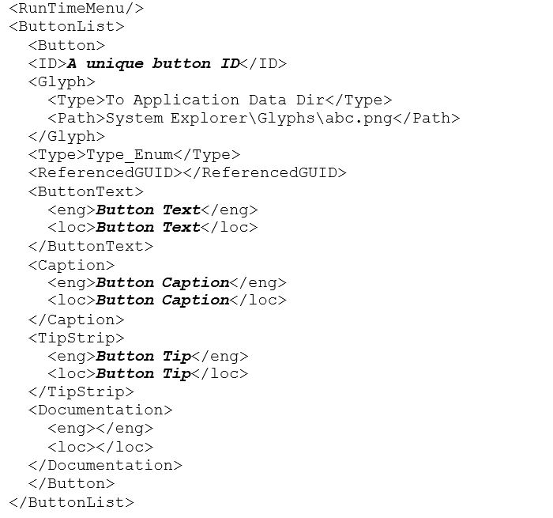 
**Custom Device Dynamic Button Framework**

•	**Type_Enum** 
•	Action runs the VI silently in the background, i.e. carry out a pre-configured task and exit 
•	Dialog 
•	Page 
•	Notification send a notification to the currently loaded page and pass the unique button ID 
•	Separator add a visual separator to the toolbar 

In the custom device LabVIEW Project, you’ll find Custom Device API.lvlib » Utility
» NI VeriStand – Enable Dynamic Button and Disable Dynamic Button.vi to enable/disable the button based on the unique button ID.

