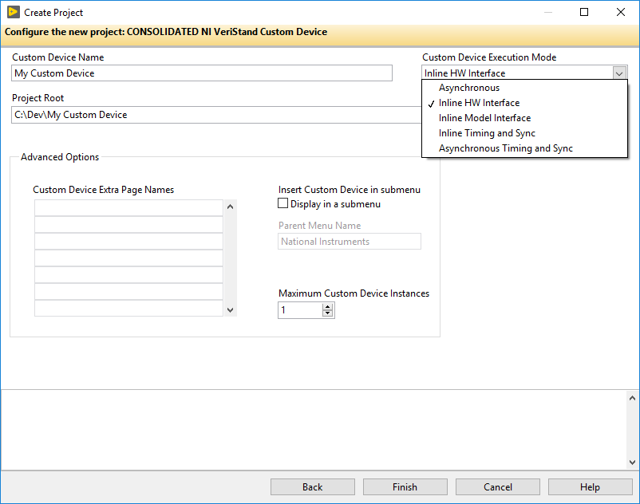
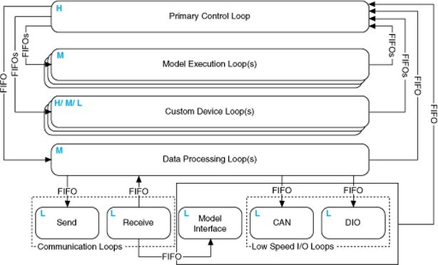
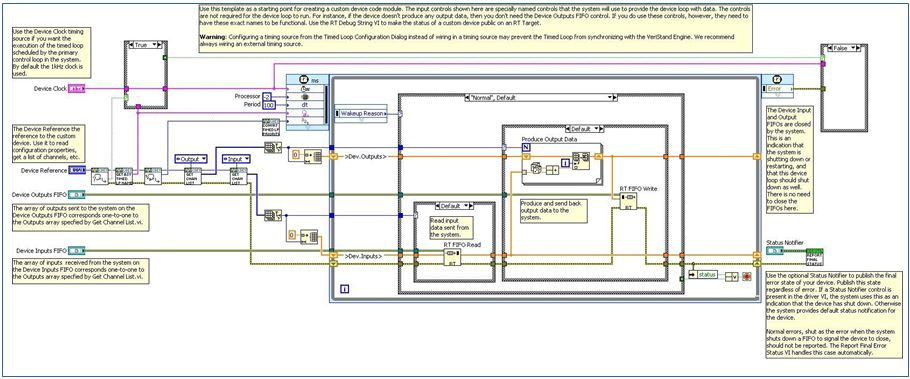
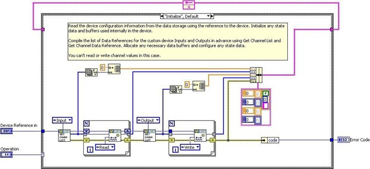

## Custom Device Types

While deployed to the execution host, all custom devices run inside the VeriStand Engine. The engine is the non-visible mechanism that controls the timing of the entire system as well as communication between the execution host and host computer. See **[VeriStand Help](https://zone.ni.com/reference/en-XX/help/372846M-01/)** » **[Components of a Project](https://zone.ni.com/reference/en-XX/help/372846M-01/veristand/comp_of_project/)** » **[Understanding the VeriStand Engine](https://zone.ni.com/reference/en-XX/help/372846M-01/veristand/understanding_vs_engine/)** for more information.

The Custom Device Template Tool generates a new LabVIEW Project containing one of five pre-built device frameworks. The framework is determined by the **Execution Mode** control.

**Figure: Execution Mode Control**

The Execution Mode determines when the device will run with respect to the other operations performed by the VeriStand Engine. There are five pre-built device frameworks. Three of the frameworks are for custom devices; the other two are for custom timing and synchronization devices.

Custom timing and synchronization devices are the same as regular custom devices, but they can be configured as the hardware synchronization master to drive RTSI0. For more information about the Real Time System Integration (RTSI) bus see **[KnowledgeBase 2R5FK53J: What is RTSI and How is it Configured?](https://www.ni.com/en-us/support/documentation/supplemental/18/real-time-system-integration--rtsi--and-configuration-explained.html)** Custom timing and synchronization devices are not covered in detail in this document. For more information about custom timing and synchronization devices, see **[VeriStand Help](https://zone.ni.com/reference/en-XX/help/372846M-01/)** » **[Configuring and Running a Project](https://zone.ni.com/reference/en-XX/help/372846M-01/veristand/configuring_and_running_a_project/)** » **[Configuring a System Definition File](https://zone.ni.com/reference/en-XX/help/372846M-01/veristand/configuring_system_definition/)** » **[Adding and Configuring Timing and Sync Devices](https://zone.ni.com/reference/en-XX/help/372846M-01/veristand/add_configure_timing_sync/)**. Multi- chassis synchronization may also be accomplished using built-in features. See the tutorial: **[Creating a Distributed System With VeriStand](https://www.ni.com/en-us/innovations/white-papers/10/creating-a-distributed-system-with-ni-veristand.html)** for more information.

Two of the regular custom devices run in-line with the Primary Control Loop (PCL), the other runs in parallel with the PCL.  A custom device is not limited to using just one type of framework. Some developers have built both in-line and parallel engines for a single custom device and allow the operator to select which mode to deploy.

Generally it's OK to alter the code within the framework depending on your needs. However you must maintain the connector pane, controls, and indicators provided by the Custom Device Template Tool or VI template. VeriStand uses these objects to interface with the custom device. If they are changed, the custom device will not work and will likely cause errors.
 
### Asynchronous

The asynchronous custom device framework provides a simple, single-loop architecture. There are sections for initialization and cleanup before and after the loop. The asynchronous template provides a Timed Loop which may be exchanged for a While at the developer’s discretion.

The loop runs in parallel loop to the PCL. If proper real-time development practices are adhered to, it is unlikely to block the PCL or slow it down. Essentially this means that the rest of the VeriStand system will continue to execute as expected even if the asynchronous custom device is latent or stalls.

The loop can be synchronized to the PCL's timing source, making it pseudo-synchronous. This applies to asynchronous devices that use a Timed Loop, While Loops cannot be used for this purpose. The benefit of an asynchronous custom device synchronized to the PCL is that it will not cause the PCL to be late just because the custom device finishes late. Use **[VeriStand – Set Loop Type](https://zone.ni.com/reference/en-XX/help/372846M-01/veristandmerge/vs_set_loop_type_vi/)** to specify the asynchronous Timed Loop uses the device clock. VeriStand tics the device clock for all Timed Loops that have **Use Device Clock** set to true.

The asynchronous device can also run at a different rate than the PCL. The rate may be defined using any execution timing method available in LabVIEW, and may iterate faster than the PCL. The rate can also be a decimation of the PCL rate specified by **[Custom Device API](https://zone.ni.com/reference/en-XX/help/372846M-01/veristandmerge/cd_api_lib/)** » **[Configuration](https://zone.ni.com/reference/en-XX/help/371361R-01/glang/configuration_file_vis/)** » **[Item Property](https://zone.ni.com/reference/en-XX/help/372846M-01/veristandmerge/vs_item_properties_vis_pal/)** » **[Device Properties](https://zone.ni.com/reference/en-XX/help/372846M-01/veristandmerge/vs_device_properties_vis_pal/)** » **[Set Custom Device Decimation VI](https://zone.ni.com/reference/en-XX/help/372846M-01/veristandmerge/vs_set_custom_device_decimation_vi/)**.

The asynchronous template provides two RT FIFOs (Device Inputs FIFO and Device Outputs FIFO) to exchange channel data with the rest of VeriStand. Since the asynchronous device runs in parallel to the PCL and passes channel data via RT FIFOs, there is a minimum of one cycle delay from when data leaves the PCL and when it enters the custom device and vice versa. These FIFOs correspond exactly to those shown in **[VeriStand Help](https://zone.ni.com/reference/en-XX/help/372846M-01/)** » **[Components of a Project](https://zone.ni.com/reference/en-XX/help/372846M-01/veristand/comp_of_project/)** » **[Understanding the VeriStand Engine](https://zone.ni.com/reference/en-XX/help/372846M-01/veristand/understanding_vs_engine/)**.

**Figure: The VeriStand Engine**

The asynchronous device is not guaranteed to execute at the same time with respect to the other components of the system. For example, the first iteration may execute before the PCL processes alarms; the second and third iterations after, the fourth before et cetera.

The input controls are specially named controls that the system will use to provide the device loop with data. The controls are not required for the device loop to run. For instance, if the device doesn't produce any output data, then you don't need the Device Outputs FIFO control. If you do need these controls, they must have these exact names to be functional.

The optional status notifier element is used to notify the RT engine of the last state of the custom device, and to indicate the device has completed execution. If this control is not used, a default No Error value is returned to the system when the device finishes execution. This error state is not checked until the system shuts down. Use an output channel to send more immediate status values to the system.

The asynchronous framework includes VIs from the VeriStand Asynchronous Device Properties VIs palette.

**Figure: Asynchronous Custom Device Framework**

**[Get Loop Type](https://zone.ni.com/reference/en-XX/help/372846M-01/veristandmerge/vs_get_loop_type_vi/)** - Returns the type of loop that an asynchronous custom device uses. The type can be either While Loop or Timed Loop. If it’s a Timed Loop, this VI also returns whether the loop uses the device clock.

**[Get Asynchronous Driver VI Timed Loop Name](https://zone.ni.com/reference/en-XX/help/372846M-01/veristandmerge/vs_get_asynchronous_driver_vi_timed_loop_name_vi/)** - Returns the name of the Timed Loop that a custom device uses. The VeriStand Engine synchronizes the start of this Timed Loop with the other system Timed Loops. Use the name to ensure synchronization occurs successfully.

**[Get Timed Loop Priority](https://zone.ni.com/reference/en-XX/help/372846M-01/veristandmerge/vs_get_timed_loop_priority_vi/)** - Returns the priority (Low, Medium, or High) of an asynchronous custom device Timed Loop. To convert this enumerated value to a numeric value that the Timed Loop input terminal accepts, use the Convert Timed Loop Priority Property to Number VI.

**[Convert Timed Loop Priority to Number](https://zone.ni.com/reference/en-XX/help/372846M-01/veristandmerge/vs_convert_timed_loop_priority_to_number_vi/)** - Converts a priority value (Low, Medium, High) for a custom device Timed Loop into a numeric value that the Timed Loop Input Node accepts. To set the priority, use the Set Timed Loop Priority VI.
 
Whenever a **[timing source](https://zone.ni.com/reference/en-XX/help/371361R-01/lvconcepts/con_select_timed_struct_timing/)** is specified for a Timed Loop, the dt terminal is in tics of the timing source. The asynchronous template has a default period of 100. The default timing source is a 1KHz clock, so the default configuration iterates at 10Hz. If you set Use Device Clock = true in the **[Set Loop Type VI](https://zone.ni.com/reference/en-XX/help/372846M-01/veristandmerge/vs_set_loop_type_vi/)**, the Timed Loop will iterate every
once every 100 iterations of the PCL.

See **[VeriStand Help](https://zone.ni.com/reference/en-XX/help/372846M-01/)** » **[VI and Function Reference](https://zone.ni.com/reference/en-XX/help/371361R-01/glang/labview_vis_and_functions/)** » **[Programming VIs and Functions](https://zone.ni.com/reference/en-XX/help/371361R-01/glang/programming_pal/)** » **[Structures](https://zone.ni.com/reference/en-XX/help/371361R-01/glang/structures/)** » **[Timed Loop](https://zone.ni.com/reference/en-XX/help/372459E-01/embsharedvi/emb_timedloop_palette/)** for more information about the Timed Loop and its terminals.

### Inline Hardware Interface

The inline hardware interface template is similar to state machine architecture. Some developers will recognize it as an action-engine. See **[NI Discussion Forums](https://forums.ni.com/?profile.language=en)** » **[LabVIEW](https://forums.ni.com/t5/LabVIEW/bd-p/170?profile.language=en)** » **[Community Nugget 4/08/2007 Action Engines](https://forums.ni.com/t5/LabVIEW/Community-Nugget-4-08-2007-Action-Engines/m-p/503801?profile.language=en&requireLogin=False)** for a discussion on action engines. The PCL specifies the case to execute. An uninitialized **[Feedback Node](https://zone.ni.com/reference/en-XX/help/371361R-01/lvconcepts/block_diagram_feedback/)** is used for iterative data transfer. There are five cases defined by the Operation enumerated control.

1.	Initialize
2.	Start
3.	Read Data from Hardware
4.	Write Data to Hardware
5.	Close

This custom device runs in-line with the PCL, which calls each case at a specific time with respect to the other components in the VeriStand engine. The PCL will not proceed until the custom device case has completed.

### Initialize

The Initialize case executes before the PCL starts. In this case, you can read the device configuration information from properties using the reference to the device. Initialize data and buffers used internally in the device. The framework compiles the list of Data References for the custom device Inputs and Outputs in advance using **[Custom Device API](https://zone.ni.com/reference/en-XX/help/372846M-01/veristandmerge/vs_custom_device_api_vis_pal/)** » **[Driver Functions](https://zone.ni.com/reference/en-XX/help/372846M-01/veristandmerge/vs_driver_functions_vis_pal/)** » **[Get Custom Device Channel List](https://zone.ni.com/reference/en-XX/help/372846M-01/veristandmerge/vs_get_custom_device_channel_list_vi/)** and Custom Device API.lvlib » Templates » RT Driver VIs » Inline » Inline Driver Utilities » Channel Data References » Get Channel Data Reference.vi.
 

**Figure: Initialize State of the Inline Hardware Interface Framework**

Since the PCL hasn’t started yet, you can't read or write channel values in the Initialize case.

### Start

The Start case executes after Initialization and before the PCL starts running. There’s no difference between what code you can place in the Initialize and Start states. Since the PCL hasn’t started yet, you can't read or write channel values in the Start case.

### Read Data from HW

The Read Data from HW case executes at the beginning of the PCL, before other components (such as Stimulus, Faults, Alarms, Procedures, et cetera) execute. For a detailed timing diagram, see the **Outline of PCL Iteration** section. After processing system mappings, the data obtained in this case is available to the other components of the system for the remainder of the PCL iteration.

**Figure: Read Data from HW State of the Inline Hardware Interface Framework**
 
The template contains a Flat Sequence frame named Read Hardware Channels. You can replace the code inside the frame with the API calls necessary to obtain data from a hardware API.

Do not call Get or Set Channel Value by Data Reference outside the inline driver VI.
Doing so could cause system instability or errors.

### Write Data to HW

The Write Data to HW case executes at the end of the PCL, after the other components (such as Stimulus, Faults, Alarms, Procedures, et cetera) have executed.

**Figure: Write Data to HW State of the Inline Hardware Interface Framework**

The case contains a Flat Sequence frame named Write Input Data to Hardware Channels. You can replace the code inside the frame with the API calls necessary to send data to a hardware device.

### Close

The Close case executes after the PCL has finished executing. It's good practice to close references and release resources in this state. Since the PCL has terminated, you cannot read or write channel values in this case.

### Inline Model Interface

The Inline Model Interface custom device template is state machine/action engine architecture. An uninitialized Feedback Node is used for iterative data transfer. There are four cases defined by the Operation enumerated control.

1.	Initialize – Same as Inline HW Interface
2.	Start – Same as Inline HW Interface
3.	Execute Model
4.	Close – Same as Inline HW Interface

This custom device is run in-line with the PCL, which calls each case at a specific time with respect to the other components in the system. The PCL will not proceed until the custom device case has returned.

### Execute Model

The execute model case is called in the middle of the PCL. This is the one state of this device that executes during the PCL. This state reads input data, performs a calculation, and then writes output data to VeriStand. Using the Inline Model Interface mode enables you to process data acquired from hardware inputs and send the processed values to hardware outputs with no latency.

**Figure: Execute Model State of the Inline Model Interface Framework**

Do not call **Get** or **Set Channel Value by Data Reference** outside the inline driver VI. Doing so could cause system instability or errors.
 
### Pre-defined Custom Device Types

The type of a custom device refers to its execution mode, which defines how the device interacts with the VeriStand Engine.

In VeriStand are included several pre-defined custom device types. To check the table with the custom device types go to **[pre-defined custom device types](https://www.ni.com/documentation/en/veristand/latest/manual/custom-device-types/)**.
 
### Outline of PCL Iteration

The order of operations in the **[Primary Control Loop](https://zone.ni.com/reference/en-XX/help/372846M-01/veristand/understanding_vs_engine/)** varies with respect to the execution mode of the controller. You can adjust this setting in **[System Explorer](https://zone.ni.com/reference/en-XX/help/372846M-01/veristand/system_explorer/)** » **[Targets](https://zone.ni.com/reference/en-XX/help/372846M-01/veristand/targets_se/)** » **[Controller](https://zone.ni.com/reference/en-XX/help/372846M-01/veristand/cp_controller/)** » Other Settings » Execution Mode.

The **[Data Processing Loop](https://zone.ni.com/reference/en-XX/help/372846B-01/veristand/understanding_vs_engine/#Data_Processing_Loop)** (DPL) is responsible for executing Procedures, alarms, and calculated channels. For more information about hardware timing in VeriStand see **[KnowledgeBase 58BFIFAF: Hardware I/O Latency Times in VeriStand](https://knowledge.ni.com/KnowledgeArticleDetails?id=kA00Z000000kKVGSA2&l=en-US)**.

(N-1) means “from the previous iteration”.

### Parallel Mode

1.	Get hardware inputs from **[Controller](https://zone.ni.com/reference/en-XX/help/372846M-01/veristand/cp_controller/)** » **[Hardware](https://zone.ni.com/reference/en-XX/help/372846B-01/veristand/hardware_se/)** » **[Chassis](https://zone.ni.com/reference/en-XX/help/372846B-01/veristand/chassis_se/)**
   •	DAQ Digital Lines and Counters are read after Read From HW case of Inline Hardware custom devices
2.	Read asynchronous custom device FIFOs (N-1)
3.	Run Read Data From HW case of Inline Hardware custom devices
   •	Scaling is applied after all hardware inputs have been acquired
4.	Read models from **[Controller](https://zone.ni.com/reference/en-XX/help/372846M-01/veristand/cp_controller/)** » **[Simulation Models](https://zone.ni.com/reference/en-XX/help/372846B-01/veristand/simulation_models_se/)**
5.	Read from DPL (N-1)
6.	Process system mappings1
7.	Run the Execute Model case of Inline Model custom devices
   •	All hardware inputs have been acquired and all channels have been scaled
before this case runs
8.	Process system mappings1
9.	Execute generators
10.	Process system mappings1
11.	Write to DPL
12.	Write to **[Controller](https://zone.ni.com/reference/en-XX/help/372846M-01/veristand/cp_controller/)** » **[Simulation Models](https://zone.ni.com/reference/en-XX/help/372846B-01/veristand/simulation_models_se/)**
13.	Write hardware outputs to **[Controller](https://zone.ni.com/reference/en-XX/help/372846M-01/veristand/cp_controller/)** » **[Hardware](https://zone.ni.com/reference/en-XX/help/372846B-01/veristand/hardware_se/)** » **[Chassis](https://zone.ni.com/reference/en-XX/help/372846B-01/veristand/chassis_se/)**
14.	Run the Write to Hardware case of Inline Hardware custom devices
15.	Write to Asynchronous device FIFOs

You can’t read data from a previous step until a “process system mappings” step has executed, even if that step acquired the data you want. For example, you write an inline HW custom device, and inside the read data from HW state of this custom device, you want to read the channel data from a DAQ card in the configuration. The DAQ executes at step 1, your code executes at step 3. However, if you read the channel for the DAQ in your code in step 3, you would get the data from the previous iteration (N-1) because “process system mappings” hasn’t executed yet. This is the case for NIVS 2010, it will likely change in the future.
 
### Low-Latency Mode

Low latency mode executes models in-line.
1.	Get hardware inputs from **[Controller](https://zone.ni.com/reference/en-XX/help/372846M-01/veristand/cp_controller/)** » **[Hardware](https://zone.ni.com/reference/en-XX/help/372846B-01/veristand/hardware_se/)** » **[Chassis](https://zone.ni.com/reference/en-XX/help/372846B-01/veristand/chassis_se/)**
•	DAQ Digital Lines and Counters are read after Read From HW case of Inline Hardware custom devices
2.	Read asynchronous custom device FIFOs (N-1)
3.	Run the Read Data From HW case of Inline Hardware custom devices
•	Scaling is applied after all hardware inputs have been acquired
4.	Read from DPL (N-1)
5.	Process system mappings1
6.	Run the Execute Model case of Inline Model custom devices
•	All hardware inputs have been acquired and all channels have been scaled
before this case runs
7.	Process system mappings1
8.	Execute generators
9.	Process mappings1
10.	Write to **[Controller](https://zone.ni.com/reference/en-XX/help/372846M-01/veristand/cp_controller/)** » **[Simulation Models](https://zone.ni.com/reference/en-XX/help/372846B-01/veristand/simulation_models_se/)**
11.	Wait for models to finish
12.	Read from **[Controller](https://zone.ni.com/reference/en-XX/help/372846M-01/veristand/cp_controller/)** » **[Simulation Models](https://zone.ni.com/reference/en-XX/help/372846B-01/veristand/simulation_models_se/)**
13.	Process system mappings1
14.	Write to DPL
15.	Write hardware outputs to **[Controller](https://zone.ni.com/reference/en-XX/help/372846M-01/veristand/cp_controller/)** » **[Hardware](https://zone.ni.com/reference/en-XX/help/372846B-01/veristand/hardware_se/)** » **[Chassis](https://zone.ni.com/reference/en-XX/help/372846B-01/veristand/chassis_se/)**
16.	Run the Write to Hardware case of Inline Hardware custom devices
17.	Write to Asynchronous device FIFOs

Based on the timing requirements of the custom device, plan the type of device before executing the Custom Device Template Tool. The AES-201 API sinks and sources data during steady-state operation; the custom device needs input and output channels. The operator needs deterministic hardware data. The AES-201 should be implemented with the Inline Hardware type of custom device.
