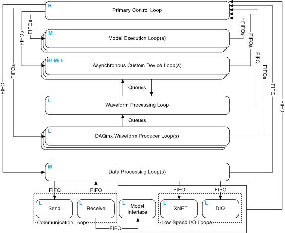
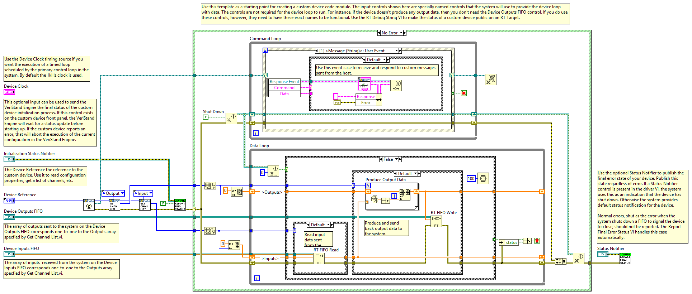
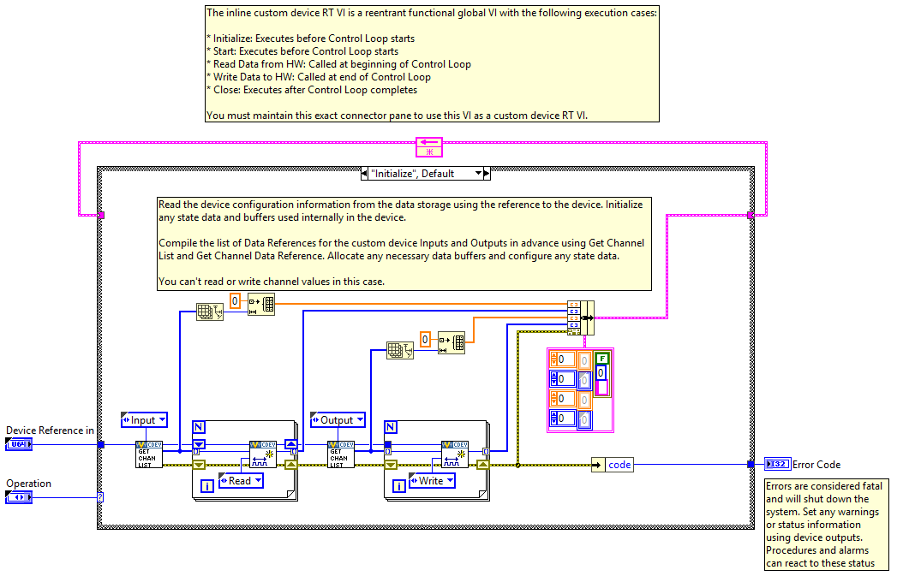
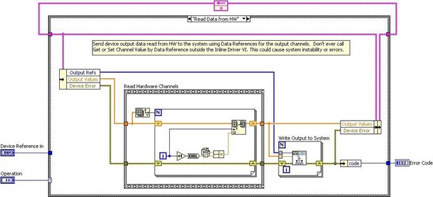
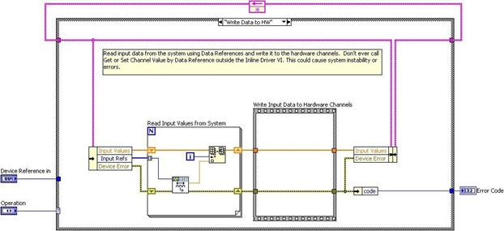
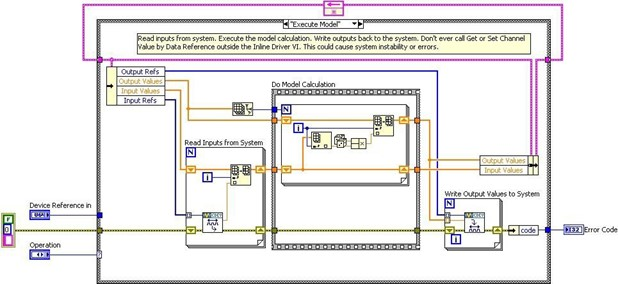

## Custom Device Types

While deployed to the Target, all custom devices run inside the VeriStand Engine. The engine is the non-visible mechanism that controls the timing of the entire system as well as communication between the Target and Host Computer. See **[VeriStand Manual](https://www.ni.com/documentation/en/veristand/latest/manual/manual-overview/)** » **[VeriStand Environment](https://www.ni.com/documentation/en/veristand/latest/manual/environment/)** » **[Components of a VeriStand Project](https://www.ni.com/documentation/en/veristand/latest/manual/project-components/)** » **[VeriStand Engine](https://www.ni.com/documentation/en/veristand/latest/manual/vs-engine/)** for more information.

The [niveristand-custom-device-wizard](https://github.com/ni/niveristand-custom-device-wizard/releases) generates a new LabVIEW Project containing one of five [device frameworks](https://www.ni.com/documentation/en/veristand/latest/manual/custom-device-types/). The framework is determined by the **Custom Device Execution Mode** control.

**Figure: NI VeriStand Custom Device Wizard**

The Execution Mode determines when the device will run with respect to the other operations performed by the VeriStand Engine. There are five device frameworks available. Three of the frameworks are for custom devices, and the other two are for custom timing and synchronization devices.

Custom timing and synchronization devices are the same as regular custom devices, but they can be configured as the hardware synchronization master to drive RTSI0. For more information see **[Real-Time System Integration (RTSI) and Configuration Explained](https://www.ni.com/en-us/support/documentation/supplemental/18/real-time-system-integration--rtsi--and-configuration-explained.html)**. Custom timing and synchronization devices are not covered in detail in this document. For more information about custom timing and synchronization devices, see **[VeriStand Manual](https://www.ni.com/documentation/en/veristand/latest/manual/manual-overview/)** » **[Configuring and Running a Project](https://www.ni.com/documentation/en/veristand/latest/manual/configure-run-project/)** » **[Configuring a System Definition File](https://www.ni.com/documentation/en/veristand/latest/manual/configure-system-definition-file/)** » **[Adding and Configuring a Hardware Device](https://www.ni.com/documentation/en/veristand/latest/manual/add-configure-hardware-device/)** » **[Adding and Configuring Timing and Sync Devices](https://www.ni.com/documentation/en/veristand/latest/manual/add-configure-timing-sync/)**. Multi- chassis synchronization may also be accomplished using built-in features. See the tutorial: **[Creating a Distributed System With NI VeriStand](https://www.ni.com/en-us/innovations/white-papers/10/creating-a-distributed-system-with-ni-veristand.html)** for more information.

Two of the regular custom devices run in-line with the Primary Control Loop (PCL), the other runs in parallel with the PCL.  A custom device is not limited to using just one type of framework. Some developers have built both in-line and parallel engines for a single custom device and allow the operator to select which mode to deploy.

Generally it's OK to alter the code within the framework depending on your needs. However you must maintain the connector pane, controls, and indicators provided by the niveristand-custom-device-wizard. VeriStand uses these objects to interface with the custom device. If they are changed, the custom device will not work and will likely cause errors.
 
### Asynchronous

The [asynchronous custom device framework](https://www.ni.com/documentation/en/veristand/latest/manual/custom-device-asynchronous-driver-template/) provides a simple, single-loop architecture. There are sections for initialization and cleanup before and after the loop. The asynchronous template provides a While Loop which may be exchanged for a Timed Loop at the developer’s discretion.

The loop runs in parallel to the PCL. If proper real-time development practices are adhered to, it is unlikely to block the PCL or slow it down. Essentially this means that the rest of the VeriStand system will continue to execute as expected even if the asynchronous custom device is latent or stalls.

The loop can be synchronized to the PCL's timing source, making it pseudo-synchronous. This applies to asynchronous devices that use a Timed Loop, While Loops cannot be used for this purpose. The benefit of an asynchronous custom device synchronized to the PCL is that it will not cause the PCL to be late just because the custom device finishes late. See **[Synchronizing an Asynchronous Custom Device with the Primary Control Loop](https://www.ni.com/documentation/en/veristand/latest/manual/custom-device-sync-asynchronous/)**. VeriStand ticks the device clock for all Timed Loops that have **Use Device Clock** set to true.

The asynchronous device can also run at a different rate than the PCL. The rate may be defined using any execution timing method available in LabVIEW, and may iterate faster than the PCL. The rate can also be a decimation of the PCL rate specified using  **NI VeriStand - Set Custom Device Decimation** VI, that can be found in the LabVIEW palette: **NI VeriStand** »  **[Custom Device API](https://www.ni.com/documentation/en/veristand/latest/manual/custom-device-api-library/)** » **Configuration** » **Item Properties** » **Device Properties** » **Set Custom Device Decimation VI**.

The asynchronous template uses RT FIFOs (Device Inputs FIFO and Device Outputs FIFO) in order to exchange channel data with the rest of VeriStand . Since the asynchronous device runs in parallel to the PCL and passes channel data via RT FIFOs, there is a minimum of one cycle delay from when data leaves the PCL and when it enters the custom device and vice versa. These FIFOs correspond exactly to those shown in **[VeriStand Manual](https://www.ni.com/documentation/en/veristand/latest/manual/manual-overview/)** » **[VeriStand Environment](https://www.ni.com/documentation/en/veristand/latest/manual/environment/)** » **[Components of a VeriStand Project](https://www.ni.com/documentation/en/veristand/latest/manual/project-components/)** » **[VeriStand Engine](https://www.ni.com/documentation/en/veristand/latest/manual/vs-engine/)**.

**Figure: The VeriStand Engine**

The asynchronous device is not guaranteed to execute at the same time with respect to the other components of the system. For example, the first iteration may execute before the PCL processes alarms, the second and third iterations after, the fourth before et cetera.

The input controls are specially named controls that the system will use to provide the device loop with data. The controls are not required for the device loop to run. For instance, if the device doesn't produce any output data, then you don't need the Device Outputs FIFO control. If you do need these controls, they must have these exact names to be functional.

The optional status notifier element is used to notify the engine of the last state of the custom device, and to indicate the device has completed execution. If this control is not used, a default No Error value is returned to the system when the device finishes execution. This error state is not checked until the system shuts down. Use an output channel to send more immediate status values to the system.

The asynchronous framework includes VIs from the VeriStand Asynchronous Device Properties VIs subpalette.

**Figure: Asynchronous Custom Device Framework**

### Inline Hardware Interface

The [inline hardware interface template](https://www.ni.com/documentation/en/veristand/latest/manual/custom-device-inline-hardware-interface-template/) is similar to a state machine architecture. Some developers will recognize it as an action-engine. See **[NI Discussion Forums](https://forums.ni.com/?profile.language=en)** » **[LabVIEW](https://forums.ni.com/t5/LabVIEW/bd-p/170?profile.language=en)** » **[Community Nugget 4/08/2007 Action Engines](https://forums.ni.com/t5/LabVIEW/Community-Nugget-4-08-2007-Action-Engines/m-p/503801?profile.language=en&requireLogin=False)** for a discussion on action engines. The PCL specifies the case to execute. An uninitialized **[Feedback Node](https://zone.ni.com/reference/en-XX/help/371361R-01/lvconcepts/block_diagram_feedback/)** is used for iterative data transfer. There are five cases defined by the Operation enumerated control.

1.	Initialize
2.	Start
3.	Read Data from Hardware
4.	Write Data to Hardware
5.	Close

This custom device runs in-line with the PCL, which calls each case at a specific time with respect to the other components in the VeriStand engine. The PCL will not proceed until the custom device case has completed.

### Initialize

The Initialize case executes before the PCL starts. In this case, you can read the device configuration information from properties using the reference to the device. Initialize data and buffers used internally in the device. The framework compiles the list of Data References for the custom device Inputs and Outputs in advance using **[Custom Device API](https://zone.ni.com/reference/en-XX/help/372846M-01/veristandmerge/vs_custom_device_api_vis_pal/)** » **[Driver Functions](https://zone.ni.com/reference/en-XX/help/372846M-01/veristandmerge/vs_driver_functions_vis_pal/)** » **[Get Custom Device Channel List](https://zone.ni.com/reference/en-XX/help/372846M-01/veristandmerge/vs_data_references_pal/)** and Custom Device API.lvlib » Templates » RT Driver VIs » Inline » Inline Driver Utilities » **[Channel Data References](https://zone.ni.com/reference/en-XX/help/372846M-01/veristandmerge/vs_data_references_pal/)** » **[Get Channel Data Reference](https://zone.ni.com/reference/en-XX/help/372846M-01/veristandmerge/vs_get_channel_data_reference/)**.
 

**Figure: Initialize State of the Inline Hardware Interface Framework**

Since the PCL hasn’t started yet, you can't read or write channel values in the Initialize case.

### Start

The Start case executes after Initialization and before the PCL starts running. There’s no difference between what code you can place in the Initialize and Start states. Since the PCL hasn’t started yet, you can't read or write channel values in the Start case.

### Read Data from HW

The Read Data from HW case executes at the beginning of the PCL, before other components (such as stimulus profiles, faults, alarms, procedures, etc.) execute. For a detailed timing diagram, see the **[Outline of PCL Iteration](https://niveristand-custom-device-handbook.readthedocs.io/en/latest/Custom_Device_Types.html#outline-of-pcl-iteration)** section. After processing system mappings, the data obtained in this case is available to the other components of the system for the remainder of the PCL iteration.

**Figure: Read Data from HW State of the Inline Hardware Interface Framework**
 
The template contains a Flat Sequence frame named Read Hardware Channels. You can replace the code inside the frame with the API calls necessary to obtain data from a hardware API.

Do not call **Get** or **Set Channel Value by Data Reference** outside the inline driver VI.
Doing so could cause system instability or errors.

### Write Data to HW

The Write Data to HW case executes at the end of the PCL, after the other components (such as stimulus profiles, faults, alarms, procedures, etc. ) have executed.

**Figure: Write Data to HW State of the Inline Hardware Interface Framework**

The case contains a Flat Sequence frame named Write Input Data to Hardware Channels. You can replace the code inside the frame with the API calls necessary to send data to a hardware device.

### Close

The Close case executes after the PCL has finished executing. It's good practice to close references and release resources in this state. Since the PCL has terminated, you cannot read or write channel values in this case.

### Inline Model Interface

The Inline Model Interface custom device template is state machine/action engine architecture. An uninitialized Feedback Node is used for iterative data transfer. There are four cases defined by the Operation enumerated control.

1.	Initialize – Same as Inline HW Interface
2.	Start – Same as Inline HW Interface
3.	Execute Model
4.	Close – Same as Inline HW Interface

This custom device is run in-line with the PCL, which calls each case at a specific time with respect to the other components in the system. The PCL will not proceed until the custom device case has returned.

### Execute Model

The execute model case is called in the middle of the PCL. This is the one state of this device that executes during the PCL. This state reads input data, performs a calculation, and then writes output data to VeriStand. Using the Inline Model Interface mode enables you to process data acquired from hardware inputs and send the processed values to hardware outputs with no latency.

**Figure: Execute Model State of the Inline Model Interface Framework**

Do not call **Get** or **Set Channel Value by Data Reference** outside the inline driver VI. Doing so could cause system instability or errors.
 
### Pre-defined Custom Device Types

The type of a custom device refers to its execution mode, which defines how the device interacts with the VeriStand Engine.

This **[table](https://www.ni.com/documentation/en/veristand/latest/manual/custom-device-types/)** displays the pre-defined custom device types that are included in VeriStand.
 
### Outline of PCL Iteration

The order of operations in the **[Primary Control Loop](https://www.ni.com/documentation/en/veristand/latest/manual/vs-engine/)** varies with respect to the execution mode of the controller. You can adjust this setting in **[System Explorer](https://www.ni.com/documentation/en/veristand/latest/manual/environment/)** » **[Targets](https://www.ni.com/documentation/en/veristand/latest/manual/specify-target/)** » **[Controller](https://www.ni.com/documentation/en/veristand/latest/manual/configure-veristand-engine/)** » Other Settings » Execution Mode.

The **[Data Processing Loop](https://www.ni.com/documentation/en/veristand/latest/manual/vs-engine/)** is responsible for executing procedures, alarms, and calculated channels. For more information about hardware timing in VeriStand see **[KnowledgeBase: Hardware I/O Latency Times in NI VeriStand](https://knowledge.ni.com/KnowledgeArticleDetails?id=kA00Z000000kKVGSA2&l=en-US)**.

### Parallel Mode

In *Parallel* mode, the PCL initiates execution of models and continues to its next iteration without waiting for models to finish executing. This causes a one-cycle delay between when a model executes and when the data it produces is available to the system.

1.	Get inputs from hardware devices in the system definition.
&nbsp;&nbsp;&nbsp; **Note:** If the system includes an inline hardware interface custom device, the PCL reads DAQ digital lines and counters after the Read Data from HW case of the custom device executes in step 3.
2.	Read asynchronous custom device FIFOs from the previous iteration.
3.	Runs the **Read Data From HW** case of inline hardware interface custom devices.
&nbsp;&nbsp;&nbsp; **Note:** If you configured hardware scaling, VeriStand applies the scaling after acquiring all hardware inputs.
4.	Reads previous iteration data from models in the system definition.
&nbsp;&nbsp;&nbsp; **Note:** This step executes on the second and subsequent iterations.
5.	Reads data from the previous iteration of the Data Processing Loop.
6.	Processes system mappings.
&nbsp;&nbsp;&nbsp; **Note:** VeriStand components (including custom devices) cannot read data from a previous step until the PCL processes system mappings, even if the previous step acquired the data the component needs.
7.	Runs the **Execute Model** case of inline model interface custom devices.
8.	Executes steps of running real-time sequences.
&nbsp;&nbsp;&nbsp; **Note:** VeriStand executes real-time sequences after input operations but before output operations and continues to run every step of the real-time sequence until the sequence is complete, reaches a Yield step, or completes an iteration of a loop with Auto Yield set to TRUE. If a sequence takes longer than the given time for an iteration of the PCL, the PCL runs late. To avoid errors, break up the timing of the steps by placing Yield steps throughout the sequence and enabling the Auto Yield property for any loops in the sequence.
9.	Processes system mappings.
10.	Writes data to models.
11.	Initiates asynchronous execution of models.
12.	Writes data to the Data Processing Loop.
13.	Writes output data to hardware devices.
14.	Runs the **Write Data to HW** case of inline hardware interface custom devices.
15.	Writes data to asynchronous custom device FIFOs.

 
### Low-Latency Mode

In *Low* Latency mode, the PCL waits for the Model Execution Loop(s) to finish writing data to models before it reads and publishes model values to the system. This occurs during every iteration of the system. When the model completes execution, the PCL provides data from the model to other loops during the same iteration that the model generated the data.

1.	Gets inputs from hardware devices in the system definition.
&nbsp;&nbsp;&nbsp; **Note:** If the system includes an inline hardware interface custom device, the PCL reads DAQ digital lines and counters after the Read Data from HW case of the custom device executes in step 3.
2.	Reads asynchronous custom device FIFOs from the previous iteration.
3.	Runs the **Read Data from HW** case of inline hardware interface custom devices.
&nbsp;&nbsp;&nbsp; **Note:** If you configured hardware scaling, VeriStand applies the scaling after acquiring all hardware inputs.
4.	Reads data from the previous iteration of the Data Processing Loop.
5.	Processes system mappings.
&nbsp;&nbsp;&nbsp; **Note:** VeriStand components (including custom devices) cannot read data from a previous step until the PCL processes system mappings, even if the previous step acquired the data the component needs.
6.	Runs the **Execute Model** case of inline model interface custom devices.
7.	Executes steps of running real-time sequences.
&nbsp;&nbsp;&nbsp; **Note:** VeriStand executes real-time sequences after input operations but before output operations and continues to run every step of the real-time sequence until the sequence is complete, reaches a Yield step, or completes an iteration of a loop with Auto Yield set to TRUE. If a sequence takes longer than the given time for an iteration of the PCL, the PCL runs late. To avoid errors, break up the timing of the steps by placing Yield steps throughout the sequence and enabling the Auto Yield property for any loops in the sequence.
8.	Processes system mappings.
9.	Writes data to models.
10.	Initiates execution of models and waits for them to complete execution.
11.	Reads data from models.
12.	Processes system mappings.
13.	Writes data to the Data Processing Loop.
14.	Writes output data to hardware devices.
15.	Runs the **Write Data to HW** case of inline hardware interface custom devices.
16.	Writes data to asynchronous custom device FIFOs.

