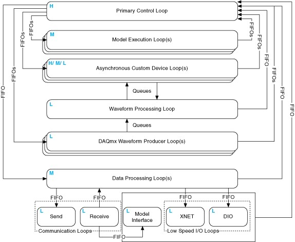

## Custom Device Types

The custom device [type](https://www.ni.com/documentation/en/veristand/latest/manual/custom-device-types/) refers to its execution mode. The mode defines how the device interacts with the [VeriStand Engine](https://www.ni.com/documentation/en/veristand/latest/manual/vs-engine/).

The *VeriStand Engine* is the non-visible mechanism that controls system timing and communication between the Target and Host Computer. While deployed to the Target, all custom devices run inside the engine.

The [niveristand-custom-device-wizard](https://github.com/ni/niveristand-custom-device-wizard/releases) generates a new LabVIEW Project containing one of five [device frameworks](https://www.ni.com/documentation/en/veristand/latest/manual/custom-device-types/). The framework is determined by the **Custom Device Execution Mode**.

The selected mode determines when the device will run with respect to the other operations performed by the VeriStand Engine. There are five device frameworks available. Three of the frameworks are for custom devices, and the other two are for custom timing and synchronization devices.

Custom timing and synchronization devices are the same as regular custom devices, but they can be configured as the hardware synchronization master to drive RTSI0. For more information, refer to [Real-Time System Integration (RTSI) and Configuration Explained](https://www.ni.com/en-us/support/documentation/supplemental/18/real-time-system-integration--rtsi--and-configuration-explained.html).

Custom timing and synchronization devices are not covered in detail in this document. For more information about custom timing and synchronization devices, refer to the *VeriStand Help* topic [Adding and Configuring Timing and Sync Devices](https://www.ni.com/documentation/en/veristand/latest/manual/add-configure-timing-sync/). Multi- chassis synchronization may also be accomplished using built-in features. For more information, refer to [Creating a Distributed System With NI VeriStand](https://www.ni.com/en-us/innovations/white-papers/10/creating-a-distributed-system-with-ni-veristand.html).

Two of the regular custom devices run in-line with the Primary Control Loop (PCL), the other runs in parallel with the PCL. A custom device is not limited to using just one type of framework. Some developers have built both in-line and parallel engines for a single custom device and allow the operator to select which mode to deploy.

Depending on your needs, you can alter the code within the framework. However, you must maintain the connector pane, controls, and indicators provided by the niveristand-custom-device-wizard. VeriStand uses these objects to interface with the custom device. If they are changed, the custom device will experience errors.

### Asynchronous

The [asynchronous custom device framework](https://www.ni.com/documentation/en/veristand/latest/manual/custom-device-asynchronous-driver-template/) provides a simple, single-loop architecture. There are sections for initialization and cleanup before and after the loop.

**Note:** The asynchronous template provides a While Loop that can be exchanged for a Timed Loop.

The loop runs in parallel to the PCL. If proper real-time development practices are adhered to, it is unlikely to block or slow the PCL. The rest of the VeriStand system will continue to execute as expected even if the asynchronous custom device is latent or stalls.

The loop can be [synchronized to the PCL's timing source](https://www.ni.com/documentation/en/veristand/latest/manual/custom-device-sync-asynchronous/), making it pseudo-synchronous. This applies to asynchronous devices that use a Timed Loop. While Loops cannot be used for this purpose.

The benefit of an asynchronous custom device synchronized to the PCL is that it will not cause the PCL to be late if the device is late. VeriStand ticks the device clock for all Timed Loops that have **Use Device Clock** set to true.

The asynchronous device can run at a different rate than the PCL. You can define the rate using any execution timing method available in LabVIEW. The rate can iterate faster than the PCL or be a decimation of the PCL rate specified using the **NI VeriStand - Set Custom Device Decimation** VI. This VI can be found in LabVIEW by navigating to **NI VeriStand** » **[Custom Device API](https://www.ni.com/documentation/en/veristand/latest/manual/custom-device-api-library/)** » **Configuration** » **Item Properties** » **Device Properties**.

The asynchronous template uses RT FIFOs, specifically Device Inputs FIFO and Device Outputs FIFO, to exchange channel data with the rest of VeriStand. Since the asynchronous device runs in parallel to the PCL and passes channel data through RT FIFOs, there is a minimum of one cycle delay from when data travels back and forth from the PCL to the custom device. These FIFOs correspond to those in the [VeriStand Engine](https://www.ni.com/documentation/en/veristand/latest/manual/vs-engine/).

The asynchronous device is not guaranteed to execute at the same time as other components of the system. For example, the first iteration may execute before the PCL processes alarms.

The input controls are specially named controls that the system will use to provide the device loop with data. The controls are not required for the device loop to run. For example, if the device doesn't produce any output data, then you don't need the Device Outputs FIFO control. If you do need these controls, they must have these exact names to be functional.

The optional *notifier* status element is used to notify the engine of the last state of the custom device and to indicate the device has completed execution. If this control is not used, a default No Error value is returned to the system when the device finishes execution. This error state is not checked until the system shuts down. Use an output channel to send more immediate status values to the system.

The asynchronous framework includes VIs from the VeriStand Asynchronous Device Properties VIs subpalette.

### Inline Hardware Interface

The [inline hardware interface template](https://www.ni.com/documentation/en/veristand/latest/manual/custom-device-inline-hardware-interface-template/) is similar to a state machine architecture.

**Note:** Some developers will recognize it as an action-engine. For a discussion on action engines, refer to the NI Discussion Forums post [Community Nugget 4/08/2007 Action Engines](https://forums.ni.com/t5/LabVIEW/Community-Nugget-4-08-2007-Action-Engines/m-p/503801?profile.language=en&requireLogin=False).

The PCL specifies the case to execute. An uninitialized **[Feedback Node](https://zone.ni.com/reference/en-XX/help/371361R-01/lvconcepts/block_diagram_feedback/)** is used for iterative data transfer.

There are five cases defined by the Operation enumerated control.

1.	Initialize
2.	Start
3.	Read Data from Hardware
4.	Write Data to Hardware
5.	Close

This custom device runs in-line with the PCL, which calls each case at a specific time with respect to the other components in the VeriStand Engine. The PCL will not proceed until the custom device case has completed.

#### Initialize Case

The *Initialize* case executes before the PCL starts. Inside the case, you can use a device reference to extract configuration information from device properties. Initialize data and buffers are used internally in the device.

The framework compiles the list of data references for the custom device Inputs and Outputs. This is done in advance using VeriStand [Data References](https://zone.ni.com/reference/en-XX/help/372846M-01/veristandmerge/vs_data_references_pal/) VIs, specifically the [NI VeriStand - Get Channel Data Reference VI](https://zone.ni.com/reference/en-XX/help/372846M-01/veristandmerge/vs_get_channel_data_reference/).

**Note:** Because the PCL has not started, channel values cannot be read or written in the Initialize case.

#### Start Case

The *Start* case executes after initialization but before the PCL runs. There is no difference between what code you can place in the Initialize and Start states.

**Note:** Because the PCL has not started, channel values cannot be read or written in the Start case.

#### Read Data from HW Case

The *Read Data from HW* case executes at the beginning of the PCL, before other components, such as alarms, and procedures, execute.

After processing system mappings, the data obtained in this case is available to the other components of the system for the remainder of the PCL iteration. For a detailed timing diagram, refer to [Outline of PCL Iteration](https://niveristand-custom-device-handbook.readthedocs.io/en/latest/Custom_Device_Types.html#outline-of-pcl-iteration).

The template contains a Flat Sequence frame named Read Hardware Channels. You can replace the code inside the frame with the API calls necessary to obtain data from a hardware API.

#### Write Data to HW Case

The *Write Data to HW* case executes at the end of the PCL, after the other components have executed.

The case contains a Flat Sequence frame named Write Input Data to Hardware Channels. You can replace the code inside the frame with the API calls necessary to send data to a hardware device.

#### Close Case

The *Close* case executes after the PCL has finished executing. You should close references and release resources in this state.

**Note:** Because the PCL has terminated, channel values cannot be read or written in the Close case.

### Inline Model Interface

The Inline Model Interface custom device template also has a state machine/action engine architecture. The template uses an uninitialized Feedback Node for iterative data transfer.

There are four cases defined by the Operation enumerated control.

1.	Initialize – Same configuration as the Inline HW Interface.
2.	Start – Same configuration as the Inline HW Interface.
3.	Execute Model
4.	Close – Same configuration as the Inline HW Interface.

This custom device is run in-line with the PCL. The device calls each case at a specific time with respect to the other components in the system. The PCL will not proceed until the custom device case has completed.

#### Execute Model Case

The *Execute Model* case is called and runs in the middle of the PCL.

This state takes the following steps.
1. Reads input data.
1. Performs a calculation.
1. Writes output data to VeriStand.

Using the Inline Model Interface mode enables you to process data acquired from hardware inputs and send the processed values to hardware outputs with no latency.

### Inline Hardware Interface

An inline hardware interface custom device executes inline with the VeriStand Engine's Primary Control Loop (PCL) and enables you to read and write data from and to a hardware device.

You can create a [standard inline hardware interface custom device from a template](https://www.ni.com/documentation/en/veristand/latest/manual/custom-device-inline-hardware-interface-template/) in the [Custom Device API library](https://www.ni.com/documentation/en/veristand/latest/manual/custom-device-api-library/). This also applies to the Inline Timing and Sync device type, which is an inline hardware interface device that you add to the system definition file as a timing and sync device.

An inline hardware interface custom device executes as a state machine, or action-engine. The device contains a Case structure, and the PCL calls each case at a specific time with respect to other components of the VeriStand Engine. Within the device, an uninitialized Feedback Node handles iterative data transfer between states.

**Note:** You can use additional Feedback Nodes or other storage mechanisms, such as functional global variables, in an inline custom device.

The inline hardware interface custom device is similar to the inline model interface custom device. An inline hardware interface custom device has two cases, or steps, that execute within an iteration of the PCL. An inline model interface custom device has only one step that executes within a PCL iteration.

### Asynchronous Timing and Sync

An asynchronous custom device executes in a parallel loop with the VeriStand Engine's Primary Control Loop (PCL) and uses RT FIFOs to exchange channel data with the rest of VeriStand.

You can [create a standard asynchronous custom device from a template](https://www.ni.com/documentation/en/veristand/latest/manual/custom-device-asynchronous-driver-template/) in the [Custom Device API library](https://www.ni.com/documentation/en/veristand/latest/manual/custom-device-api-library/). This also applies to the Asynchronous Timing and Sync device type, which is an asynchronous device that you add to the system definition file as a timing and sync device. 

#### Timing of an Asynchronous Custom Device

The rate at which an asynchronous custom device executes depends on how you configure it. By default, the asynchronous custom device RT Driver VI template uses a While Loop, meaning your asynchronous custom device will execute as fast as possible. You can change the default While Loop to a Timed Loop, and then configure the Timed Loop to use a specific timing source, such as the timing source for a hardware device.

You can synchronize an asynchronous custom device with the Primary Control Loop by using the Device Clock control as the timing source of your Timed Loop. Device Clock is a timing sourced ticked for every iteration of the Primary Control Loop after custom device FIFOs have been updated. If you synchronize your device with the PCL, the dt of your Timed Loop will be in ticks of the PCL. So if you set the dt as 3, your Timed Loop will execute every 3 ticks of the PCL.

#### Decimation of an Asynchronous Custom Device

You can use Set Custom Device Decimation VI in the initialization code of your asynchronous custom device to change the decimation rate of your device. In an asynchronous custom device, the decimation affects when the Primary Control Loop reads and writes the FIFOs it uses to communicate with the custom device. For example, if you set the Decimation parameter of Set Custom Device Decimation VI to 4, the Primary Control Loop reads and writes the FIFOs on every fourth iteration.

#### Latency Due to FIFOs in Asynchronous Custom Device

Because asynchronous devices run in parallel with the PCL and pass channel data via RT FIFOs, there is a minimum of one cycle delay from when data leaves the PCL and when it enters the custom device, and vice versa. Additionally, asynchronous devices might not always execute at the same time with respect to the other components of the VeriStand. For example, the first iteration might execute before the PCL processes alarms, the second and third iterations after, and so on. 

### Outline of PCL Iteration

The order of operations in the [Primary Control Loop](https://www.ni.com/documentation/en/veristand/latest/manual/vs-engine/) varies with respect to the execution mode of the controller.

**Note:** You can adjust the settings in *[System Explorer](https://www.ni.com/documentation/en/veristand/latest/manual/environment/)* by navigating to **Targets** » **Controller** » **Other Settings** » **Execution Mode**.

The [Data Processing Loop](https://www.ni.com/documentation/en/veristand/latest/manual/vs-engine/) is responsible for executing procedures, alarms, and calculated channels. For more information on hardware timing in VeriStand, refer to the *KnowledgeBase* topic [Hardware I/O Latency Times in NI VeriStand](https://knowledge.ni.com/KnowledgeArticleDetails?id=kA00Z000000kKVGSA2&l=en-US).

The following diagram displays the operation of the VeriStand Engine.

### Parallel Mode

In *Parallel* mode, the PCL initiates execution of models and continues to its next iteration without waiting for models to finish executing. This causes a one-cycle delay between when a model executes and when the data it produces is available to the system.

The following are the steps that the PCL takes while in parallel mode.

1. Gets inputs from hardware devices in the system definition.   **Note:** If the system includes an inline hardware interface custom device, the PCL reads DAQ digital lines and counters after the Read Data from HW case of the custom device executes in step 3.
2. Reads asynchronous custom device FIFOs from the previous iteration.
3. Runs the **Read Data From HW** case of inline hardware interface custom devices.  **Note:** If you configured hardware scaling, VeriStand applies the scaling after acquiring all hardware inputs.
4. Reads previous iteration data from models in the system definition.   **Note:** This step executes on the second and subsequent iterations.
5. Reads data from the previous iteration of the Data Processing Loop.
6. Processes system mappings.   **Note:** VeriStand components and custom devices cannot read data from a previous step until the PCL processes system mappings. This is true even if the previous step acquired the data the component needs.
7. Runs the **Execute Model** case of inline model interface custom devices.
8. Executes steps of running real-time sequences.   **Notes:**
    * VeriStand executes real-time sequences after input operations but before output operations. VeriStand continues to run every step of the real-time sequence until the sequence is complete, reaches a Yield step, or completes an iteration of a loop with Auto Yield set to `TRUE`. If a sequence takes longer than the given time for an iteration of the PCL, the PCL runs late.
    * To avoid errors, break up the timing of the steps by placing Yield steps throughout the sequence and enabling the Auto Yield property for any loops in the sequence.
9. Processes system mappings.
10. Writes data to models.
11. Initiates asynchronous execution of models.
12.	Writes data to the Data Processing Loop.
13.	Writes output data to hardware devices.
14.	**(Optional)** For inline hardware interface custom devices, runs the **Write Data to HW** case.
15.	Writes data to asynchronous custom device FIFOs.

### Low Latency Mode

In *Low Latency* mode, the PCL waits for the Model Execution Loop(s) to finish writing data to models before it reads and publishes model values to the system. This occurs during every iteration of the system.

When the model completes execution, the PCL provides data from the model to other loops during the same iteration that the model generated the data.

The following are the steps that the PCL takes while in low latency mode.

1. Gets inputs from hardware devices in the system definition.   **Note:** If the system includes an inline hardware interface custom device, the PCL reads DAQ digital lines and counters after the Read Data from HW case of the custom device executes in step 3.
2. Reads asynchronous custom device FIFOs from the previous iteration.
3. Runs the **Read Data from HW** case of inline hardware interface custom devices.   **Note:** If you configured hardware scaling, VeriStand applies the scaling after acquiring all hardware inputs.
4. Reads data from the previous iteration of the Data Processing Loop.
5. Processes system mappings.   **Note:** VeriStand components (including custom devices) cannot read data from a previous step until the PCL processes system mappings, even if the previous step acquired the data the component needs.
6. Runs the **Execute Model** case of inline model interface custom devices.
7. Executes steps of running real-time sequences.   **Notes:**
    * VeriStand executes real-time sequences after input operations but before output operations. VeriStand continues to run every step of the real-time sequence until the sequence is complete, reaches a Yield step, or completes an iteration of a loop with Auto Yield set to `TRUE`. If a sequence takes longer than the given time for an iteration of the PCL, the PCL runs late.
    * To avoid errors, break up the timing of the steps by placing Yield steps throughout the sequence and enabling the Auto Yield property for any loops in the sequence.
8. Processes system mappings.
9. Writes data to models.
10. Initiates execution of models and waits for them to complete execution.
11. Reads data from models.
12.	Processes system mappings.
13.	Writes data to the Data Processing Loop.
14.	Writes output data to hardware devices.
15.	**(Optional)** For inline hardware interface custom devices, runs the **Write Data to HW** case.
16.	Writes data to asynchronous custom device FIFOs.
