## Implement the Custom Device

You should thoroughly plan before you implement the custom device. We’ll now implement the custom device for the AES-201. Recall this is a hypothetical 3rd party device. By inventing our own device and API, we’re able to focus on the custom device process and avoid the programming tedium. If you’d like to walk through building an actual custom device, you can follow **[Building Custom Devices for NI Veristand](https://zone.ni.com/reference/en-XX/help/372846M-01/veristandmerge/building_cds/)**.
 

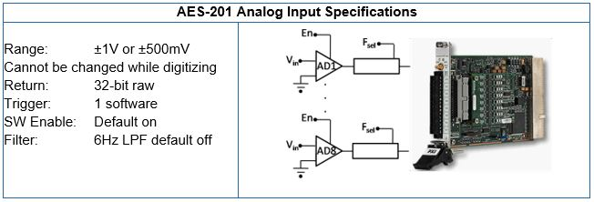 
**Figure: AES-201**

**Do we need a custom device?**
Our customer requires 32-bits of resolution for their RT test system. This is the only PXI digitizer that fulfills this requirement. After checking with NI.com and the manufacturer, we found no custom device exists for the AES-201, so we determine that a new custom device is necessary.

**What are the risks?**
The AES-201 ships with a hardware driver that’s compatible with LabVIEW Real-Time and a LabVIEW API. We have a real-time desktop target that’s identical to our customer’s platform. At our request, the customer has provided their model dll, so we can test and benchmark on a system very similar to our customer’s system.

**Implementation**

Based on the AES-201, we create the following specifications.

•	Eight output channels ADDataFromCh<1..8> 
•	Nine input channels ADEnCh<1..8>, SWTrig 
•	Nine properties: FilterEn<1..8> and Range 
•	We will use a nested two-level hierarchy 
•	We plan to override the default channel page for ADDataFromCh<1..8> but we’ll use the default page for everything else. We’ll create a few extra pages just to be safe. 
•	To avoid FIFO latency, we’ll use the Hardware Inline custom device. 

### Build the Template Project

Open <vi.lib>\NI Veristand\Custom Device Tools\Custom Device Template Tool\Custom Device Template Tool.vi. Configure the front panel to generate a LabVIEW Project for the AES-201 custom device and then run the VI.
 
The Custom Device Template Tool puts the new LabVIEW Project in a sub folder inside the target folder (A). The name of the custom device (B) is also the name of the sub folder. That is, you don’t have to specify a sub folder for your device because the tool makes one for you. Select the type of custom device from the Execution Mode control (C). We’ll only need one extra page, but we’ll create several just in case requirements change (D).

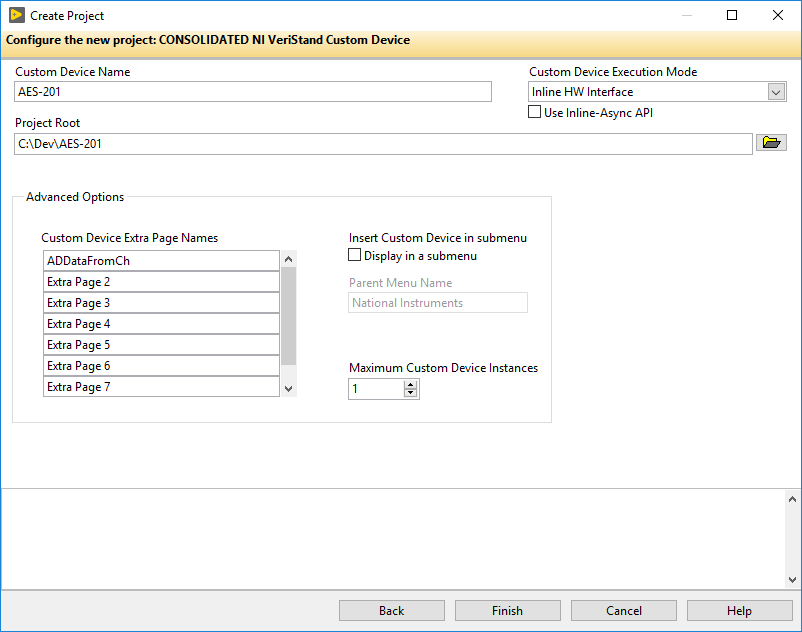 

### Build the Configuration

Now we’ll modify the LabVIEW Project VIs generated by the Custom Device Template Tool. We’ll start with AES-201 Initialization.vi. In the initialization VI, we’ll build-up the default channel list. You’ve already seen **[Add Custom Device Channel VI](https://zone.ni.com/reference/en-XX/help/372846M-01/veristandmerge/vs_add_custom_device_channel_vi/)**.

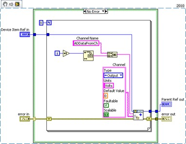 
 
Add a Boolean property to each channel using **[Set Item Property](https://zone.ni.com/reference/en-XX/help/372846M-01/veristandmerge/vs_set_item_property_vi/)**. The property will indicate the state of the filter on the channel.	

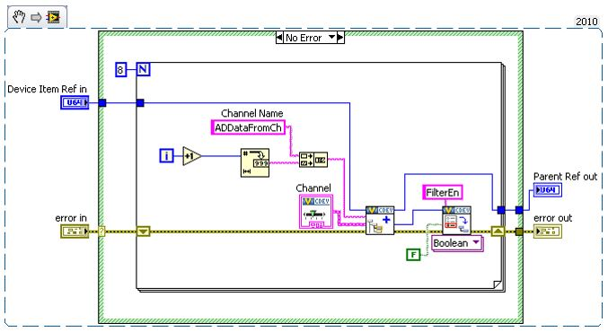

It’s good practice to use **[Global Variables](https://zone.ni.com/reference/en-XX/help/371361R-01/lvconcepts/glob_variables/)** or **[enum type definitions](https://zone.ni.com/reference/en-XX/help/371361R-01/lvhowto/creating_type_defs/)** for any constants that will be reused throughout the custom device.
Replace the string constant with a global variable that has the same default value as the constant. Add the global variable to the custom device lvlib in the LabVIEW Project.	

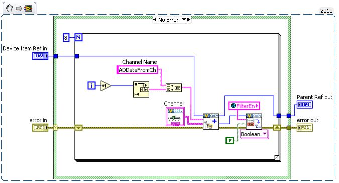

We want to override the default channel page so we can add a control to the page that allows the operator to set the filter. We created an extra page called ADDataFromCh.vi for this purpose. Look in the custom device XML and find the GUID associated with the extra page. While you’re at it, change the glyph for the custom channel page to default fpga channel.

<Page>
<Name>
<eng>ADDataFromCh</eng>
<loc>ADDataFromCh</loc>
</Name>
<GUID>8AB4F65B-85C9-6BD6-B869-680C60278524</GUID>
<Glyph>
<Type>To Application Data Dir</Type>
<Path>System Explorer\Glyphs\default fpga channel.png</Path>
</Glyph>
<Item2Launch>
<Type>To Common Doc Dir</Type>
<Path>Custom Devices\AES-201\AES-201 Configuration.llb\ADDataFromCh.vi</Path>
</Item2Launch>
</Page>
<Page>

Operators are used to having channels associated with that glyph. Likewise, change the glyph of the main page to daq device.
 
Add the GUID to the global variable. Wire the global into the GUID terminal of **[Add Custom Device Channel](https://zone.ni.com/reference/en-XX/help/372846M-01/veristandmerge/vs_add_custom_device_channel_vi/)**. This associates the channel with the VI.

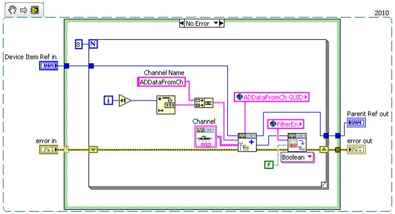

Now when the operator clicks on ADDataFromCh<1..8> in the configuration tree, ADDataFromCh.vi runs as a sub panel in System Explorer instead of the default channel page. 

From here-on, we’ll set properties when we create the item rather than using the **[Set Item Property VI](https://zone.ni.com/reference/en-XX/help/372846M-01/veristandmerge/vs_set_item_property_vi/)** to set them on the item reference.

Now that we’ve linked the channels to the extra page, we’ll make edits to the extra page, ADDataFromCh.vi. In the Initialization frame, we’ll add code to display the channel information.

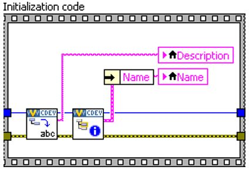

Operators are used to seeing channel data when they click on a channel, so we want to preserve that experience. If the device is a channel, we’ll send the channel data to an indicator on the front panel.

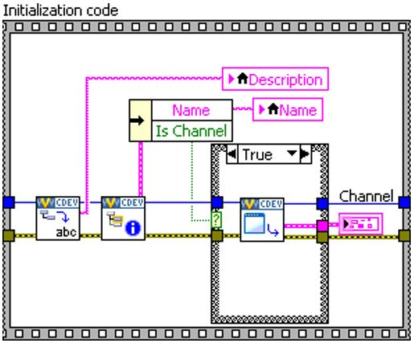

It’s good practice to use the Boolean outputs from functions in the API to make sure that you’re operating on a valid reference.

In this case, we’ll only retrieve the channel data if we have a valid channel reference. Another option is to specify the default property value. The default property value is returned if the
property is not found. Using the default property value does not set the property.

Notice how the initialization frame reads the name and description from the device reference.

Do the same thing for the FilterEn property so the operator can see the state of the channel’s filter setting. NI VeriStand is responsible for passing the correct channel reference to our custom device, and storing state data for all the controls and indicators. The developer is responsible for acting on the reference and displaying the state.

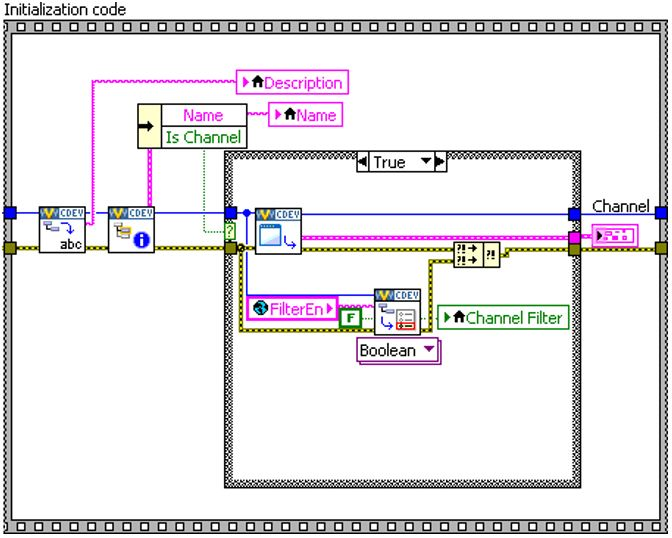

Add a Boolean control to the front panel called **Channel Filter**. Create a case in the Event Structure for the control’s value change. If the FilterEn property is found, set the property according to the value of the control. If the FilterEn property is not found, show a dialog box with debugging information. 

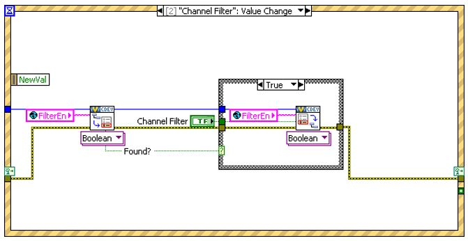

If the operator does not change this control, the property is never created. There are several ways around this. You could initialize the property in the Initialization VI, or you can assume a default value when you read the property.

Remember, this VI runs on the host computer, so we can launch a pop- up dialog box to assist with debugging.

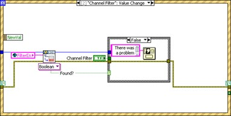

Now we’ll build a subVI that creates channels so we can reuse it for the enable channels.

Add the default channel GUID to the global variable. You can get it from the front panel of **[Add Custom Device Channel](https://zone.ni.com/reference/en-XX/help/372846M-01/veristandmerge/vs_add_custom_device_channel_vi/)**.

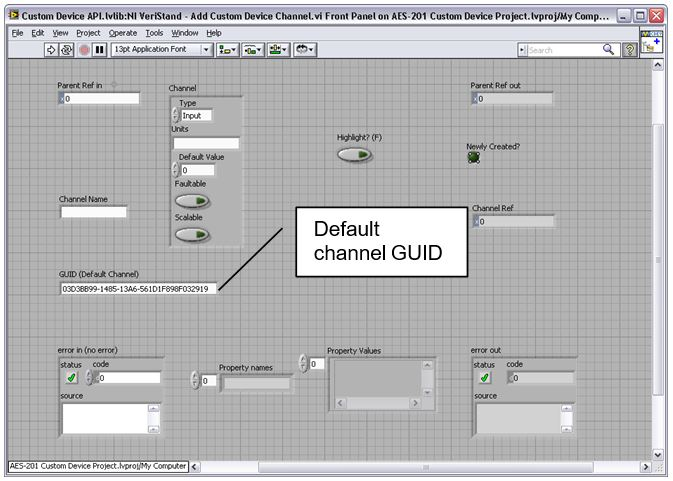

Here it is for your reference:
03D3BB99-1485-13A6-
561D1F898F032919.

If the **Override Default Channel?** terminal of our subVI is true, the VI takes a GUID from the caller. If not, the VI uses the default channel GUID.

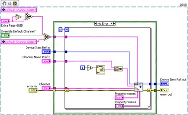

Notice how properties are set from the **[Add Custom Device Channel VI](https://zone.ni.com/reference/en-XX/help/372846M-01/veristandmerge/vs_add_custom_device_channel_vi/)** directly. You can use this subVI in many custom device projects.
 
Custom devices execute as reentrant on the execution host. This enables the operator to run multiple independent instances of the same custom device. Consider the case if the operator has several AES-201 cards. Be sure to enable **Reentrant execution** from the subVI’s File » **[VI Properties](https://zone.ni.com/reference/en-XX/help/371361R-01/lvdialog/vi_properties_dialog_box/)** » **[Execution](https://zone.ni.com/reference/en-XX/help/371361R-01/lvdialog/execution/)** category to preserve this capability. See **[LabVIEW Help](https://zone.ni.com/reference/en-XX/help/371361R-01/)** » **[Fundamentals](https://zone.ni.com/reference/en-XX/help/371361R-01/TOC5.htm)** » **[Managing Performance and Memory](https://zone.ni.com/reference/en-XX/help/371361R-01/TOC89.htm)** » **[Concepts](https://zone.ni.com/reference/en-XX/help/371361R-01/TOC90.htm)** » **[Suggestions for Using Execution Systems and Priorities](https://zone.ni.com/reference/en-XX/help/371361R-01/lvconcepts/suggestions_for_exec/)** from Multiple Places for more information about reentrant VIs.

The final Initialization VI creates two sections. The Hardware Inputs section has eight output channels. The Hardware Enables section has eight input channels. We also create an input channel for the software trigger.

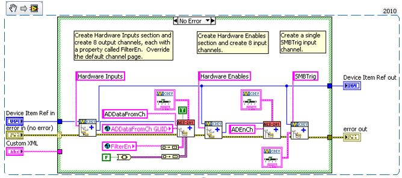

Now that the initialization routine is done, we’ll turn our attention to the main page. We’ll use a type definition combo box to set the range of the AES-201. Add the type definition to the custom device lvlib.

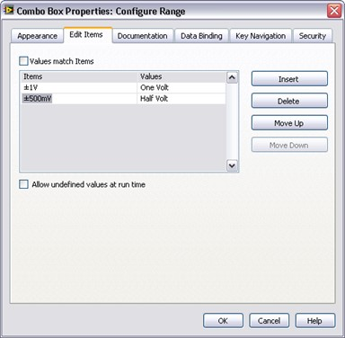

Modify the main page so the operator can set the range of the device. You don’t have to override the main page with a custom page; you can simply modify the main page directly.

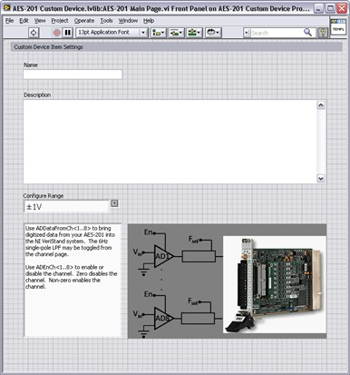

Add another string to the global variable for the Range property.

Add an event case to the main page that sets the range property when the operator changes the value of
the control.

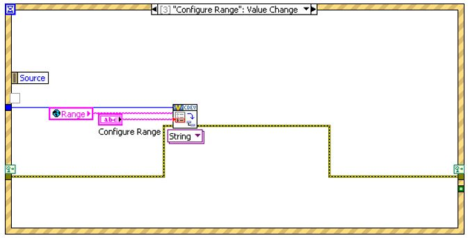
 
The engine will need some way to know how to address the board. Add another control so the operator can configure a Resource Number.

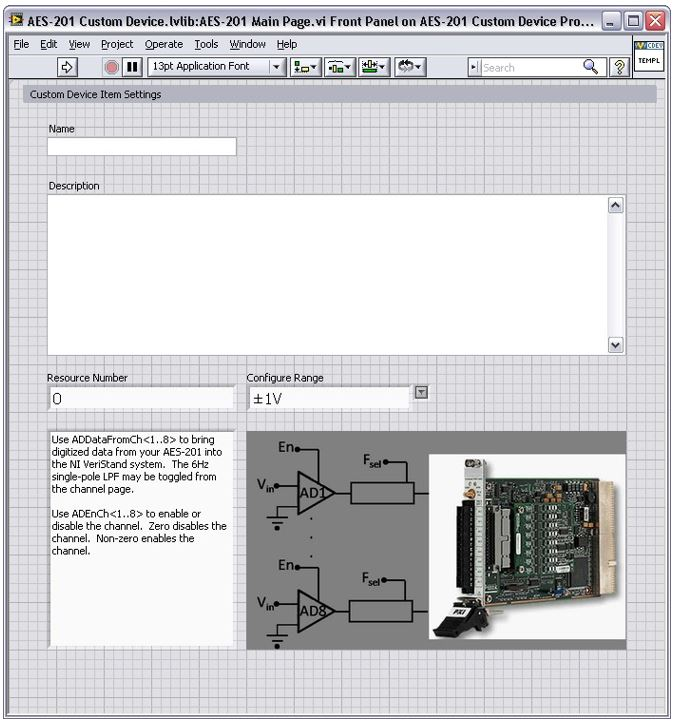

Many developers have asked for MAX integration/auto-discovery so the operator doesn’t have to enter resource names manually. As of NI VeriStand 2010 this functionality does not exist. You can write your own discovery routine that populates available resources, or you can allow the operator to enter the resource name manually.

Add the event case to set the resource number property.

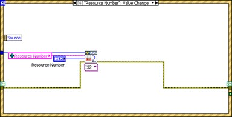
 
Read the device’s resource name and range into the corresponding controls in the initialization frame, the same as you did for the extra channel page’s filter property.

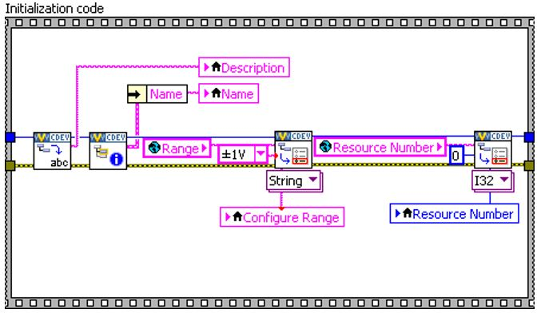

Remember, NI VeriStand stores state and provides the correct reference; the developer acts on the reference and modifies the state.

Build the custom device and inspect the hierarchy, sections, channels, main page and extra pages. Now we’ll turn our attention to the RT
Driver.

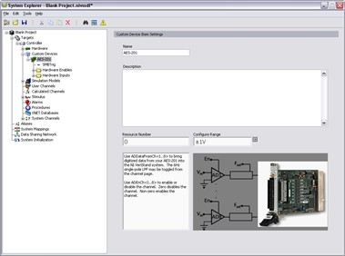

### Build the Driver

The AES-201 comes with a simple LabVIEW API. We’ll use the API to build the RT driver portion of the custom device.

 
Functions in the API call into the hardware dll. This is typical of a LabVIEW API. This paradigm requires the developer to post the dll to the execution host.

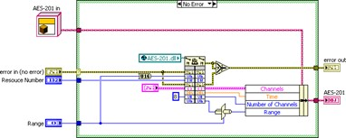

Modify the custom device to package the dll with the custom device and deploy it to the execution host.

### Add Custom Device Dependencies

Shared libraries are typically .dll files on Windows/PharLap operating systems and .out files on VxWorks systems. If you’re building a custom device for a Compact RIO execution host, you’ll be working with .out files. 

There are two parts to packaging dependencies. The first part is to incorporate the dependency into the LabVIEW Project.

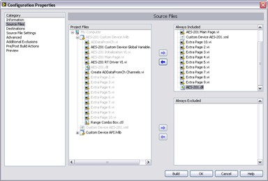

Add the dll to the custom device LabVIEW library.

Modify the configuration’s **[source distribution](https://zone.ni.com/reference/en-XX/help/371361R-01/lvdialog/source_distrib_db/)** by adding the dll to the **[Always Included](https://zone.ni.com/reference/en-XX/help/371361R-01/lvdialog/source_file_distrib_page/)** list.
 
Note the location of the Support Directory. In this case it’s C:\Documents and Settings\All Users\Documents\National Instruments\NI VeriStand xxxx\Custom Devices\AES- 201\Data.

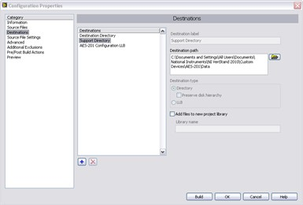

Set the destination directory for the dll to the Support Directory.

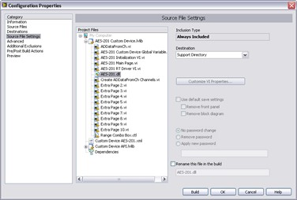

Now when you build the configuration, LabVIEW sends the dll to the support directory.

The second part in packaging dependencies is to incorporate the dependency into the custom device. Use **[Add Custom Device Dependencies](https://zone.ni.com/reference/en-XX/help/372846M-01/veristandmerge/vs_add_custom_device_dependencies_vi/)** to deploy the library to the execution host.

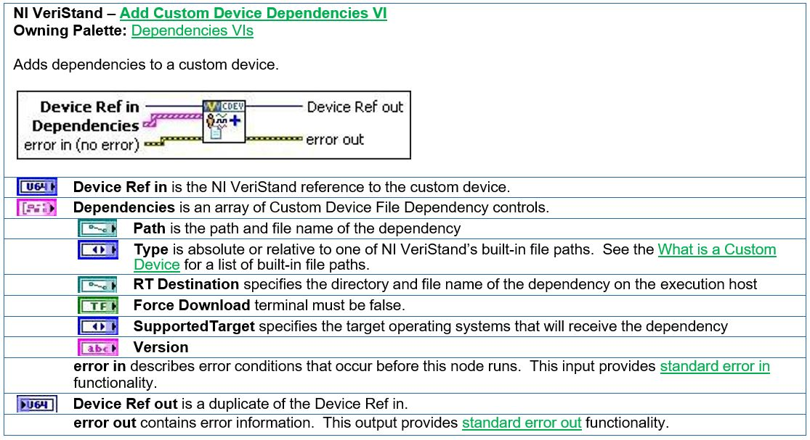

There are several other VIs in the NI VeriStand Dependencies VIs palette that operate on custom device dependencies. These functions do what you’d expect given their names.
•	**[Dependencies VIs](https://zone.ni.com/reference/en-XX/help/372846M-01/veristandmerge/vs_dependencies_vis_pal/)** » **[Get Custom Device Dependencies](https://zone.ni.com/reference/en-XX/help/372846M-01/veristandmerge/vs_get_custom_device_dependencies_vi/)**
•	**[Dependencies VIs](https://zone.ni.com/reference/en-XX/help/372846M-01/veristandmerge/vs_dependencies_vis_pal/)** » **[Reset Custom Device Dependencies](https://zone.ni.com/reference/en-XX/help/372846M-01/veristandmerge/vs_reset_custom_device_dependencies_vi/)**

Add the custom device dependency to the Initialization VI.

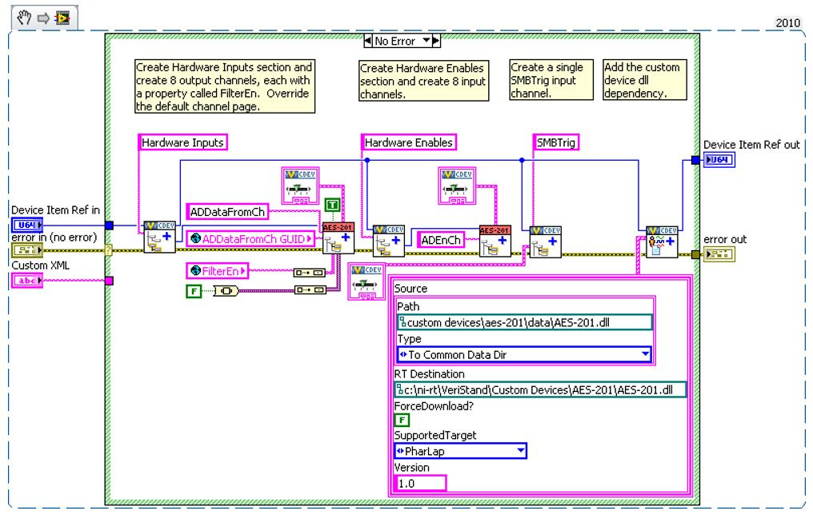
 
As a result, the Initialization VI adds the dll to the project’s dependency list when it runs.

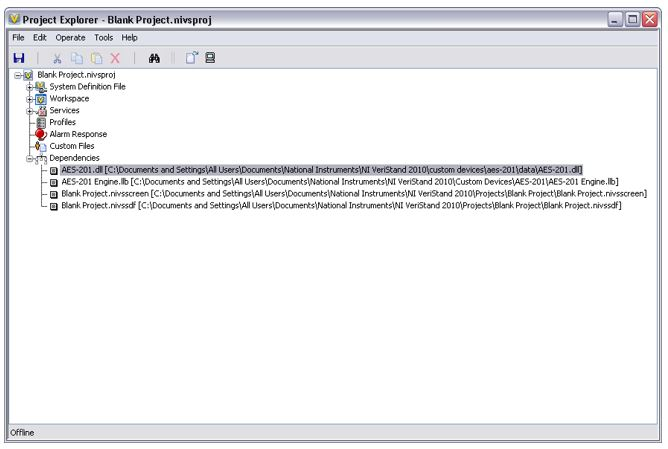

You must have some way to direct the engine to the dll on the execution host. One way is to deploy the dll to a folder in RT’s search path (C:\ni-rt\system by default).

A better way is to use a global variable that points to the absolute path of the dll on the execution host

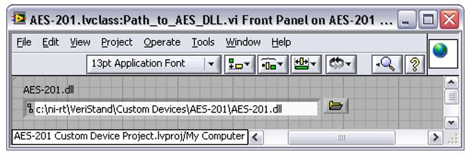

Deploy the dll to **C:\ni-rt\VeriStand\Custom Devices\<Custom Device Name>\<library>.dll**. This is more maintainable.

Read the range and resource number properties from the custom device reference. Recall that you must read the property from the correct item, and we set these properties to the top-level device reference. Call the AES-201 API to initialize the board according to the property values.
 
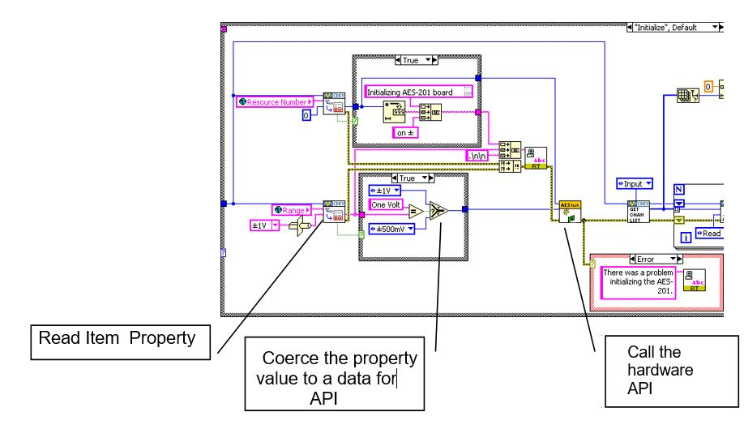
 
Remember, if the operator didn’t trigger the event to set the property, there won’t be a property to read. Instead of throwing an error, default to the value of your choice and call the API accordingly.

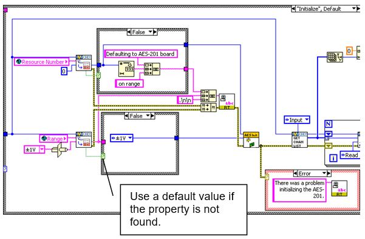

It might be nice to tell the operator what’s going on. Print a few strings to the console.

The inline HW custom device uses a feedback node to pass state data between states. Add the AES-201 state data to the feedback node’s cluster. If you’re not familiar with LabVIEW Objects, it’s sufficient to know that this LabVIEW object represents all the state data needed to use the AES-201 in subsequent states

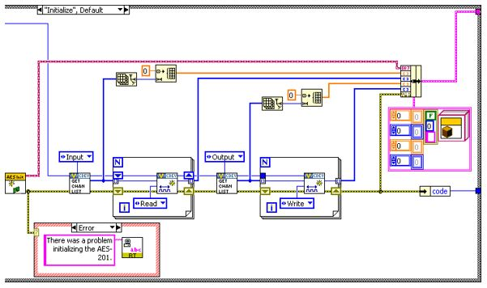

Add the input and output channel references to the state data cluster.

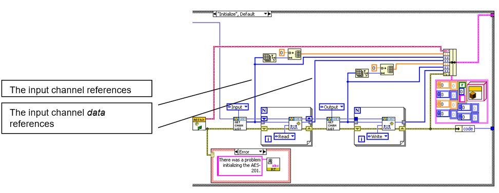
 
The output channels are for ADDataFromCh<1..8>. Check the filter property on each output channel reference and call the AES-201 API to set the filter accordingly.

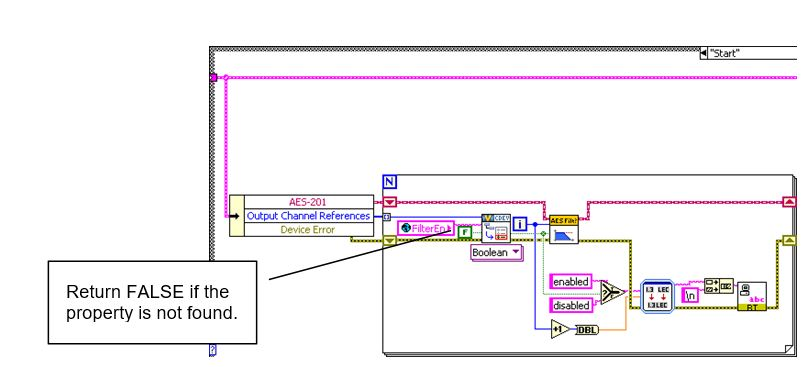

After the custom device has been configured and deployed, NI VeriStand will no longer exchanged property information between the host computer and execution host. Since we implemented the filter as a property, we’ll call the AES-201 API in the Start case. If the operator wants to toggle the filter, he must reconfigure the device in System Explorer.

Now that we’ve configured the hardware, we’ll request an A/D sample. For this custom device, the Read Data from HW case is nicely suited for this operation.

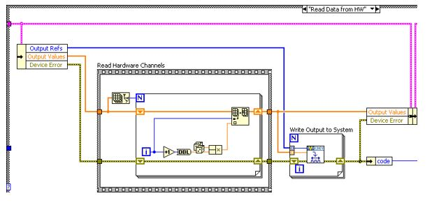

Replace the Read Hardware Channels frame with the API call to digitize. Convert the 32-bit raw data to DBL data depending on the range of the AES-201.

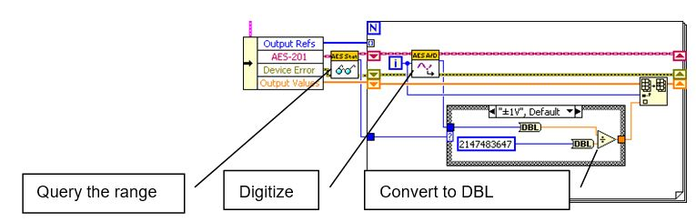

Send the channel data to the rest of the NI VeriStand system by writing to the Output Reference.

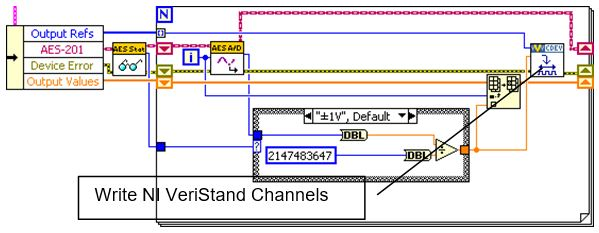
 
For flat hierarchies, the reference array corresponds one-to-one with channels as they were created on the host computer. In other words, the first channel created is the 0’th element of the array.

For non-flat hierarchies, the reference array corresponds top-down and one-to-one with channels as they were created. In other words, channels at the highest level of the hierarchy appear first in the array, then subsequent levels channels appear in the array in the order they were created.

Robust custom devices do not depend on any particular order of channel references. Unique properties or GUIDs should be used to ensure the driver VI operates on the correct channel.

The AES-201 inputs are enabled by default. Build the custom device, enable filtering on all channels, add it to a new system definition and deploy the project.

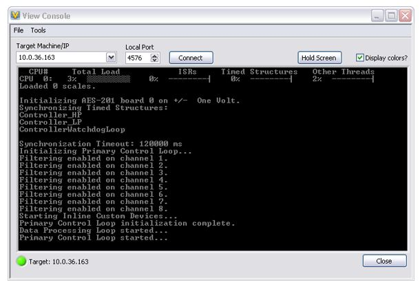

You should see messages on the console indicating the non-default configuration. This is a good sanity check.

Map the ADDataFromCh<1..8> channels to a simple graph and make sure they display the expected signals.

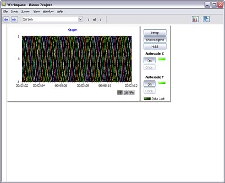

Now we’ll process the software enable channels. For this custom device, the Write Data to HW case is nicely suited.

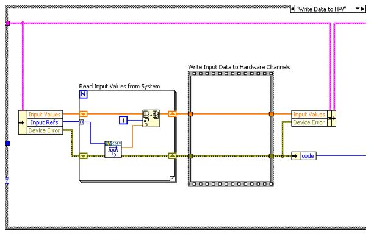

The SWTrig channel is higher than the ADEnCh<1..8> input channels in the hierarchy; even though it was created last, it’s the first channel in the input channel reference array. We’ll skip the SWTrig channel reference for now, and read the 8 enable channels.

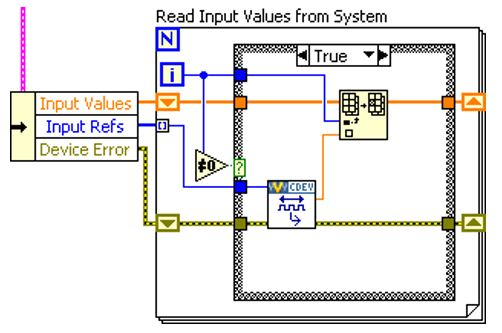

Make a call to the AES-201 only if the enable channel value has changed. Enable the hardware channel if the NI VeriStand channel does not equal zero.

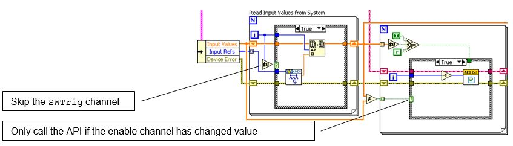

### Channel Change Detection

You can build change detection into the custom device engine so it doesn’t perform actions if the data hasn’t changed. This will cause differing execution times depending on data. Some may consider this **[jitter](https://zone.ni.com/reference/en-XX/help/370715P-01/lvrtconcepts/builddeterapps_rt/)**; but it isn’t the literal sense of the word unless the code fails to meet determinism requirements. And as long as you don’t fail a requirement, saving time is never bad.

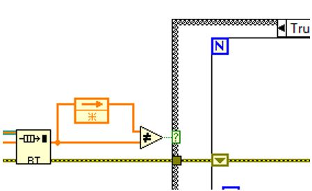

**Figure: Simple Change Detection**	

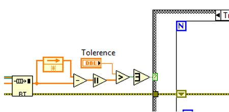

**Figure: Change Detection with Tolerance**

There are a variety of methods for doing change detection. We’ll briefly discuss two methods. Simple change detection can fail due to floating point precision issues. Change detection with tolerance works-around the precision issues. Make sure to use tolerances that avoid false triggers.

Rebuild the device and add 8 Boolean controls to the workspace. Map each control to the corresponding ADEnCh<1..8> channel.

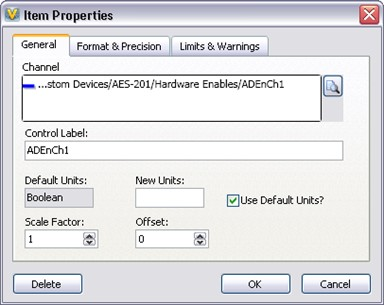

You should now be able to toggle the channels on and off from the workspace. In this contrived example, disabled channels hold the last sample.

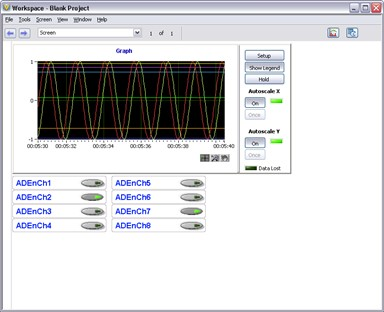

Since we thoroughly planned the AES-201 custom device before we started writing code, it was fairly straightforward to implement the device. Planning is key. The next section of the document will cover some debugging and benchmarking techniques.
