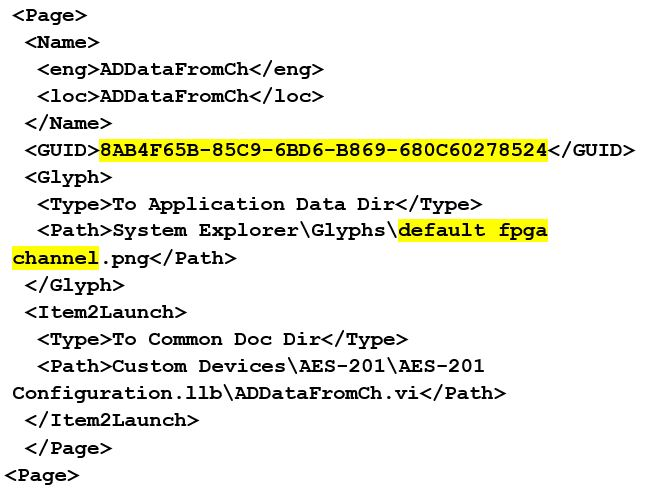

## Implementing a Custom Device

We will now walk through the implementation of a hypothetical third-party custom device for the AES-201. This example will focus on the custom device process. For more information on programming the custom device, refer to **[Building a Custom Device](https://www.ni.com/documentation/en/veristand/latest/manual/custom-device-build/)**.

The specifications of this custom device are displayed in the following image.

### Determine Custom Device Feasibility

Before we begin, let us consider the customer needs, analyze any risks, and create specifications for the custom device.

#### Customer Needs

Our customer requires 32-bits of resolution for their real-time (RT) test system. This is the only PXI digitizer that fulfills their requirements. After checking with NI.com and the manufacturer, we did not find an existing AES-201 custom device. We determine that a new custom device is necessary.

#### Risk Analysis
The AES-201 ships with a hardware driver that’s compatible with LabVIEW Real-Time and a LabVIEW API. We have a real-time desktop target that is identical to our customer’s platform. At our request, the customer has provided their model DLL. This will allow us to test and benchmark on a similar structure to our customer's system.

#### Development Specifications
Based on the AES-201, we create the following specifications.

* Have eight output channels: *ADDataFromCh<1..8>*.
* Have nine input channels: *ADEnCh<1..8>*, *SWTrig*.
* Have nine properties: *FilterEn<1..8>* and *Range*.
* Use a nested two-level hierarchy.
* Override the default channel page for *ADDataFromCh<1..8>*.
* Use the default page for everything else.   **Note:** We only need one extra page, but we will create several just in case requirements change.
* Use the Hardware Inline custom device to avoid FIFO latency.

### Build the Template Project

We will begin by building a template project.

1. Open the [niveristand-custom-device-wizard](https://github.com/ni/niveristand-custom-device-wizard/releases) from LabVIEW by navigating to **Create Project** » **NI VeriStand** » **CONSOLIDATED NI VeriStand Custom Device**.
1. Enter the **Custom Device Name**.   This will serve as the sub folder name.
1. Select the **Custom Device Execution Mode**.
1. Select the **Project Root**.   The wizard creates the new LabVIEW Project in a sub folder inside the project root. We do not need to specify a sub folder for the device because the wizard creates one.
1. Click **Finish**.

The following image displays a configured wizard that will generate a LabVIEW Project for the AES-201 custom device.

### Build the Configuration

We will now modify the LabVIEW Project VIs generated by the niveristand-custom-device-wizard.

#### Edit the Initialization VI

We will start by opening the Initialization VI. Locate the VI by navigating to **AES-201 System Explorer.lvlib** » **System Explorer** » **Dynamically Called**. In the initialization VI, we will build-up the default channel list. For more information, refer to [Add Custom Device Channels and Waveforms](https://www.ni.com/documentation/en/veristand/latest/manual/custom-device-add-channel-waveforms/).

Add a Boolean property to each channel. This property will indicate the state of the filter on the channel. For more information, refer to [Adding Custom Device Item Properties](https://www.ni.com/documentation/en/veristand/latest/manual/custom-device-add-item-properties/).

Replace the string constant with a global variable that has the same default value as the constant. Use the global variable *Constants.vi* by navigating to **&lt;Custom Device Name&gt; Shared.lvlib** » **Shared**.

**Note:** You should use [global variables](https://zone.ni.com/reference/en-XX/help/371361R-01/lvconcepts/glob_variables/) or [enum type definitions](https://zone.ni.com/reference/en-XX/help/371361R-01/lvhowto/creating_type_defs/) for any constants that will be reused throughout the custom device.

#### Override the Default Page

We want to override the default channel page to add a control that allows the operator to set the filter. We created an extra page called *ADDataFromCh.vi* for this purpose.

Open the custom device XML to find the GUID associated with the extra page. You should update the glyph of the channel page to *default fpga channel*. Operators are used to having channels associated with this glyph.

**Note:** You can also change the glyph of the main page to *daq device*.

Add the GUID to the global variable and wire the global into the GUID terminal of **[Add Custom Device Channel](https://zone.ni.com/reference/en-XX/help/372846M-01/veristandmerge/vs_add_custom_device_channel_vi/)**. This will associate the channel with the VI.

When the operator clicks on **ADDataFromCh<1..8>** in the configuration tree, *ADDataFromCh.vi* runs as a sub panel in System Explorer instead of the default channel page.

From here-on, we will set properties when we create the item rather than using the [Set Item Property VI](https://zone.ni.com/reference/en-XX/help/372846M-01/veristandmerge/vs_set_item_property_vi/) to set them on the item reference.

#### Edit the Extra Page

Now that we have linked the channels to the extra page, we will make edits to the extra page, *ADDataFromCh.vi*. In the Initialization frame, we will add code to display the channel information.

Operators are used to seeing channel data when they click on a channel. If the device is a channel, we will send the channel data to an indicator on the front panel.

You should use the Boolean outputs from functions in the API to make sure that you are operating on a valid reference. In this case, we will only retrieve the channel data if we have a valid channel reference.

Another option is to specify the default property value. The default property value is returned if the property is not found. Using the default property value does not set the property.

The initialization frame will read the name and description from the device reference. Do the same thing for the FilterEn property so the operator can see the state of the channel’s filter setting.

VeriStand is responsible for passing the correct channel reference to the custom device and storing state data for all the controls and indicators. The developer is responsible for acting on the reference and displaying the state.

Add a Boolean control to the front panel called *Channel Filter*. Create a case in the Event Structure for the control’s value change. If the FilterEn property is found, set the property according to the value of the control. If the FilterEn property is not found, show a dialog box with debugging information.

If the operator does not change this control, the property is never created. To rectify this, you can initialize the property in the Initialization VI or you can assume a default value when you read the property.

Remember, this VI runs on the host computer. We can launch a pop-up dialog box to assist with debugging.

Now we will build a subVI that creates channels so we can reuse it for the enabled channels.

Add the default channel GUID to the *Constants.vi*. You can get the GUID from the front panel of **[Add Custom Device Channel](https://zone.ni.com/reference/en-XX/help/372846M-01/veristandmerge/vs_add_custom_device_channel_vi/)**.

For reference, the GUID is `03D3BB99-1485-13A6-561D1F898F032919`.

If the **Override Default Channel?** terminal of our subVI is true, the VI takes a GUID from the caller. If not, the VI uses the default channel GUID.

The properties are set from the **[Add Custom Device Channel VI](https://zone.ni.com/reference/en-XX/help/372846M-01/veristandmerge/vs_add_custom_device_channel_vi/)** directly. You can use this subVI in many custom device projects.

#### Allow Simultaneous Calls to the Same Extra Page

Custom devices execute as reentrant on the target. This enables the operator to run multiple independent instances of the same custom device. This would be useful if the operator has several AES-201 cards.

To preserve this capability, enable **Preallocated clone reentrant execution** from the subVI by navigating to **File** » **[VI Properties](https://zone.ni.com/reference/en-XX/help/371361R-01/lvdialog/vi_properties_dialog_box/)** » **[Execution](https://zone.ni.com/reference/en-XX/help/371361R-01/lvdialog/execution/)**. For more information, refer to the LabVIEW Help and navigate to **Fundamentals** » **Managing Performance and Memory** » **Concepts** » **[Reentrancy: Allowing Simultaneous Calls to the Same SubVI](https://zone.ni.com/reference/en-XX/help/371361R-01/lvconcepts/reentrancy/)**.

#### Final Initialization VI

The final Initialization VI creates two sections.
1. Hardware Inputs, with eight output channels.
1. Hardware Enables, with eight input channels.  **Note:** We will also create an input channel for the software trigger.

#### Configure the Main Page

Now that the initialization routine is complete, we should configure the main page. We will use a type definition combo box to set the range of the AES-201. Add the type definition to the *AES-201 System Explorer.lvlib*.

Modify the main page so the operator can set the range of the device.

**Note** You do not have to override the main page with a custom page. You can modify the main page directly.

Add another string to the global variable for the range property.

Add an event case to the main page that sets the range property when the operator changes the value of the control.

The engine will need to know how to address the board. Add another control so the operator can configure the **Resource Number**.

Add to the event case to set the resource number property.

Read the device’s resource name and range into the corresponding controls in the initialization frame similarly to the extra channel page’s filter property.

#### Build the Final Configuration

Build the custom device and inspect the hierarchy, sections, channels, main page, and extra pages.

### Build the Driver

The AES-201 comes with a simple LabVIEW API. We will use the API to build the RT driver portion of the custom device.

Functions in the API call into the hardware DLL. This is typical of a LabVIEW API. This paradigm requires the developer to post the DLL to the execution host.

Modify the custom device to package the DLL with the custom device and deploy it to the execution host.

### Add Custom Device Dependencies

Shared libraries are typically *.dll* files on Windows operating systems and *.so* files on Linux systems. If you’re building a custom device for a PXI target, you will be working with *.so* files.

There are two parts to packaging dependencies. First, you need to incorporate the dependency into the LabVIEW Project.

Add the DLL to the custom device LabVIEW library.

Modify the configuration’s **[Source Distribution](https://zone.ni.com/reference/en-XX/help/371361R-01/lvdialog/source_distrib_db/)** by adding the DLL to the **[Always Included](https://zone.ni.com/reference/en-XX/help/371361R-01/lvdialog/source_file_distrib_page/)** list.

Be sure to note the location of the support directory. In this case it’s `C:\Documents and Settings\All Users\Documents\National Instruments\NI VeriStand 2018\Custom Devices\AES- 201\Data`.

Set the destination directory for the DLL to the support directory.

When you build the configuration, LabVIEW sends the DLL to the support directory.

The second part to packaging dependencies is in incorporating the dependency into the custom device. Use the **[Add Custom Device Dependencies VI](https://zone.ni.com/reference/en-XX/help/372846M-01/veristandmerge/vs_add_custom_device_dependencies_vi/)** to deploy the library to the execution host.

There are several other VIs in the VeriStand Dependencies VIs palette that operate on custom device dependencies. They can be found by navigating to the following locations.
*	**Dependencies VIs** » **[Get Custom Device Dependencies](https://zone.ni.com/reference/en-XX/help/372846M-01/veristandmerge/vs_get_custom_device_dependencies_vi/)**
*	**Dependencies VIs** » **[Reset Custom Device Dependencies](https://zone.ni.com/reference/en-XX/help/372846M-01/veristandmerge/vs_reset_custom_device_dependencies_vi/)**

Add the custom device dependency to the Initialization VI.

As a result, the Initialization VI adds the DLL to the project dependency list while running.

You must direct the engine to the *.so* file on the target. Use either of the following methods.

* Deploy the *.so* file to a folder in RT’s search path. By default, the path is `C:\ni-rt\system`.
* **(Recommended)** Use a global variable that points to the absolute path of the DLL on the target.

For ease of maintenance, deploy the *.so* file to `C:\ni-rt\VeriStand\Custom Devices\<Custom Device Name>\<library>.so`.

Read the range and resource number properties from the custom device reference. Recall that you must read the property from the correct item and that we set these properties to the top-level device reference.

Call the AES-201 API to initialize the board according to the property values.

If the operator didn’t trigger the event to set the property, there won’t be a property to read. Instead of throwing an error, default to the value of your choice and call the API accordingly.

**Note:** You should print a few strings to the console to tell the operator what is happening.

The inline HW custom device uses a feedback node to pass state data between states. Add the AES-201 state data to the feedback node’s cluster.

This LabVIEW object represents all the state data needed to use the AES-201 in subsequent states.

Add the input and output channel references to the state data cluster.

The output channels are for *ADDataFromCh<1..8>*. Check the filter property on each output channel reference and call the AES-201 API to set the filter accordingly.

After the custom device has been configured and deployed, VeriStand will no longer exchange property information between the host computer and execution host.

Since we implemented the filter as a property, we will call the AES-201 API in the **Start** case. If the operator wants to toggle the filter, they must reconfigure the device in System Explorer.

After configuring the hardware, we will request an A/D sample. For this custom device, the read data from hardware case will be useful for this operation.

Replace the Read Hardware Channels frame with the API call to digitize. Convert the 32-bit raw data to DBL data, depending on the range of the AES-201.

Send the channel data to the rest of the VeriStand system by writing to the Output Reference.

For flat hierarchies, the reference array corresponds one-to-one with channels. This is because they were created on the host computer. The first channel created is the 0th element of the array.

For non-flat hierarchies, the reference array corresponds top-down and one-to-one with channels as they were created. Channels at the highest level of the hierarchy appear first in the array, then subsequent levels channels appear in the order they were created.

Robust custom devices do not depend on any particular order of channel references. Unique properties or GUIDs should be used to ensure the driver VI operates on the correct channel.

By default, the AES-201 inputs are enabled. You must build the custom device, enable filtering on all channels, add it to a new system definition, and deploy the project.

Check the console for messages to determine if the non-default configuration is active. You should also map the *ADDataFromCh<1..8>* channels to a simple graph to ensure they display the expected signals.

Now we will process the software enable channels. For this custom device, the *Write Data to HW* case is useful.

The *SWTrig* channel is higher than the *ADEnCh<1..8>* input channels in the hierarchy. Even though *SWTrig* was created last, it is the first channel in the input channel reference array.

We will skip the *SWTrig* channel reference for now and read the eight enable channels.

Make a call to the AES-201 only if the enable channel value has changed. Enable the hardware channel if the VeriStand channel does not equal zero.

### Channel Change Detection

You can build change detection into the custom device engine so it does not perform actions if the data has not changed. This will cause differing execution times depending on data.

**Note:** This is not considered [jitter](https://zone.ni.com/reference/en-XX/help/370715P-01/lvrtconcepts/builddeterapps_rt/) unless the code fails to meet determinism requirements.

There are a variety of change detection methods. We will briefly discuss two of them. They are simple change detection and change detection with tolerance.

The following LabVIEW code is an example of simple change detection.

Simple change detection can fail due to floating point precision issues. Change detection with tolerance avoids these precision issues. You should use tolerances that avoid false triggers.

The following LabVIEW code is an example of change detection with tolerance.

Rebuild the device and add eight Boolean controls to the workspace. Map each control to the corresponding *ADEnCh<1..8>* channel.

You should now be able to toggle the channels on and off from the workspace. In this example, disabled channels hold the last sample.

Planning is very important. Because we thoroughly planned the AES-201 custom device before we started writing code, it was fairly straightforward to implement.
