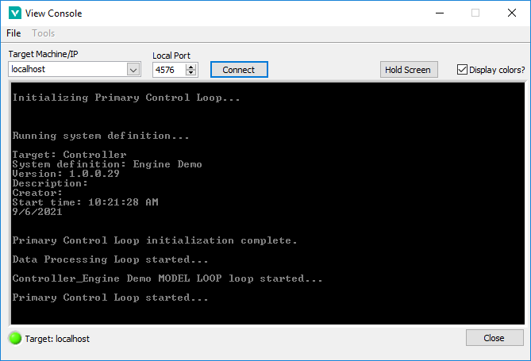
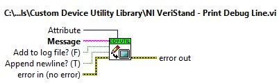
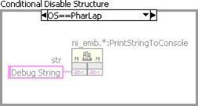

### Debugging and Benchmarking

Debugging and benchmarking is a normal process of code development. There are a variety of ways to debug and benchmark custom devices.

#### LabVIEW Debugging Techniques

Custom devices are written in LabVIEW code. Therefore it’s possible to develop, test and debug in LabVIEW before running the Custom Device Template Tool. In other words, you can use **[LabVIEW’s built-in debugging techniques](https://www.ni.com/en-us/support/documentation/supplemental/12/debugging-techniques-in-labview.html)** during development; and merge the LabVIEW code into the custom device framework after it matures.

Since the custom device is one of many parts of the system definition, the behavior of the LabVIEW code within the custom device framework will likely differ from the stand-alone LabVIEW application, especially in regards to timing. As a result, you should benchmark the custom device inside of the VeriStand Engine.
Once added to the system definition, custom devices have been fully integrated into VeriStand’s context. As a result, LabVIEW’s built-in debugging techniques are no longer available. Several techniques are available for debugging and benchmarking the custom device.
 
#### Console Viewer

A subcomponent of VeriStand RT Engine is the RT Console Viewer.
You can install it to the execution host using Measurement and Automation Explorer. When installed, the component runs a small UDP daemon allowing the operator to view the console from a utility called the RT Console Viewer. You can access the RT Console viewer from **VeriStand » Workspace » Tools » Console Viewer**.	



**Figure: RT Console Viewer**

The Console Viewer will show the system definition and the resulting CPU usage. The viewer is also useful for displaying debugging messages. The console viewer provides a periodic snapshot of utilization. CPU spikes and transients will probably be unobservable. If the system is very busy, it may not update the console viewer at all. You can use other debugging methods for a more accurate indication of resource utilization.

As the name implies, the RT Console viewer is only available on real-time targets. The RT Console Viewer is also available as a stand-alone add-on to LabVIEW Real-Time. See **[NI Developer Zone Tutorial: Remotely View Console Output of Real-Time Targets](https://knowledge.ni.com/KnowledgeArticleDetails?id=kA03q000000x4TjCAI&l=en-US)** for more information.

#### Printing to the Console
Printing to the console is often all that’s needed to debug an application.

#### Printing With NIVS Debug String VI
The recommended method of printing to the console is to use Print NIVS Debug String VI. You can download the VI from NI Community » VeriStand Add-Ons » Documents » Print VeriStand Debug String.



This VI works on both Windows and RT execution hosts. It has an optional input to change the color of the text. It also has an optional input to append the string to the VeriStand log file.

#### Printing With ni_emb.dll

The NIVS Debug String VI is not available in VeriStand 2009. You’ll find **ni_emb.dll** in
**<labview>\Targets\NI\RT\vi.lib**. This dll contains a stub function called **PrintStringToConsole**. Calling this function sends a string to the RT console. Configure the function to run in any thread using the C calling convention. The return type is void and it has a C String pointer input constant. You’ll find this function wrapped in a VI in the same folder in **rtutility.llb\RT Debug String.vi**. Since **ni_emb.dll** is a stub dll, it’s not necessary to deploy this VI to the RT target. The stub exists so the **PrintStringToConsole** function does not return an error when called on Windows.

If you do not want to call **ni_emb.dll** on a Windows OS, you can use a **[Conditional Disable Structure](https://zone.ni.com/reference/en-XX/help/371361R-01/glang/conditional_disable_structure/)** around the dll. See **[NI Tutorial: Using the Conditional Disable Structure](https://zone.ni.com/reference/en-XX/help/371361R-01/lvhowto/creating_cond_disable_struc/)** for more information.

	 
Figure: Disable ni_emb.dll for non-Windows Operating Systems

#### Distributed System Manager

You can use the NI Distributed System Manager (DSM) to monitor the CPU and memory resources of an RT target. You must install System State Publisher on the RT target. This component runs a small daemon that publishes the system state to DSM. See **[NI Distributed System Manager for LabVIEW 2018 Help](https://zone.ni.com/reference/en-XX/help/371361R-01/sysman/sysman/)** » **[System Manager Overview](https://zone.ni.com/reference/en-XX/help/372572E-01/sysman/sysman_overview/)** » **[Monitor RT target resources](https://zone.ni.com/reference/en-XX/help/372572E-01/sysman/monitoring_resources/)** for more information.

System State Publisher provides a periodic snapshot of utilization. Spikes and transients in CPU utilization will probably not be observable. If the system is very busy, it may not update DSM at all. You can use other debugging methods for a more accurate indication of resource utilization.

#### System Channels

VeriStand includes dozens of **[system channels](https://zone.ni.com/reference/en-XX/help/372846M-01/veristand/system_channels_table/)**. System channels provide information about what’s going on under the hood of VeriStand. Several of these system channels are useful in benchmarking and debugging.

#### Table of Debugging and Benchmarking System Channels

```eval_rst
+-----------------+--------------------------------------------------------------------------+
|System Channel   |Description                                                               |
+=================+==========================================================================+
|HP Count         |The number of times the Primary Control Loop reported being late.         |
+-----------------+--------------------------------------------------------------------------+
|HP Loop Duration |The duration of the Primary Control Loop in nanoseconds.                  |
+-----------------+--------------------------------------------------------------------------+
|LP Count         |The number of times the Data Processing Loop reported being late.         |
+-----------------+--------------------------------------------------------------------------+
|Model Count      |The number of times the models have not completed their execution in time.|
+-----------------+--------------------------------------------------------------------------+
```
 
If the value of the count channels increase over time, the execution host is not achieving the desired loop rates. You can use the system channels in conjunction with an **[alarm](https://zone.ni.com/reference/en-XX/help/372846M-01/veristand/add_alarms/)** or **[procedure](https://www.ni.com/documentation/en/veristand/latest/manual/add-configure-procedure/)** to handle the event.

#### System Monitor Add-on

The VeriStand System Monitor is a Custom Device that tracks memory resources and CPU usage on an RT target running the VeriStand Engine. Set the update rate (Hz) in System Explorer to determine how often the custom device checks CPU and memory usage and sends them to the corresponding channel. The VeriStand System Monitor can only be used on an RT target. The custom device returns an error if you target it to a Windows system.

#### Real-Time Trace Viewer

VeriStand 2020 provides built-in support for using the **[Real-Time Trace Viewer](https://zone.ni.com/reference/en-XX/help/370715P-01/lvtracehelp/lv_tracetoolkit_help/)** and **[Real-Time Trace Viewer VIs](https://zone.ni.com/reference/en-XX/help/370715P-01/lvtrace/tracetoolkitvis_pal/)** to capture the timing and execution data of VI and thread events for applications running on an RT target. In LabVIEW, select **Tools»Real-Time Module»Trace Viewer** to display the Real-Time Trace Viewer. For more info on how to use Real-Time Trace Viewer, in LabVIEW go to **Help>>LabVIEW Help>>Real-Time Module>>Real-Time Trace Viewer**.


#### Additional Debugging Options for VeriStand
Upon request, National Instrument may provide advanced debugging tools to help you resolve certain custom device issues. These tools are a last resort when all other debugging options have been exhausted. Please contact National Instruments for more information.
 

#### Table of Debugging and Benchmarking Techniques


```eval_rst
+--------------------+-------------------+-----------+-----------------------------------------------------------------+
|Technique           |Useful For         |Granularity|Caveats                                                          |
+====================+===================+===========+=================================================================+
|LabVIEW's Built-in  |Debugging          |N/A        |-	Useful before the LabVIEW code has been merged into the       |
|Debugging Tools     |                   |           |   custom device framework                                       |
|                    |                   |           |-	LabVIEW debugging hooks do affect timing                      |
|                    |                   |           |-	Execution highlighting drastically affects VI timing          |
+--------------------+-------------------+-----------+-----------------------------------------------------------------+
|Console Viewer      |Debugging          |Low        |-	Periodic snapshot of utilization, transients and spikes may be|
|                    |Benchmarking CPU   |           |   missed                                                        |
|                    |                   |           |-	Requires the RT Console Viewer daemon                         |
+--------------------+-------------------+-----------+-----------------------------------------------------------------+
|RT Debug String     |Debugging          |N/A        |-	Incurs overhead, especially when the console window requires  |
|                    |                   |           |   a redraw                                                      |
+--------------------+-------------------+-----------+-----------------------------------------------------------------+
|Distributed System  |Benchmarking CPU   |Medium     |-	Periodic snapshot of utilization, transients and spikes may be|
| Manager            |Benchmarking RAM   |           |   missed                                                        |
|                    |                   |           |-	Requires the System State Publisher daemon                    |
+--------------------+-------------------+-----------+-----------------------------------------------------------------+
|System Channels     |Benchmarking timing|High       |-	Knowledge of the operator's System Definition is required to  |
|                    |                   |           |   make good use of the system channels for benchmarking         |
+--------------------+-------------------+-----------+-----------------------------------------------------------------+
|System Monitor      |Benchmarking CPU   |High       |-	This add-on is an asynchronous custom device. The higher      |
| Add-on             |Benchmarking RAM   |           |   you configure the custom device loop rate, the more overhead  |
|                    |                   |           |   it adds.                                                      |
+--------------------+-------------------+-----------+-----------------------------------------------------------------+
|Real-Time Execution |Debugging          |Ultra High |-	Execution trace logs contain a vast amount of detailed        |
| Tracing            |Benchmarking       |           |   information. They require a good deal of domain expertise     |
|                    |                   |           |   interpret.                                                    |
|                    |                   |           |-	Using the tool effectively requires starting and stopping the |
|                    |                   |           |   trace directly around the period of interest.                 |
+--------------------+-------------------+-----------+-----------------------------------------------------------------+
|Additional Debugging|Debugging          |           |-	Must request from NI                                          |
|Options             |                   |           |-	NI must approve its use                                       |
|                    |                   |           |-	Considered a last resort only                                 |
+--------------------+-------------------+-----------+-----------------------------------------------------------------+
```


