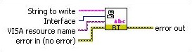

### Debugging and Benchmarking

Debugging and benchmarking is a normal process of code development. There are a variety of ways to debug and benchmark custom devices.

#### LabVIEW Debugging Techniques

Custom devices are written in LabVIEW code. Therefore it’s possible to develop, test and debug the code in LabVIEW, before running the niveristand-custom-device-wizard. In other words, you can use **[LabVIEW’s built-in Debugging Techniques](https://www.ni.com/en-us/support/documentation/supplemental/12/debugging-techniques-in-labview.html)** during development, and merge the LabVIEW code into the custom device framework after it matures.

Since the custom device is one of many parts of the system definition, the behavior of the LabVIEW code within the custom device framework will likely differ from the stand-alone LabVIEW application, especially in regards to timing. As a result, you should benchmark the custom device inside of the VeriStand Engine.

Once added to the system definition, custom devices have been fully integrated into VeriStand’s context. As a result, LabVIEW’s built-in Debugging Techniques are no longer available. Several techniques are available for debugging and benchmarking the custom device.
 
#### Console Viewer

A subcomponent of VeriStand RT Engine is the [Console Viewer](https://www.ni.com/documentation/en/veristand/latest/manual/viewing-console-output/).

You can install it to the target using Measurement and Automation Explorer. When installed, the component runs a small UDP daemon allowing the operator to view the console from a utility called the Console Viewer. You can access the Console Viewer from the **VeriStand Editor » Tool Launcher » View Console**.

&nbsp;&nbsp;&nbsp;**Note:** You cannot use the **Console Viewer** on NI Linux Real-Time targets. Instead, connect your NI Linux Real-Time targets to a computer using a serial port to view the output.


**Figure: Console Viewer**

The Console Viewer will show the system definition and the resulting CPU usage. The viewer is also useful for displaying debugging messages. The console viewer provides a periodic snapshot of utilization. CPU spikes and transients will probably be unobservable. If the system is very busy, it may not update the console viewer at all. You can use other debugging methods for a more accurate indication of resource utilization.

The Console Viewer is also available as a stand-alone add-on to LabVIEW Real-Time. See **[NI Developer Zone Tutorial: Remotely View Console Output of Real-Time Targets](https://knowledge.ni.com/KnowledgeArticleDetails?id=kA03q000000x4TjCAI&l=en-US)** for more information.

#### Custom Error Codes

You can define custom error codes in LabVIEW and distribute the codes to VeriStand with a custom device. Copy the *custom errors.txt* file to VeriStand in the *&lt;Base&gt;\National Instruments\Shared\Errors\English* directory and add the file as a dependency in custom device and **[Custom Device XML file](https://www.ni.com/documentation/en/veristand/latest/manual/custom-device-xml/)**.

For RT targets, deploy the *errors.txt* file to the error directory on target to display error descriptions in Console Viewer.

For more information, refer to the Defining Custom Error Codes to Distribute throughout Your Application topic in the *LabVIEW Help*.

#### Printing With "NI VeriStand - Print Debug Line" VI
The recommended method of printing to the console is to use "NI VeriStand - Print Debug Line" VI. This VI is part of **Custom Device API » Utilities » Print Debug Line.vi**.


This VI works on both Windows and RT execution hosts. It has an optional input (Attribute) to change the color of the text. It also has an optional input to append the string to the VeriStand log file.

#### Printing with RT Debug String VI

The RT Debug String.VI sends a string to the standard output device. By default, this VI sends the debug string to the video port. If you have a device capable of serial redirection, this VI sends the debug string to the serial port. RT Debug String VI can be found in: **Real-Time » RT Utilities » RT Debug String.vi** LabVIEW palette.

For more information go to **[Real-Time VIs](https://zone.ni.com/reference/en-XX/help/370715P-01/lvrtvihelp/lv_real_time_vi_help/)** >> **[RT Utilities VIs](https://zone.ni.com/reference/en-XX/help/370715P-01/lvrtvihelp/rt_board_utilities_vis/)** >> **[RT Debug String VI](https://zone.ni.com/reference/en-XX/help/370715P-01/lvrtvihelp/rt_debug_strings/)** .

	 

**Figure: RT Debug String VI**

#### Telemetry Custom Device

The **[Telemetry Custom Device](https://github.com/ni/niveristand-telemetry-custom-device/releases)** supports VeriStand benchmarking by helping you log system channels and monitor target resources. The usage data is logged to a TDMS file on the target that is running the VeriStand Engine.

#### System Channels

VeriStand includes dozens of **[system channels](https://www.ni.com/documentation/en/veristand/latest/manual/system-channels/)**. System channels provide information about what’s going on under the hood of VeriStand. Several of these system channels are useful in benchmarking and debugging.

#### Table of Debugging and Benchmarking System Channels

```eval_rst
+-----------------+--------------------------------------------------------------------------+
|System Channel   |Description                                                               |
+=================+==========================================================================+
|HP Count         |The number of times the Primary Control Loop reported being late.         |
+-----------------+--------------------------------------------------------------------------+
|HP Loop Duration |The duration of the Primary Control Loop in nanoseconds.                  |
+-----------------+--------------------------------------------------------------------------+
|LP Count         |The number of times the Data Processing Loop reported being late.         |
+-----------------+--------------------------------------------------------------------------+
|Model Count      |The number of times the models have not completed their execution in time.|
+-----------------+--------------------------------------------------------------------------+
```

If the value of the count channels increase over time, the execution host is not achieving the desired loop rates. You can use the system channels in conjunction with an **[alarm](https://www.ni.com/documentation/en/veristand/latest/manual/add-configure-alarm/)** or **[procedure](https://www.ni.com/documentation/en/veristand/latest/manual/add-configure-procedure/)** to handle the event.

#### System Monitor Custom Device

The **[System Monitor Custom Device](https://github.com/ni/niveristand-system-monitor-custom-device/releases)** tracks memory resources and CPU usage on an RT target running the VeriStand Engine. Set the update rate (Hz) in System Explorer to determine how often the custom device checks CPU and memory usage and sends them to the corresponding channel. The VeriStand System Monitor can only be used on an RT target. The custom device returns an error if you target it to a Windows system.

#### Distributed System Manager

You can use the NI Distributed System Manager (DSM) to monitor the CPU and memory resources of an RT target. You must install System State Publisher on the RT target. This component runs a small daemon that publishes the system state to DSM. See **[NI Distributed System Manager for LabVIEW 2018 Help](https://zone.ni.com/reference/en-XX/help/371361R-01/sysman/sysman/)** » **[System Manager Overview](https://zone.ni.com/reference/en-XX/help/372572E-01/sysman/sysman_overview/)** » **[Monitor RT target resources](https://zone.ni.com/reference/en-XX/help/372572E-01/sysman/monitoring_resources/)** for more information.

System State Publisher provides a periodic snapshot of utilization. Spikes and transients in CPU utilization will probably not be observable. If the system is very busy, it may not update DSM at all. You can use other debugging methods for a more accurate indication of resource utilization.

#### Real-Time Trace Viewer

VeriStand provides built-in support for using the **[Real-Time Trace Viewer](https://zone.ni.com/reference/en-XX/help/370715P-01/lvtracehelp/lv_tracetoolkit_help/)** and **[Real-Time Trace Viewer VIs](https://zone.ni.com/reference/en-XX/help/370715P-01/lvtrace/tracetoolkitvis_pal/)** to capture the timing and execution data of a VI and thread events for applications running on an RT target. In a LabVIEW VI, select **Tools » Real-Time Module » Trace Viewer** to display the Real-Time Trace Viewer. For more info on how to use Real-Time Trace Viewer, in LabVIEW go to **Help » LabVIEW Help » Real-Time Module » Real-Time Trace Viewer**.

#### Additional Debugging Options for VeriStand
Upon request, National Instrument may provide advanced debugging tools to help you resolve certain custom device issues. These tools are a last resort when all other debugging options have been exhausted. Please contact National Instruments for more information.
 
#### Table of Debugging and Benchmarking Techniques

You can use tools provided by LabVIEW and VeriStand to benchmark and debug your custom device.
You can use the following table that displays various tools you can use to **[benchmark and debug VeriStand custom devices](https://www.ni.com/documentation/en/veristand/latest/manual/custom-device-benchmark-debug/)**.
