## Migrating from LLB to PPL

A *packed project library* (PPL) is a compiled LabVIEW library (*.lvlib*) that contains the VIs of that library. PPLs allow you to call public VIs similarly to their use in the original project library.

PPLs were first introduced in LabVIEW 2010. From LabVIEW 2017 onward, you can compile a PPL for newer versions of LabVIEW. This option is enabled by default.

**Note:** To change this setting, in the Packed Library build specification, click **Advanced** and disable **Allow future versions of LabVIEW to load this packed library**.

Using a PPL to package a VeriStand custom device does not block the use of an LLB. The two options can coexist as a part of the same project. To use both packaging methods, retain the existing LLB build specifications and add the additional PPL build specifications to the project.

**Note:** You may need to modify the custom device source code to support both options. You may also need to modify the XML configuration file to reflect the new loading paths for the custom device elements.

### Benefits of Using PPL Based Custom Devices

A PPL provides namespacing for all contained items and preserves the file hierarchy of the source project library. These features result in several benefits for a custom device:
* Grants each packaged custom device a copy of shared VI dependencies. These copies are compiled and included in the PPL through namespacing. The PPL also avoids load-time conflicts.

* Avoids internal naming conflicts by preserving the file hierarch. LLBs could generate compile-time warnings and extra files. You can include multiple LabVIEW project libraries in the same PPL, even if the libraries contain items with the same name. This also allows for the easier use of LabVIEW classes when building custom devices.

* Improves deployment time through a smaller disk footprint. The following image demonstrates the relative size difference between PPL and LLB packaging of the same FPGA Addon Engine.

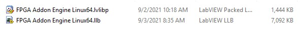

### Drawbacks of Using PPL Based Custom Devices

Converting a custom device to PPL comes with a number of manageable drawbacks.

* Constant relative path updates
* Incompatible LabVIEW features
* RT Driver VI path errors
* Deployment errors

#### Constant Relative Path Updates

Relative paths for PPL items start from the most common directory on disk. Changing the organization or disk location of an item in the library build specification can affect the relative path. Changes within the custom device folder structure can also alter the organization of the items.

Each change will require an update to the configuration XML file to include the newest paths. To solve this issue, refer to the [*Update the XML*](https://niveristand-custom-device-handbook.readthedocs.io/en/latest/Migrating_LLB_to_a_PPL_based_Custom_Device.html#update-the-xml).

#### Incompatible LabVIEW Features

Some LabVIEW features are not compatible with PPL. For example, public malleable VIs (VIMs) cannot be included in a PPL for export. Only VIMs set with a private scope can be included. To solve this issue, remove these features from your custom device at the code or project level.

#### RT Driver VI Path Errors

Opening a PPL based custom device in VeriStand will generate invalid path errors for the RT Driver VIs. VeriStand System Explorer does not recognize PPL paths. These errors do not affect how the Custom Device runs. To solve this issue, refer to the [*Update VeriStand System Explorer*](https://niveristand-custom-device-handbook.readthedocs.io/en/latest/Migrating_LLB_to_a_PPL_based_Custom_Device.html#update-veristand-system-explorer).

#### Deployment Errors

Some custom device APIs, such as the NI VeriStand Custom Device Channel APIs, use Global Data References. This will cause deployment errors for a PPL based custom device. To solve this issue, refer to the [*Update Global Data References*](https://niveristand-custom-device-handbook.readthedocs.io/en/latest/Migrating_LLB_to_a_PPL_based_Custom_Device.html#update-global-data-references).

### Implementing a PPL Based Custom Device

To create a new PPL based Custom Device, use the [VeriStand Custom Device Wizard](https://github.com/ni/niveristand-custom-device-wizard/releases) to generate a template project.

### Migrating an LLB Based Custom Device to PPL

To migrate to a PPL based custom device, you must perform the following actions.

1. Update VeriStand System Explorer
2. Update Global Data References
3. Update Libraries
4. Update the XML
5. Build the PPL File

#### Update VeriStand System Explorer

To remove RT Driver path errors, update the *Initialization* and *Action on Compile* VIs.

Inside the Initialization VI, add a *Clear RT Drivers* subVI to delete all RT Driver paths from the system definition after the custom device is created. The paths can be removed because they are only used during and after deployment.

The following image displays where to insert the subVI.

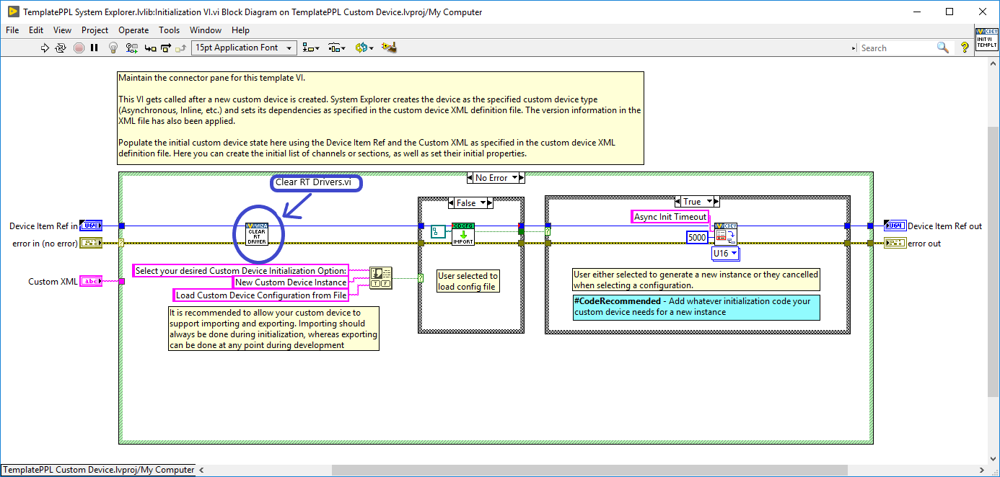

Inside the Action on Compile VI, add a *Set RT Driver* subVI to re-insert the corresponding RT Driver paths before system deployment. VeriStand keeps a copy of the deployed system definition in the local cache unless the system definition is unmodified between deployments. The latest changes are preserved, allowing VeriStand to use the "complete" system definition from the local cache during deployment.

The following image displays where to insert the subVI.

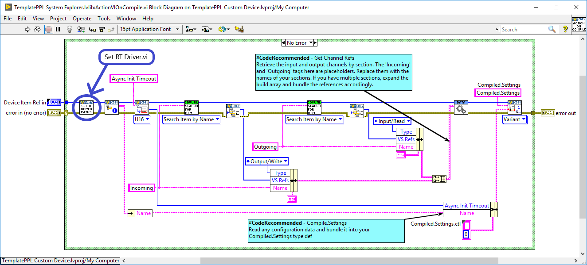

For an example of these subVI structures, refer to the [FPGA Add-on Custom Device](https://github.com/ni/niveristand-fpga-addon-custom-device). This custom device will be available in the upcoming version of the NI VeriStand Custom Device Wizard.

#### Update Global Data References

When using certain VeriStand Custom Device APIs, such as in an inline custom device, you must update how global data references are initialized.

For performance reasons, channel values are stored in VeriStand as a single block of data. For example, they can be sorted as an array of double values. To access a value element corresponding to a given channel, VeriStand uses Global Variables to pass engine pointer information to the calling APIs.

This approach works for LLB based custom devices, but not for PPL. When compiling a PPL, a separate, namespaced, copy of the global variable is created and included within the package. The global variable cannot be used to transfer data between the VeriStand engine and the running custom device. Performing a data transfer results in a runtime error. To mitigate this problem, implement an alternative way to access the values within these global variables.

The following initialization code needs to be incapsulated within a subVI, such as **Initialize Global Variables**.

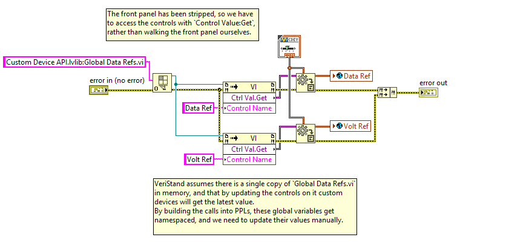

This code can be called only once from within the target custom device. For an inline custom device, it must also be called in the RT Driver **Read Data from HW** case for engine initialization.

The following image displays where to insert this code.

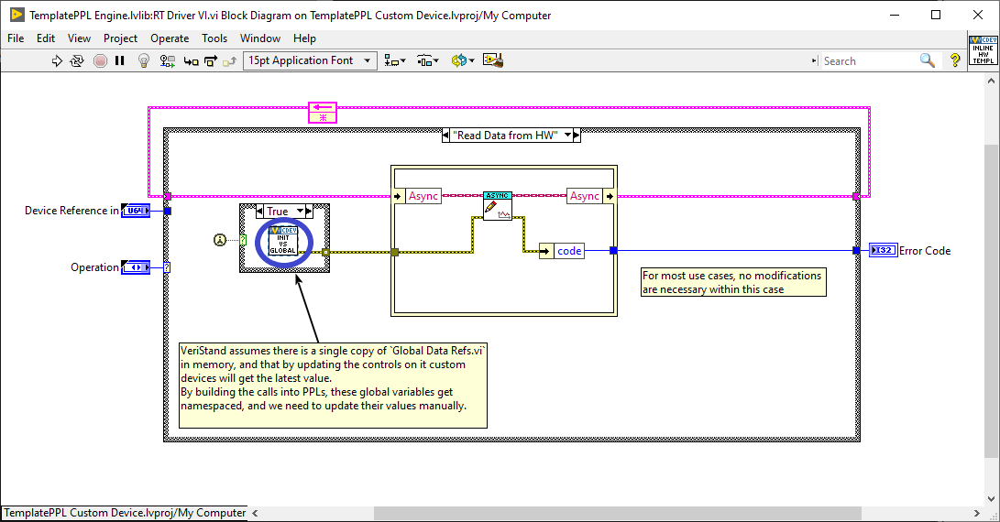

#### Update Libraries

You must create a PPL for each LLB build specification in the project.

The PPL needs to have a similar configuration to the LLB. You should keep the same built files structure, including the same file structure as the LLB build specifications. This will allow you to reuse the build post-step to copy generated files to the VeriStand directory.

To make these library updates in LabVIEW, right-click **Build Specifications** and select **New** » **Packed Library**.

##### Information Settings

In the Configuration Release PPL Properties dialog box, click **Information** to enter a new **Build Specification Name**.

There are rules to consider when organizing the built files. These rules ensure that the files can be copied or moved to the VeriStand Custom Device's directory once built.

**Note:** The Post Build Action VI operates based on the same naming and path convention.

 a) Custom Device System Explorer

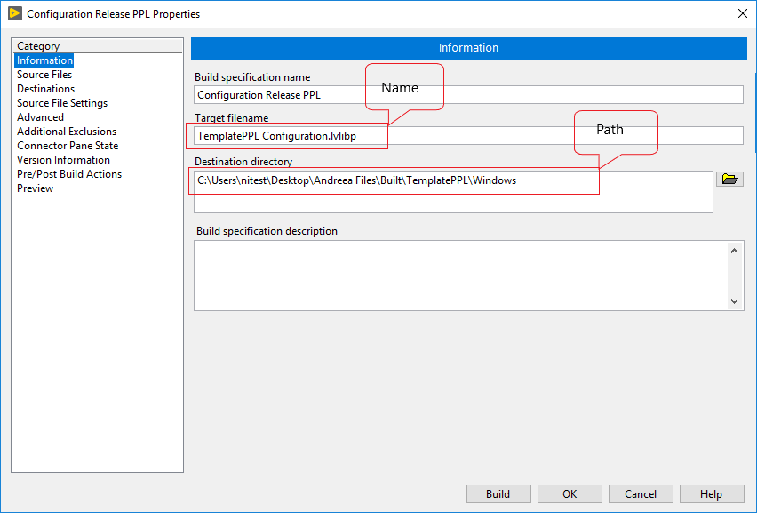

* The destination path should have the following structure: ``"..\built\Custom Device Name\Operating System``
* The PLL file name should use the following format: [Custom Device Name] + [Configuration]

The following image displays an example name and path of a Windows Configuration library file.

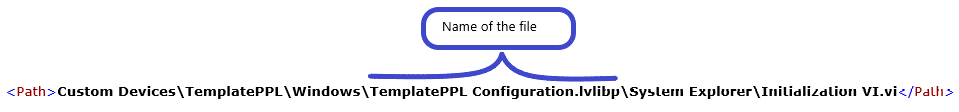

 b) Custom Device Engine

* The destination path should use the following structure: ``"..\built\Custom Device Name\Operating System``
* The PLL file name should use the following format: [Custom Device Name] + [Engine] + [Operating System Name]

The following image displays an example name and path of a Linux engine file.

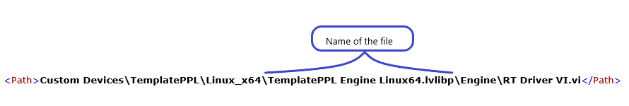

**Note:** Starting with VeriStand 2021 only one type of real-time operating system is supported: Linux x64.

##### Source Files Settings

 a) Custom Device System Explorer

In the Configuration Release PPL Properties dialog box, click **Source Files** and select the library containing the System Explorer files of your custom device (i.e. Configuration library). Set this library as the **Top-level Library**.

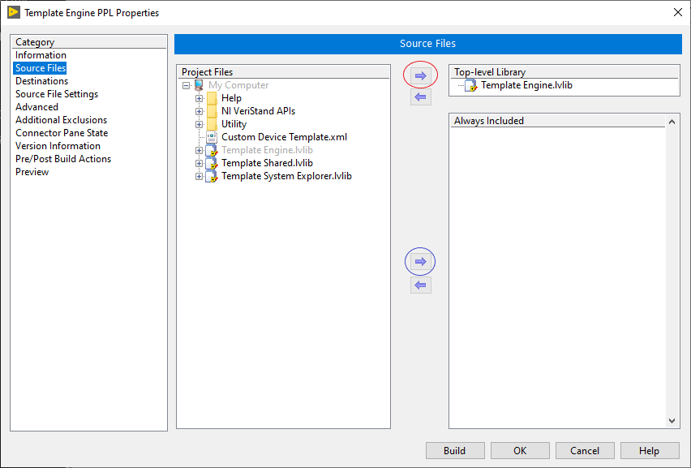

**Note:** To distribute additional files with the PPL, such as a configuration XML file, add them to the **Always-Included** files list.

 b) Custom Device Engine

In the Configuration Release PPL Properties dialog box, click **Source Files** and select the library containing the engine files of your custom device (i.e. Configuration library). Set this library as the **Top-level Library**.

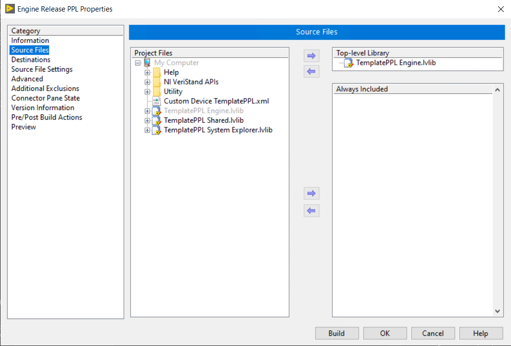

**Note:** You should also configure PPLs for the Real Time targets build specifications.

#### Update the XML

You must update XML files either manually or by creating a **Post-Build Action** VI.

##### Manual Updates

To update manually, you will need to update the path for each LLB with the path of each corresponding PPL.

The following image displays the XML code sequence for the custom device RT Driver VI on a Windows target.

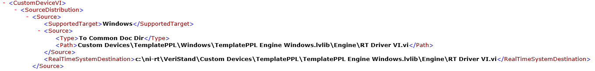

You need to update what comes after the `<Path>` tag.

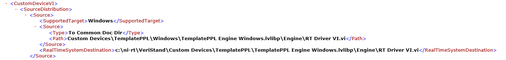

The `<Path>` tag contains a path for a VI located inside a PPL. You need to update all the `<Path>` tags in the XML that reference VIs inside the newly created PPLs.

**Note:** You also need to update the `<RealTimeSystemDestination>` tags.

##### Post-Build Action VI

To automate path updates, implement a VI to update the XML file.

The following image displays one possible VI.

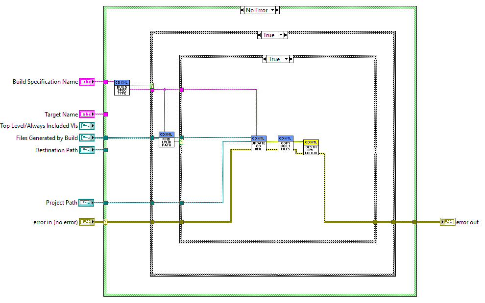

You can set this VI in LabVIEW as a Post-Build Action for your engine or configuration build specification.

To set the action in LabVIEW, open the Engine Release PPL Properties dialog box and click **Pre/Post Build Actions** to enable **Excute VI after build**.

For an example of such a VI being implemented, refer to the [FPGA Add-on Custom Device](https://github.com/ni/niveristand-fpga-addon-custom-device). this custom device will be available in the upcoming version of the NI VeriStand Custom Device Wizard.

#### Build the PPL File

Once finished with your updates, you can build the PPL.

The following window should display after the build finishes.

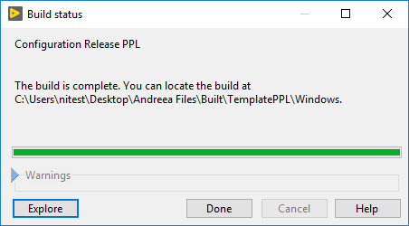
