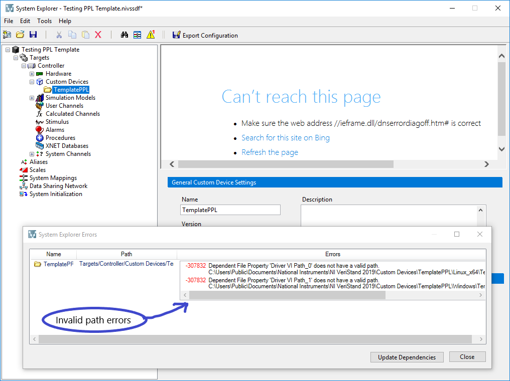
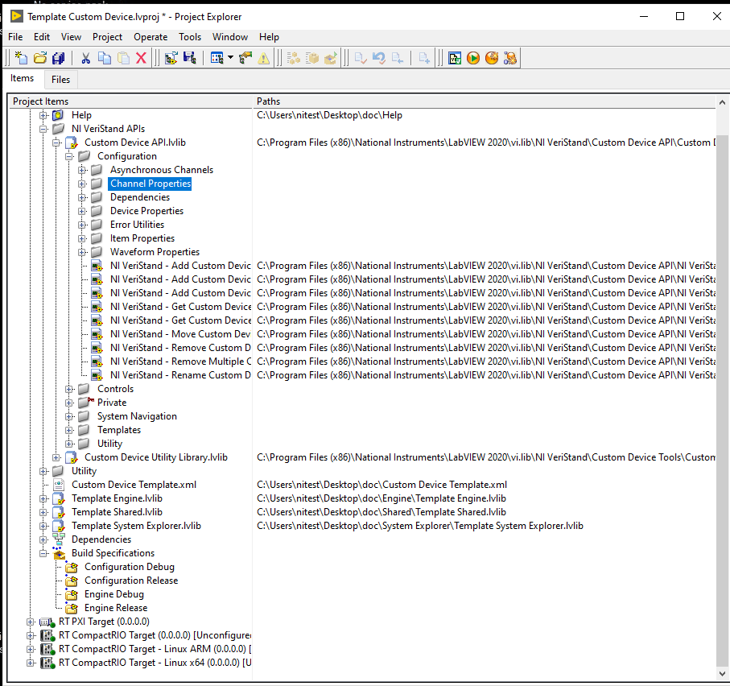

## Migrating from LLB to PPL

First introduced with LabVIEW 2010, a packed project library (PPL) is a compiled LabVIEW project library (.lvlib) that contains all of the .project library VIs and allows the user to call the public VIs in a manner that is identical to the use of the original .project library. Since LabVIEW 2017 you can compile a packed project library to be also used with newer versions of LabVIEW. This option is enabled by default, but if you want to change that setting, choose "Advanced" in the sidebar and disable the option "Allow future versions of LabVIEW" to load this packed library. 

Using PPLs for packaging VeriStand Custom Devices does not eliminate the usage of LLBs for the same purpose. A developer does not have to chose between using one or another. The two options can coexist as part of the same project. A developer can keep the existing LLB build specifications and simply add to the project the additional PPL ones. Of course, it might be necessary to modify the CD source code in order to be able to support both options. The XML configuration file would have to be modified as well to reflect the new loading paths for the CD elements.

### Benefits for using PPL based Custom Devices

Packed Project Libraries (PPL) provide name spacing for all of its contained items and preserve the file hierarchy of the source project library. These features result in several potential benefits for a Custom Device packed in a PPL:
* If two given custom devices would reference the same VI dependency, by packaging them into PPLs, each custom device would receive its own copy of the required dependency. This would be compiled and included in its respective PPL via namespacing for the contained items. The PPLs would also make sure that load-time conflicts are avoided.

* Since PPLs preserve the file hierarchy of the source project library, that solves the issue of internal naming conflicts, which is specific to LLBs (which causes compile-time warnings and extra files to be generated). Multiple LabVIEW project libraries can be included in the same PPL, even if those contain items with the same name. This is the same reason why LabVIEW classes could now be easier used when building VeriStand Custom Devices.

* Much smaller disk footprint, which would improve the deployment time (as you can see for the FPGA Addon below). . 

### Drawbacks of using PPL based Custom Devices

* One of the main drawback is that inside the PPL, relative paths for the items are maintained starting from the most common directory on disk. This can be confusing for LabVIEW developers that would expect the relative paths to start from the root of the library and follow the original project structure. Additionally, it also means that changing the organization, or location on disk, of the items that are included in the library build specification could in turn affect the relative paths of the items in the packed library. In time, this behavior could prove to be quite a challenge, since changes within the custom device folder structure could affect the organization of the items in the generated packed library. In turn, this would create the need to constantly update the configuration XML file with the new paths. The solution will be discussed below (in the migration steps).

* Certain LabVIEW features are not compatible with packed project libraries. For instance, malleable VIs (VIMs) cannot be included in a PPL and exported as public members, they can only be set with private scope. Implicitly, if a custom device code makes use of malleable VIs, packing it inside a PPL would require some changes (to either the code or the project level) to maintain compatibility.

* When you open a PPL based Custom Device in Veristand, you will see an error regarding invalid paths for the RT Driver VIs (as you can see in the image below). This is happening because the Veristand System Explorer does not recognize PPL paths. However, this does not affect how your Custom Device runs. The fix for this issue is described in the next chapters.

* Certain VeriStand Custom Device APIs (like the NI VeriStand Custom Device Channel APIs) are using Global Data References. This will lead to deployment errors for PPL based custom devices that use this API. Additional details, as well as the fix for this problem is described in the next chapter.

### Implementing a PPL based Custom Device

For creating a new packed project library based Custom Device you can start from a Custom Device template project. You can choose one for your application from the [VeriStand Custom Device Wizard](https://github.com/ni/niveristand-custom-device-wizard/releases). 
### Migrating to a PPL based Custom Device from an LLB one

1. Changes for the VeriStand System Explorer

Now we will discuss the VeriStand error (mentioned in the drawbacks section), and how can we make it disappear. The solution would be to change the code of the **Initialization** VI and **Action on Compile** VI (as you can see below). The subVI in the Initialization VI dynamically deletes all of the the RT Driver paths from the system definition, after the Custom Device was created. This is acceptable, since these paths are used only during and after deployment. The purpose of the subVI added in the Action on Compile VI, is to re-insert the corresponding RT Driver paths, right before the system deployment. Since VeriStand keeps a copy of the deployed system definition in the local cache ( unless the system definition is unmodified between deployments), this latest change is preserved - therefore, VeriStand now has a "complete" system definition in the local cache, which will be used for subsequent deployments. A good example (where you can see the exact structure of the subVIs) is implemented on [FPGA Add-on Custom Device](https://github.com/ni/niveristand-fpga-addon-custom-device) and will be available in the upcoming version of the LabVIEW Custom Device Wizard. 

2. Changes regarding global data references

If you use certain VeriStand Custom Device APIs, which is the case for an inline custom device, the first step to migrate an existing Custom Device would include changes regarding how the global data references are initialized.
For performance reasons, channel values are stored in VeriStand as a single block of data - i.e. as an array of double values. To be able to access a value element corresponding to a given channel, VeriStand is using Global Variables to pass pointer information, from the engine, to the calling APIs. While this works well for custom devices packed in LLBs, the same does not apply for packed project libraries, due to namespacing. Essentially, when compiling a PPL, a separate (namespaced) copy of the global variable is created and included with it. In turn, it cannot be used anymore for data transfer between the VeriStand engine and the running custom device and would result in a runtime error. To be able to mitigate this problem, we need to implement an alternative way to access the values within these global variables.
The initialization code below needs to be incapsulated within a subVI ("Initialize Global Variables"). It has to be called only once from within the target custom device and, for an Inline type, it would have to be called specifically in the "Read Data from HW" case of the "RT Driver" due to how the VeriStand engine initializes (as you can see, circled in BLUE, below the subVI's code).

3. Changes regarding libraries

The next step is to create a packed project library for each LLB build specification you have in the project. The PPL needs to have the a similar configuration with the LLB's. This means that, ideally, you would keep the same structure for the built files (the same file structure as for the LLB build specifications, to be able to reuse the build post-step for copying generated files to the VeriStand directory). To do so, you need to right click on **Build Specifications** » **New** » **Packed Library**. The window for configuring your packed library will open.

** *Information* Category of Configurations **

Select *Information* from the left menu and rename the PPL in the *Build Specification Name* field. Following convention, there are some rules to consider in order to organize the built files properly, so that, they can be easily copied/moved to the VeriStand Custom Devices directory once the build is complete (It would be worth mentioning that the, Post Build Action VI, mentioned in the next section, operates based on the same naming and path convention).
 a) Custom Device System Explorer

* The destination path should have the following structure: **"..\built\Custom Device Name\Operating System** 
* The name of the packed library file should have the following format: **Custom Device Name** + **Configuration** + **Operating System Name** (you can see an exemple for the name and path of a System Explorer file on Windows)

 b) Custom Device Engine
 
* The destination path should have the following structure: **"..\built\Custom Device Name\Operating System**
* The name of the packed library file should have the following format: **Custom Device Name** + **Engine** + **Operating System Name** (you can see an exemple for the name and path of an Engine file on Linux)

**Note:** Moving forward, we are supporting only one type of RT OS. This means there will be a total of two targets: Windows and Linux x64.

** *Source Files* Category of Configurations **

 a) Custom Device System Explorer

From the *Source Files* in the Category list (on the left), select the library containing the *System Explorer* files of your custom device (i.e. Configuration library). Set it as the *Top-level Library* by clicking on the topmost arrow in the Source Files window. If you need additional files to be distributed with the packed library (for example, the configuration XML file), you can add them to the "Always-Included" files list (see below)..

**Note:** if you need to include something in the PPL (for exemple the XML file in the System Explorer PPL), select the the file you want to include and press the bottom blue arrow (the one circled in BLUE).

 b) Custom Device Engine

From the *Source Files* in the Category list (on the left), select the library containing the *Engine* files of your custom device (i.e. Configuration library). Set it as the *Top-level Library* by clicking on the topmost arrow in the Source Files window. 

**Note:** You should configure PPLs also for the Real Time targets build specifications.

4. Changes regarding the XML

The last step is to make the necessary changes in the XML file. For this you have too choices: you can do it *manually*, or you can create a *Post-Build Action* VI. 

If you choose to do it **manually**, you will need to change the path for each LLB with the path of each corresponding PPL.
For example, the following image represents the XML code sequence for the custom device RT Driver VI on a Windows target. 

You need to change what comes after the `<Path>` tag.

Here you can see the `<Path>` contains a path for a VI located inside a PPL. You need to update all the `<Path>` tags in the XML that reference VIs inside the newly created PPLs.

**Note:** You need to update also the `<RealTimeSystemDestination>` tags.

If you don't want to spend time manually changing the paths, you can chose to implement a VI that automatically updates the XML file (see below). This is also the long-term solution for the problem with relative paths, metioned earlier. 

The best approach is to set such a VI as a *Post-Build Action* for your engine or configuration build specification (see below). You can also see it implemented in [FPGA Add-on Custom Device](https://github.com/ni/niveristand-fpga-addon-custom-device) and will be available in the upcoming version of the LabVIEW Custom Device Wizard.

5. Build Files

Press *Build* and you should see this window after the build finishes:

