## Planning the Custom Device

The most critical phase of custom device development is planning. Several VeriStand idiosyncrasies require more thorough planning than smaller stand-alone LabVIEW applications.

As the use-cases and flexibility of a custom device increases, so does the complexity of planning and implementing the device. The design tradeoff of this increase is a more robust device that requires less customization by the operator.

There are five areas to plan before you begin implementing.

1.	Channels
2.	Properties
3.	Hierarchy
4.	Pages
5.	Device Type

In the following discussion, we will refer to a hypothetical 3rd party analog to digital (A/D) converter called the AES-201. The device was chosen to simplify the discussion.

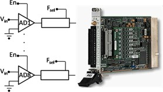

**Note:** For an actual device, refer to the *VeriStand Manual* topics under [Creating Custom Devices](https://www.ni.com/documentation/en/veristand/latest/manual/create-custom-device/).

The AES-201 has eight 32-bit analog input (AI) channels. The device can digitize on ±1V or ±500mV. The card has a single software trigger line. Each channel has a software enable that is `ON` by default and a 6Hz low pass filter that is `OFF` by default.

A call to the hardware API makes a single A/D conversion on the specified channel and returns raw data. The range of the device cannot be changed after the device has been initialized.

### Channels

*Channels* are used to exchange data between the custom device and the rest of the VeriStand system.

All channels are 64-bit floating point numbers. There is no built-in mechanism for other channel data types.

There are three common use cases for planning a custom device channel.

1. Data generated by the custom device after it is deployed. This data can be required by other parts of the VeriStand system.
2. Data originating elsewhere in the VeriStand system. This data can be consumed by the custom device after it is deployed.
3. Dynamic properties that can change after the device is deployed. These properties can be implemented in channels.

**Note:** Custom devices should be designed for generic use. Just because your customer does not use all channels and settings of the hardware does not mean you should hide anything from the operator.

Given these use cases, the AES-201 custom device should have one channel each for *ADDataFromCh<1..8>*. The digitized data is going to change while the device is running. The operator may need that data to be available to the rest of the VeriStand system. For example, operators often map data from hardware to simulation model inputs.

The operator may need to map the AES-201 software trigger to another channel in System Explorer, such as a calculated channel. The developer should create a channel for *SWTrig*.

The operator may need to disable a channel or toggle the input filter or the AES-201 while the device is running. The developer should plan an additional 16 channels for *FilterEnCh<1..8>* and *ADEnCh<1..8>*.

VeriStand channels are always LabVIEW DBLs. It may be easier to flatten data to DBL than it is to implement a background communication loop that passes native data types to the rest of the system. While the AES-201 LabVIEW API calls for Boolean data to enable the channel or filter, you can use a DBL channel with the assumption that *0 = False* and *!0 = True*.

Channels are created with the [Add Custom Device Channel VI](https://www.ni.com/documentation/en/veristand/latest/manual/custom-device-add-channel-waveforms/). A channel is either an Input or an Output. Channel type is determined by the custom device in the following situations.

* If the custom device passes data to the rest of the VeriStand system, it requires an output channel.
* If the custom device receives data from the rest of the system, it requires an input channel. For example, the AES-201 may have eight output channels (ADDataFromCh<1..8>) and 17 input channels (ADEnCh<1..8>, FilterEnCh<1..8>, and SWTrig).

Once the custom device is loaded into VeriStand, the operator can map each input channel to a single data source. The operator can map each output channel to an arbitrary number of sinks. For example, you can map *ADDataFromCh1* to several simulation model inputs. *SWTrig* can be mapped to a user channel or a model output, but not both.

#### Add Custom Device Channel VI

Use the *NI VeriStand – Add Custom Device Channel VI* to add a channel to the device.

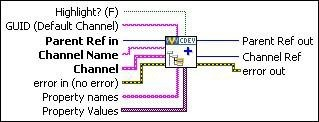

The device or device subsection is specified by *Parrent Ref in*. If the *Channel Name* you specify already exists, the VI overwrites the existing channel settings without affecting any custom properties. The VI can be called from any VI that runs on the host computer.

#### Other Useful Channel VIs

There are other VIs in the **NI VeriStand** » **Custom Device API** LabVIEW palette that operate on custom device channels.

* **Configuration** » **[Get Custom Device Channel Data VI](https://zone.ni.com/reference/en-XX/help/372846M-01/veristandmerge/vs_get_custom_device_channel_data_vi/)**
* **Configuration** » **[Rename Custom Device Item VI](https://zone.ni.com/reference/en-XX/help/372846M-01/veristandmerge/vs_rename_custom_device_item_vi/)**
* **Configuration** » **[Remove Custom Device Item VI](https://zone.ni.com/reference/en-XX/help/372846M-01/veristandmerge/vs_remove_custom_device_item_vi/)**
* **Channel Properties** » **[Set Custom Device Channel Default Value VI](https://zone.ni.com/reference/en-XX/help/372846M-01/veristandmerge/vs_set_custom_device_channel_default_value_vi/)**
* **Channel Properties** » **[Set Custom Device Channel Faultability VI](https://zone.ni.com/reference/en-XX/help/372846M-01/veristandmerge/vs_set_custom_device_channel_faultability_vi/)**
* **Channel Properties** » **[Set Custom Device Channel Scalability VI](https://zone.ni.com/reference/en-XX/help/372846M-01/veristandmerge/vs_set_custom_device_channel_scalability_vi/)**
* **Channel Properties** » **[Set Custom Device Channel Type VI](https://zone.ni.com/reference/en-XX/help/372846M-01/veristandmerge/vs_set_custom_device_channel_type_vi/)**
* **Channel Properties** » **[Set Custom Device Channel Units VI](https://zone.ni.com/reference/en-XX/help/372846M-01/veristandmerge/vs_set_custom_device_channel_units_vi/)**
* **Driver Functions** » **[Get Custom Device Channel List VI](https://zone.ni.com/reference/en-XX/help/372846M-01/veristandmerge/vs_get_custom_device_channel_list_vi/)**

In addition to these channel-specific VIs, any VI from the [Item Properties](https://zone.ni.com/reference/en-XX/help/372846M-01/veristandmerge/vs_item_properties_vis_pal/) palette can be used with a custom device channel.

### Properties

*Properties* are used within the custom device to communicate state information.

Property names are case-sensitive strings. Unlike channels, property values can be any standard LabVIEW data type.

For one-time instances, you should use properties to transfer configuration and state information from the configuration to the engine. This transfer occurs when the system definition is deployed to the target.

After the system definition deploys, the engine can still read and write properties on the execution host. However, the engine cannot exchange properties with the host computer using the property VIs.

Because the AES-201 range cannot be changed after the card initializes, you should implement the AES-201 range setting as a property. The configuration routine on the host computer can set the *Range* property of the card based on operator input.

When the operator deploys the system definition, the engine can read the *Range* property. The engine can then call the hardware API to set the range.

After the AES-201 starts, the range cannot be changed. If the operator wants to change the range setting, they will need to use System Explorer to reconfigure the custom device and redeploy the system definition. The engine can still read and write the *Range* property, but the update is not reflected in System Explorer.

You can also implement the filter setting as a property. In System Explorer, the operator can enable or disable the filter on each channel page.

Doing so would allow the device to require eight fewer channels. However, the operator would no longer be able to toggle the input filter while the custom device is running.

**Note:** To illustrate several aspects of custom device development, we will implement the filter setting as a property.

#### Set Item Property VI

The *NI VeriStand – Set Item Property VI* can be called from any VI in the custom device.

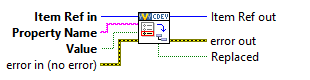

Properties can be applied to any channel or section. In addition to this VI, properties can be set when a channel or section is created by using *Property Names* and *Property Values*.

A property must be read from the item to which it was set. For example, if you set the *Filter_Enabled* property on the ADDataFromCh1 channel, you cannot read the value of the property directly from the parent section or any reference other than ADDataFromCh1. Properties do not inherit.

#### Get Item Property VI

The *NI VeriStand - Get Item Property VI* returns the value of a specific item Property Name.

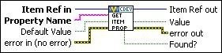

If the *Property Name* does not exist for the specified item, *Value* returns `Default Value`. Use the *Found?* output to check that the intended property name was found on the item.

#### Remove Item Property VI

The *NI VeriStand – Remove Item Property VI* removes the property name from an item.

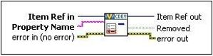

The Get Item Property and Remove Item Property VIs may be called from any VI in the custom device.

#### Other Useful Property VIs

There are other VIs in the **NI VeriStand** » **Custom Device API** LabVIEW palette that operate on custom device properties.

* **Item Properties** » **[Get Item Description](https://zone.ni.com/reference/en-XX/help/372846M-01/veristandmerge/vs_get_item_description_vi/)**
* **Item Properties** » **[Get Item GUID](https://zone.ni.com/reference/en-XX/help/372846M-01/veristandmerge/vs_get_item_guid_vi/)**
* **Item Properties** » **[Get Property Names List](https://zone.ni.com/reference/en-XX/help/372846M-01/veristandmerge/vs_get_property_names_list_vi/)**
* **Item Properties** » **[Set Item Description](https://zone.ni.com/reference/en-XX/help/372846M-01/veristandmerge/vs_set_item_description_vi/)**
* **Item Properties** » **[Set Item GUID](https://zone.ni.com/reference/en-XX/help/372846M-01/veristandmerge/vs_set_item_guid_vi/)** 
* **Device Properties** » **[Get Custom Device Decimation](https://zone.ni.com/reference/en-XX/help/372846M-01/veristandmerge/vs_get_custom_device_decimation_vi/)**
* **Device Properties** » **[Get Custom Device Driver](https://zone.ni.com/reference/en-XX/help/372846M-01/veristandmerge/vs_get_custom_device_driver_vi/)**
* **Device Properties** » **[Get Custom Device Version](https://zone.ni.com/reference/en-XX/help/372846M-01/veristandmerge/vs_get_custom_device_version_vi/)**
* **Device Properties** » **[Set Custom Device Decimation](https://zone.ni.com/reference/en-XX/help/372846M-01/veristandmerge/vs_set_custom_device_decimation_vi/)**
* **Device Properties** » **[Set Custom Device Driver](https://zone.ni.com/reference/en-XX/help/372846M-01/veristandmerge/vs_set_custom_device_drivers/)**
* **Device Properties** » **[Set Custom Device Version](https://zone.ni.com/reference/en-XX/help/372846M-01/veristandmerge/vs_set_custom_device_version_vi/)**
* **Device Properties** » **[Specify Custom Device Execution Mode](https://zone.ni.com/reference/en-XX/help/372846M-01/veristandmerge/vs_specify_custom_device_execution_mode_vi/)**

### Custom Device Decimation

You can set the decimation for any type of custom device. However, decimation is handled differently for inline and asynchronous custom devices.

* An inline custom device is called when indicated by its decimation. For example, decimating an inline custom device by 4 causes the Primary Control Loop (PCL) to call the custom device on every fourth iteration.   **Note:** The device must execute in a short enough time for the entire PCL to complete its iteration in addition to device execute time.
* Asynchronous devices have their channel FIFOs read on the Nth iteration of the PCL. N is the decimation rate of the asynchronous device.

### Hierarchy

VeriStand allows each custom device to be presented as a hierarchy in System Explorer. A hierarchy allows developers to organize and present a custom device to the operator.

Within a Custom Device hierarchy, there are sections and channels. All items in a custom device configuration tree are either channels or sections. *Sections* provide a way to group items in a hierarchy.

The following rules apply to channels and sections.

1. You cannot create additional levels of a custom device hierarchy from channels.
1. You cannot map sections to other items in VeriStand.
1. You cannot use sections to exchange data during run-time.

Use the [NI VeriStand - Add Custom Device Section](https://zone.ni.com/reference/en-XX/help/372846M-01/veristandmerge/vs_add_custom_device_section_vi/) VI to create sections.

The default section glyph (icon) is a folder. You can change the glyph by modifying the custom device XML. A collection of glyphs that install with VeriStand is found in `<Application Data>\System Explorer\Glyphs`.

#### Add Custom Device Section VI

The *NI VeriStand – Add Custom Device Section VI* adds a section with the *Section Name* to the device specified by *Parent Ref in*.

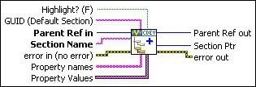

If the name you specify already exists for that device, this VI updates only the GUID of that section without affecting any properties or child items.

This VI can be called from any VI that runs on the host computer. You build-up the custom device hierarchy by using the *Parent Ref out* and *Section Ptr* outputs.

Parent Reference is the level of the hierarchy that will contain the new section. Section Pointer is the reference to the new section, one level deeper in the hierarchy than the Parent Reference.

#### Hierarchy Examples

You should plan a custom device to use the minimum number of sections necessary to make the hierarchy well-organized, intuitive, and user friendly.

There are two types of hierarchies.
1. Flat
2. Nested

We will examine these hierarchy types in relation to AES-201 and discuss the advantages and disadvantages of each.

##### Flat Hierarchy

The following is an example of a flat, or single-level, hierarchy for the AES-201.

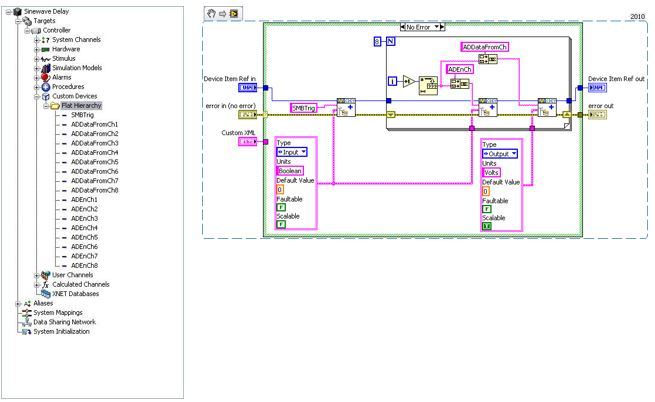

In this example, all of the channels are under the main section in the configuration tree. While it is easy for the operator to determine how many channels are available, the type of channel is unknown. Also, the channel function is only implied by the name.

A *flat hierarchy* is best suited for devices with a small number of channels that all perform the same function. The hierarchy is less useful for devices with many channels, or when channels perform different functions. For example, a custom device for a multifunction data acquisition board would be difficult to present in a flat hierarchy.

Notice that the same *Device Item Ref in* is used to create the *SWTrig*, *ADEnCh<1..8>*, and *ADDataFromCh<1..8>* channels. As a result, all of these channels appear at the same level of the hierarchy.

In the code, you should be able to identify the input and output channels. *SWTrig* and *ADEnCh<1..8>* are input channels because the custom device sinks data from them. *ADDataFromCh<1..8>* are output channels because they source data to the rest of VeriStand.

From an operator perspective, custom device inputs and outputs may seem backwards. Hardware inputs correspond to custom device outputs. The operator is not required to interact with the custom device source code. They will work in System Explorer. However, the channel direction should still make sense.

##### Nested Hierarchy

The following is an example of a nested hierarchy for the AES-201.

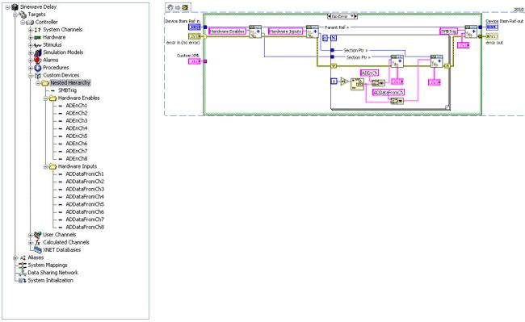

The channels have been organized into *Hardware Enables* and *Hardware Inputs* sections. This device is well-organized and fairly intuitive.

The *Section Ptr* outputs are used to create channels beneath the corresponding section in the initialization VI. The parent reference is also used to create the trigger channel at the same level as the two sections in the custom device hierarchy.

### Pages

*Pages* are VIs that System Explorer displays in the configuration pane subpanel.

*Subpanels* are LabVIEW front pane containers that allow a VI to display the front panel of another VI. For more information, refer to the *LabVIEW Help* topic [Container Controls and Indicators](https://zone.ni.com/reference/en-XX/help/371361R-01/lvconcepts/container_controls_and_indicators#).

When you click an item in the configuration tree, a page displays in the Subpanel. Pages run on the host computer. They define the appearance and configuration experience of the custom device.

The [niveristand-custom-device-wizard](https://github.com/ni/niveristand-custom-device-wizard/releases) creates two configuration VIs by default.
1. Initialization VI - A simple VI that does not populate in the Subpanel.
1. Main VI - A page.

When you click on the top-most custom device item in the configuration tree, the *&lt;Custom Device Name&gt; Main Page* VI goes into the configuration pane and executes the block diagram.

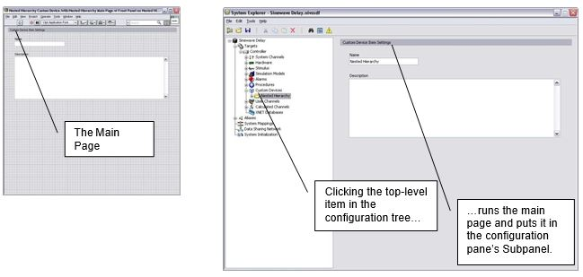

If the developer did not assign a custom page to a new section or channel, the default section or channel page is shown when the operator clicks on the item in the configuration tree.

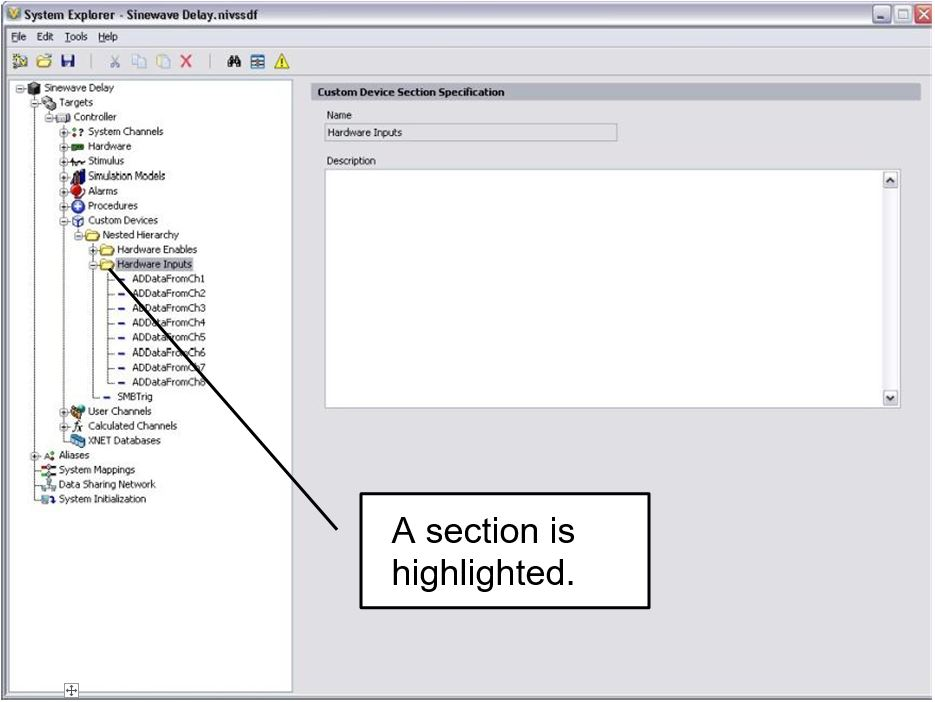

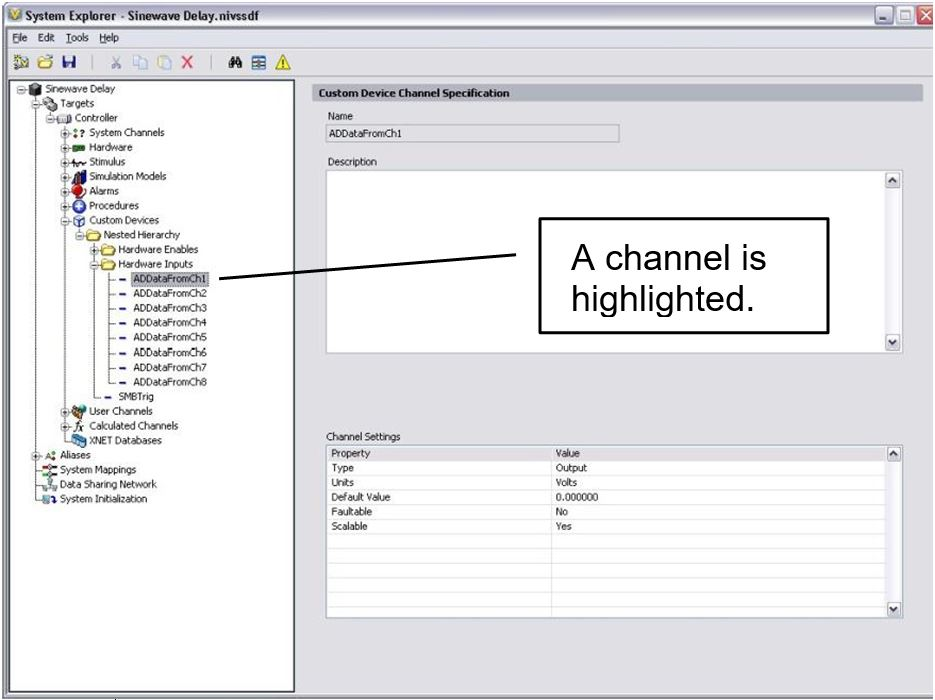

The default pages allow the operator to set a description for the section or page. VeriStand retains this data in the System Definition (*.nivssdf*) file.

You cannot individually modify the block diagram or font panel of default pages. The *niveristand-custom-device-wizard* allows the developer to specify extra pages. Extra pages can be used to override the default page for an item.

When the developer creates an extra page and associates it with a section or channel, item's default page is overridden. You can individually modify the front panel and block diagram of extra pages. The block diagram executes when the operator clicks on the item in the configuration tree.

There are two rules for modifying custom device pages.

1. Do not change the front panel size. The front panel is loaded into a subpanel in the configuration pane. Changing the size may make the front panel unusable.
1. Do not change the names or connector pane associations of any terminal generated by the page template or niveristand-custom-device-wizard. VeriStand uses these objects to interface with the page. Changing these items may make the custom device unusable.

### Extra Pages

Extra pages override default pages and allow you to customize the appearance and behavior of any item in the custom device hierarchy.

You should plan an extra page for each item in the custom device you want to customize differently. For example, to customize the page for each *ADDataFromCh* channel, you will need multiple extra pages. To customize all *ADDataFromCh* channels the same way, you will only need one extra page.

**Note:** VeriStand stores state data for each individual item in the custom device hierarchy in the system definition file.

The AES-201 may need five extra pages.
* A page for each section.
* A page for *ADDataFromCh<1..8>* channels.
* A page for *ADEnCh<1..8>* channels.
* A page for the *SWTrig* channel.
* A page for unforeseen needs.

You may not need all of these extra pages. It is better to have extra pages now rather than need more later.

VeriStand requires four items to override a default page with an extra page.
1.	Page
2.	Globally Unique IDentifier (GUID)
3.	XML Declaration
4.	Build Specification

#### Page

A properly formed page VI must exist.

If you plan properly, you will be able to specify all the extra pages when you run the niveristand-custom-device-wizard. An extra page is created for each element in the **Custom Device Extra Page Names** control.

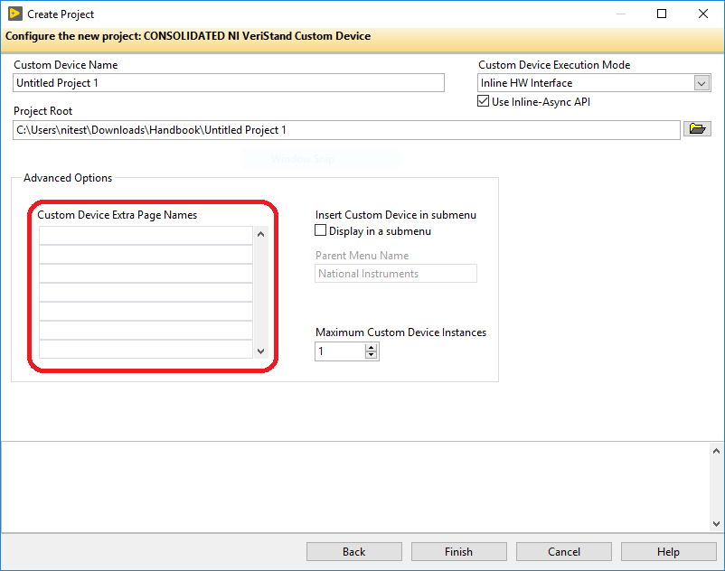

The *niveristand-custom-device-wizard* generates the page, GUID, and XML Declaration. The wizard then includes the page in the build specification. You will find the extra page template in the *Page Template.vit*. This file is located at `Custom Device API.lvlib\Templates\Subpanel Page VI`.

If you do not use the wizard to create extra pages, you must manually add and configure them. Manually adding extra pages to a custom device after running the wizard is difficult. Avoid this issue by creating a few extra pages beyond what you think is necessary.

**Note:** Unused extra pages are not executed, but they do consume marginal space on disk.

#### GUID

When you associate an extra page with a channel or section, you override the default page for that item.

This can be do done in two ways.
1. Specify the GUID when the item is created.
1. Set the item’s GUID with the [NI VeriStand - Set Item GUID VI](https://zone.ni.com/reference/en-XX/help/372846M-01/veristandmerge/vs_set_item_guid_vi/). You can access this VI in LabVIEW  by navigating to **NI VeriStand** » **Custom Device API** » **Configuration VIs** » **Item Properties**.

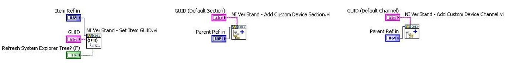

The *niveristand-custom-device-wizard* generates a GUID for each extra page in the Custom Device Extra Page Names control.

#### XML Declaration

The custom device API associates a channel or section with a GUID while the custom device XML associates the GUID with the page VI.

The page and its GUID must be declared in the custom device XML `<Pages>` section within a `<Page>` schema.

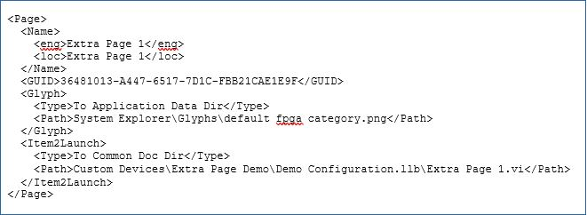

If the developer planned for the extra pages before running the *niveristand-custom-device-wizard*, the tool makes the appropriate entries in the custom device XML file for each extra page.

#### Build Specification

Extra pages are dynamically called VIs. Since they are not a part of the custom device VI hierarchy, they must be explicitly included in the Build Specification.

If the developer planned for the required extra pages before running the *niveristand-custom-device-wizard*, the wizard configures the build specifications to include the extra pages into the initialization library.

If a page must be added to the custom device after the tool runs, you must edit the configuration Build Specification to include the extra page. You must also include any dynamically called dependencies.
