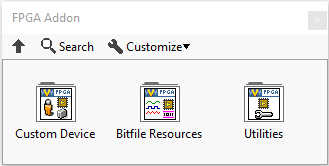

# Scripting APIs

Scripting APIs use LabVIEW VIs to configure Custom Devices in a VeriStand system definition file.

Depending on how much functionality was made available through Scripting for a specific Custom Device, users can change basic settings, or fully configure a Custom Device.

You can develop a Scripting API to create flexible and reusable system definition files. 

NI has developed Scripting APIs for some NI supported Custom Devices. One such example is the [Scripting API for the FPGA Addon](https://github.com/ni/niveristand-fpga-addon-custom-device/blob/main/Source/Quick%20Start%20Documentation/FPGA%20Addon%20Quick%20Start%20Guide.md#scripting-api) Custom Device.

The functions for this Scripting API are grouped into: **Custom Device**, **Bitfile Resources**, and **Utilities** palettes.  

&nbsp;&nbsp;&nbsp; 

**Custom Device palette**

## Scripting APIs for NI supported Custom Devices

The following list contains NI supported Custom Devices that have a Scripting API: 
•	[Instrument Addon Scripting API](https://github.com/ni/niveristand-fpga-addon-custom-device/blob/main/Source/Quick%20Start%20Documentation/FPGA%20Addon%20Quick%20Start%20Guide.md#scripting-api) 
•	[FPGA Addon Scripting API](https://github.com/ni/niveristand-fpga-addon-custom-device/blob/main/Source/Quick%20Start%20Documentation/FPGA%20Addon%20Quick%20Start%20Guide.md#scripting-api) 
•	[Routing and Faulting Scripting API](https://github.com/ni/niveristand-fpga-addon-custom-device/blob/main/Source/Quick%20Start%20Documentation/FPGA%20Addon%20Quick%20Start%20Guide.md#scripting-api) 
•	[Engine Simulation Toolkit Scripting API](https://github.com/ni/niveristand-engine-simulation-toolkit-custom-device/tree/main/Source/Scripting%20API) 
•	[Communications Bus Template Scripting API](https://github.com/ni/niveristand-communications-bus-template/tree/main/Source/Custom%20Device%20Support/Scripting) 
•	[Ballard ARINC 429 Scripting API](https://github.com/ni/niveristand-ballard-arinc429-custom-device/blob/main/Docs/User%20Guide/User%20Guide.md#scripting-the-custom-device-configuration) 
•	[Ballard MIL-STD-1553 Scripting API](https://github.com/ni/niveristand-ballard-milStd1553-custom-device/tree/main/Source/Scripting%20Examples) 
