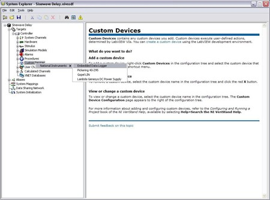
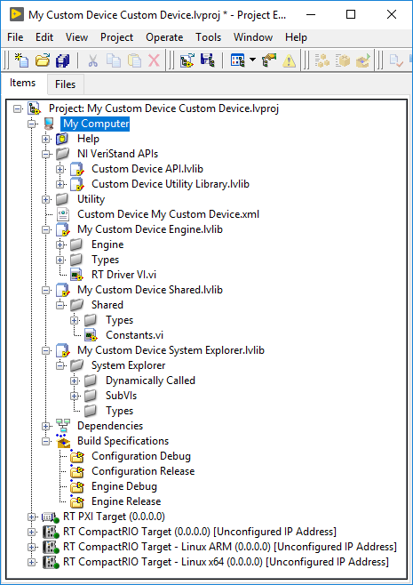
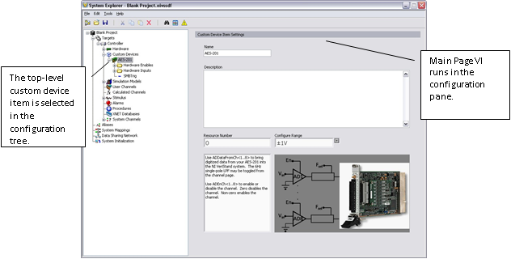
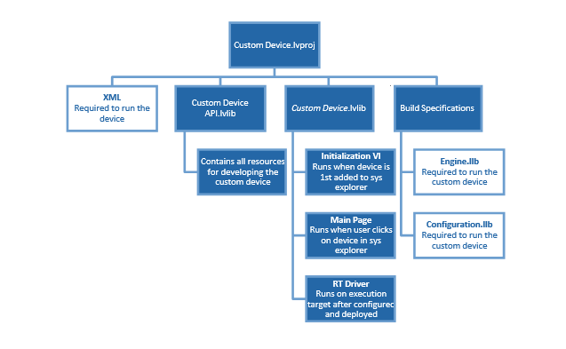

### Introduction to Custom Devices


VeriStand is an open software environment you can use to configure real-time testing applications, including hardware-in-the-loop (HIL) systems. With VeriStand, you can complete the following objectives.

* Configure real-time input/output (IO), stimulus profiles, data logging, alarming, and other tasks; 
* Implement control algorithms or system simulations by importing models from a variety of software environments; 
* Build test system interfaces quickly with a run-time editable user interface complete with ready-to-use tools. 

For more information **[NI Developer Zone Tutorial: What is NI VeriStand](https://www.ni.com/en-us/shop/data-acquisition-and-control/application-software-for-data-acquisition-and-control-category/what-is-veristand.html)**.

You can customize and extend the VeriStand environment with LabVIEW to meet application requirements. This document provides the background, design decisions,and technical information required to understand and develop custom devices in VeriStand 2020 and later. 

Before you begin creating custom device, you must understand the VeriStand Engine. <a href="https://zone.ni.com/reference/en-XX/help/372846B-01/">For more information on the refer to VeriStand Help

#### What is a Custom Device?

While VeriStand provides most of the functionality required by a real-time testing application, the environment to be customized to meet application requirements.  Custom devices are one way to extend VeriStand. For more ways to customize NI VeriStand, refer to **[NI Developer Zone Tutorial: Using LabVIEW and Other Software Environments with NI VeriStand](http://zone.ni.com/devzone/cda/tut/p/id/9366)**.

Developers can use custom devices to dictate haw Veristand executes. Any LabVIEW callable code can be made into a custom device. Custom devices allow customization to the operator interface within System Explorer. 

Custom devices can display many different configuration experiences. This include simple controls on a VI front panel, pop-up windows and silent routine to scrape the configuration from a database.

A custom device typically consists of two **[VI libraries](http://zone.ni.com/reference/en-XX/help/371361G-01/lvhowto/lv_file_extensions/)** (configuration and engine) and an XML file. The VI Libraries define the behavior of the device. The XML file tells VeriStand how to load, display, use and deploy the device. Custom devices can be created by NI 3rd parties, and in-house developers. The developer builds the configuration and engine library, and the XML file from **[Source Distributions](http://zone.ni.com/reference/en-XX/help/371361G-01/lvhowto/build_source_distrib/)** in LabVIEW. 

Most custom devices begin as a LabVIEW template project. The Custom Device Template Tool VI scripts the template project based on user inputs. You can then modify the template project to fulfill the requirements of the custom device. The Custom Device Template Tool installs on top of LabVIEW with the Full and PC versions of VeriStand.

A LabVIEW project is needed to build a custom device, but only the configuration library, engine library and XML file are required to use the custom device in VeriStand.

After obtaining (or building himself)the custom device’s libraries, the operator places them in the VeriStand <CommonData>\Custom Devices directory. This directory location varies with the host operating system.

#### Table of Directories and Aliases:


```eval_rst
+-------------------------+-------------------------------------------------------------------------------------+
|<Common Data>            |Alias: To Common Doc Dir                                                             |
+=========================+=====================================================================================+
|Generic Windows OS       |<Public Documents>\\National Instruments\\<xxxx>                                     |
+-------------------------+-------------------------------------------------------------------------------------+
|Default Windows XP       |C:\\Documents and Settings\\All Users\\Shared Documents\\National Instruments\\<xxxx>|
+-------------------------+-------------------------------------------------------------------------------------+
|Default Windows Vista & 7|C:\\Users\\Public\\Documents\\National Instruments\\<xxxx>                           |
+-------------------------+-------------------------------------------------------------------------------------+
```

```eval_rst
+-------------------------+-------------------------------------------------------------------------------------+
|<Application Data>       | Alias: To Application Data Dir                                                      |
+=========================+=====================================================================================+
|Generic Windows OS       |<Application Data>\\National Instruments\\<xxxx>                                     |
+-------------------------+-------------------------------------------------------------------------------------+
|Default Windows XP       |C:\\Documents and Settings\\All Users\\Shared Documents\\National Instruments\\<xxxx>|
+-------------------------+-------------------------------------------------------------------------------------+
|Default Windows Vista & 7|C:\\Users\\Public\\Documents\\National Instruments\\<xxxx>                           |
+-------------------------+-------------------------------------------------------------------------------------+
```
 
```eval_rst
+----------------------------+-----------------------------------------------+
|<Base>                      | Alias: To Base                                |
+============================+===============================================+
|Generic Windows OS          |<Program Files>\\National Instruments\\<xxxx>  |
+----------------------------+-----------------------------------------------+
|Default Windows XP,Vista & 7|C:\\Program Files\\National Instruments\\<xxxx>|
+----------------------------+-----------------------------------------------+
```

```eval_rst
+----------------------------------+------------------------------------------------------------+
|<Custom Device Engine Destination>| Alias: To Base                                             |
+==================================+============================================================+
|PharLap / ETX                     |C:\\ni-rt\\veristand\\custom devices\\<custom device name>\\|
+----------------------------------+------------------------------------------------------------+
```

**Note:** <<xxxx>> is the  Veristand version number.

VeriStand parses **Common Data\Custom Devices** for custom device XML files when it first launches. You must restart VeriStand to recognize newly added or modified custom device XML files. 

Add the custom device to the system definition in the configuration tree by navigating to **[System Definition](http://zone.ni.com/reference/en-XX/help/372846B-01/veristand/root_se/)** » **[Targets](http://zone.ni.com/reference/en-XX/help/372846B-01/veristand/targets_se/)** » **[Controller](http://zone.ni.com/reference/en-XX/help/372846B-01/veristand/cp_controller/)** and right-clicking **[Custom Devices](http://zone.ni.com/reference/en-XX/help/372846B-01/veristand/custom_devices_se/)**. The following image displays how-to add a custom device.



Most custom devices consist of two VI libraries and XML file. Logically, custom devices consist of three parts.
   Custom Device Framework
   Custom Code
   Custom Device XML File

#### Custom Device Framework

The custom device framework consists of type definitions, specifically named controls and indicators, template VIs and a LabVIEW API. Together these items for the rules, or framework, that allows any conforming VI to interact with VeriStand. There are prebuilt types of custom devices. Almost any requirement can be accomplished by adding or modifying code in one of the prebuilt devices.

The prebuilt devices start with the Custom Device Template Tool. The template tool is located in <span style="color:green">*<vi.lib>\ NI Veristand\Custom Device Tools\Custom Device Template Tool\Custom Device Template Tool.vi*</span>.
The developer specifies the type of custom device before running the template tool. The tool generates the LabVIEW Project for the new custom device. The exact resources in the project depend on the type of custom device selected.

The project is pre-populated with VIs, LabVIEW Libraries, an XML File, and two build specifications. These resources provide the framework upon which almost all custom devices are built.

VeriStand evolved from NI Dynamic Test Software (NI-DTS). NI-DTS evolved from 3rd party intellectual property (IP) called EASE. The IP made basic provisions for add-on LabVIEW code. This provisions could be considered the first custom device framework on which several “custom devices” were built. If you find a custom device that does not fit the Custom Device Template Tool framework, you may be operating an EASE based custom devices.

For each of the five types of custom devices, you’ll see two VI libraries in the LabVIEW source project: <span style="color:green">*Custom Device API.lvlib*</span> and <span style="color:green">*Custom Device Name Custom Device.lvlib.*</span>

The following image displays a new custom device project that uses these two libraires.

<br />

The Custom Device API library contains most of the type definitions, template VIs and LabVIEW API needed to interact with VeriStand data and timing resources. They allow the VI to behave as a native task in the VeriStand Engine. 

   **Note:** Some of these VIs also appear on the LabVIEW palette in **[VeriStand](http://zone.ni.com/reference/en-XX/help/372846B-01/TOC12.htm)** » **[Custom Device API](http://zone.ni.com/reference/en-XX/help/372846B-01/TOC13.htm)**.

The API library contains the custom device’s configuration and real-time engine VIs. These correspond to the configuration and engine VI libraries (or LLBs). The front panel and block diagram of these VIs are populated with objects from the Custom Device API library.


#### Configuration

The custom device’s configuration defines how the operator adds and configures the custom device through a user interface (UI). The Custom Device Template Tool provides the Initialization VIs for configuration purposes. You can add more VIs during development. 

When a custom device VI’s front panel is presented to the operator in System Explorer, that VI is called a page. Pages are a subset of the VIs that make up a custom device.


#### Initialization VI

The Custom Device Template Tool names the initialization VI <span style="color:green">*<Custom Device Name> Initialization VI.vi.*</span> It runs in the background when the custom device is first added to the system definition. The initialization page does not run again unless the operator removes and re-adds the custom device.

While you may rename certain objects in the custom device’s LabVIEW Project, it’s important to understand the ramifications of doing so. For example, the Initialization VI is referenced by name in the custom device XML file. This file is generated when you first run the Custom Device Template Tool. If you rename the Initialization VI after running the tool, you’ll need to manually change the path to the Initialization VI in the
custom device XML file.

The Initialization Page runs each time a new instance of the same custom device is added to the system definition. VeriStand retains state information for each instance of a custom device in the **[System Definition](http://zone.ni.com/reference/en-XX/help/372846B-01/veristand/comp_of_project/#system_definition_file)** (.**[nivssdf](https://www.ni.com/documentation/en/veristand/latest/manual/configure-system-definition-file/)**) file. State is defined by the value of each control, indicator, and property of the page. The system definition is human-readable XML, so you can open the file with a text editor. 

   **Note:** You can use the **[.NET API](http://zone.ni.com/devzone/cda/tut/p/id/9366#toc2)** to programmatically modify the system definition.

#### Main Page

The Custom Device Template Tool creates Main Page.vi. After the custom device has been added to the system definition, the main page runs whenever the operator clicks on the custom device’s top-level item in the System Explorer configuration tree. The following image displays the top-level item.


< br />

#### Engine

The Custom Device Template Tool creates the <span style="color:green">*<Custom Device Name> RT Driver.vi.*</span> This defines the behavior of the custom device on the **[execution host](http://zone.ni.com/reference/en-XX/help/372846B-01/veristand/veristand_glossary/#execution_host)**. The RT Driver VI runs on the execution host regardless of the target’s operating system. VeriStand deploys the engine when the operator runs the project from VeriStand or when the system definition is deployed using the VeriStand Execution API.

VeriStand 2009 did not support the VeriStand Engine on VxWorks operating systems. Starting with VeriStand 2010, if you want to support VxWorks targets such as Compact RIO, you must compile the engine library for VxWorks. PharLap and Windows engines do not require additional compilation.

The engine runs after the custom device deployed to the execution host. You can usually add initialization, steady-state, and shutdown code to the engine template. There aren’t any hard boundaries on what code you can put into the engine, only on what code you should put in the engine.

Each of the five prebuilt custom devices has a different engine VI. Each engine VI executes at a different time with respect to other VeriStand components. The timing requirements of a custom device, and thus the type of device selected, are functions of when the device needs to execute with respect to other VeriStand Engine components.

Not all requirements can be satisfied by one of the five types of prebuilt custom devices. Some custom devices will require multiple engine libraries, such as (to support different real-time operating systems for example). **[NI VeriStand – Set Custom Device Driver VI](http://zone.ni.com/reference/en-XX/help/372846B-01/veristandmerge/vs_set_custom_device_driver_vi/)** allows you to programmatically change the driver library for a custom device. 
Some custom devices use the prebuilt template as a launching pad for multiple parallel processes or complex frameworks.
For more information, refer to **Beyond the Template Frameworks**.

#### Custom Code

Custom code performs any functionality desired by the custom device developer. While the initialization and engine frameworks provide access to VeriStand data and timing resources, you must implement the code to meet specification.

For example, custom code can perform a single A/D conversion on a 3rd party digitizer. The framework provides the means for sending the digitized value to the rest of the VeriStand system so that it can be mapped to a channel or used in a stimulus profile.

#### Custom Device XML

Each custom device has an XML file that contains information used by VeriStand to load, configure, display, deploy and run the device. The basic information includes VI and dependency paths, page names, action items, menu items, and meta data for the various pages that make up the custom device.

The Custom Device Template Tool generates an XML file in the template LabVIEW Project. Any properly formatted XML file will be parsed by VeriStand. After the XML file is created by the Custom Device Template Tool, all updates have to be manual.

The custom device XML file does not automatically synchronize with changes to the LabVIEW project. Also, the file does not automatically deploy. You must modify the XML file in the LabVIEW Project directory when making changes. Building the initialization specification overwrites the XML in the <span style="color:green">*&lt;Common Data&gt;\Custom Devices folder*</span>.

The XML file alters the appearance and behavior of the custom device in System Explorer. For example, you can add a right-click menu to a custom device by adding tags to the custom device XML file.

VeriStand parses <span style="color:green">*&lt;Common Data&gt;*</span> for custom devices when it launches. A corrupt custom device XML file can affect the overall VeriStand system. You should exercise care and make a backup of the custom device XML before modifying it.

