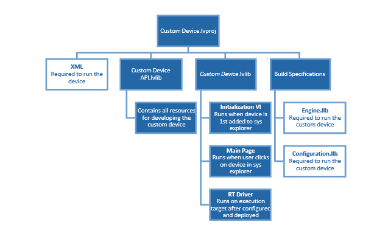
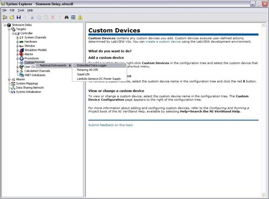

### Introduction to Custom Devices

VeriStand is an open software environment you can use to configure real-time testing applications, including hardware-in-the-loop (HIL) systems.

With VeriStand, you can complete the following objectives.

* Configure real-time input/output (I/O), stimulus profiles, data logging, alarming, and other tasks.
* Implement control algorithms or system simulations by importing models from a variety of software environments.
* Build test system interfaces quickly with a run-time editable user interface complete with ready-to-use tools.

For more information on VeriStand, refer to the NI Developer Zone tutorial [What is NI VeriStand?](https://www.ni.com/en-us/shop/data-acquisition-and-control/application-software-for-data-acquisition-and-control-category/what-is-veristand.html)

You can customize and extend the VeriStand environment with LabVIEW to meet application requirements. This document provides the background, design decisions, and technical information required to understand and develop custom devices in VeriStand.

Before you begin creating a custom device, you must understand the VeriStand Engine. For more information on the VeriStand Engine refer to the [VeriStand Manual](https://www.ni.com/docs/en-US/bundle/veristand/page/vs-engine.html).

#### What is a Custom Device?

While VeriStand provides most of the functionality required by a real-time testing application, the environment can be customized to meet application requirements.

Custom devices are one way to extend VeriStand. For more ways to customize NI VeriStand, refer to the NI Developer Zone tutorial [Using LabVIEW and Other Software Environments with NI VeriStand](https://www.ni.com/ro-ro/innovations/white-papers/09/using-ni-veristand-with-other-software-environments-to-create-re.html).

Developers can use custom devices to dictate how VeriStand executes. Any LabVIEW callable code can be made into a custom device. Custom devices allow customization to the operator interface within System Explorer.

Custom devices can display many different configuration experiences. This include simple controls on a VI front panel, pop-up windows and silent routines to scrape the configuration from a database.

A custom device typically consists of an XML file and .llb/.lvlibp [VI libraries](https://www.ni.com/docs/en-US/bundle/labview/page/lvhowto/lv_file_extensions.html). The following chart displays the organizational structure of a custom device LabVIEW project.



The XML file tells VeriStand how to load, display, use and deploy the device. The VI Libraries define the behavior of the device. One library is for configuration and the other is for the engine.

Custom devices can be created by NI, 3rd parties, and in-house developers. The developer builds the configuration and engine library, and the XML file from [Source Distributions](https://www.ni.com/docs/en-US/bundle/labview/page/lvdialog/source_distrib_db.html) in LabVIEW.

Most custom devices begin as a LabVIEW template project. The latest [niveristand-custom-device-wizard](https://github.com/ni/niveristand-custom-device-wizard) release scripts the template project based on user inputs. You can then modify the template project to fulfill the requirements of the custom device.

A LabVIEW project is needed to build a custom device, but only the configuration library, engine library and XML file are required to use the custom device in VeriStand.

After obtaining (or building himself) the custom device’s libraries, the operator places them in the VeriStand `<CommonData>\Custom Devices` directory. This directory location varies with the host operating system.

#### Table of Directories and Aliases:

The following tables list paths to common VeriStand directories by operating system. The heading before each table indicates how NI documentation refers to the directory. For directories with aliases listed, the alias is the text that appears with a relative path in an API or XML file. This text defines the directory that the path is relative to.

```{eval-rst}
+-------------------------+-------------------------------------------------------------------------+
|<Common Data>            |Alias: To Common Doc Dir                                                 |
+=========================+=========================================================================+
|Windows                  |<Public Documents>\\National Instruments\\NI VeriStand <xxxx>            |
+-------------------------+-------------------------------------------------------------------------+
```

```{eval-rst}
+-------------------------+-----------------------------------------------------------------------+
|<Application Data>       | Alias: To Application Data Dir                                        |
+=========================+=======================================================================+
|Windows                  |<Application Data>\\National Instruments\\VeriStand                    |
+-------------------------+-----------------------------------------------------------------------+
```

```{eval-rst}
+----------------------------+-------------------------------------------------------+
|<Base>                      | Alias: To Base                                        |
+============================+=======================================================+
|Windows                     |<Program Files>\\National Instruments\\VeriStand <xxxx>|
+----------------------------+-------------------------------------------------------+
```

```{eval-rst}
+----------------------------------+--------------------------------------------------------------+
|<Custom Device Engine Destination>| Alias: To Base                                               |
+==================================+==============================================================+
|Linux                             |c:\\ni-rt\\NIVeriStand\\Custom Devices\\<custom device name>\\|
+----------------------------------+--------------------------------------------------------------+
```

&nbsp;&nbsp;&nbsp; **Note:** &lt;xxxx&gt; is the  VeriStand version number.

VeriStand parses `Common Data\Custom Devices` for custom device XML files when it first launches. You must restart VeriStand to recognize newly added or modified custom device XML files.

Add the custom device to the system definition in the configuration tree by navigating to **System Definition** » **Targets** » **Controller** and right-clicking **Custom Devices**.



Custom devices consist of three parts.

* Custom Device Framework
* Custom Code
* Custom Device XML File

#### Custom Device Framework

The custom device framework consists of type definitions, specifically named controls and indicators, template VIs and a LabVIEW API. Together these items form the rules, or framework, that allows any conforming VI to interact with VeriStand. There are several prebuilt types of custom devices. Almost any requirement can be accomplished by adding or modifying code in one of the prebuilt devices.

The prebuilt devices start with the [niveristand-custom-device-wizard](https://github.com/ni/niveristand-custom-device-wizard).
The developer specifies the type of custom device before running the niveristand-custom-device-wizard. The wizard generates the LabVIEW Project for the new custom device. The exact resources in the project depend on the type of custom device selected.

The project is pre-populated with VIs, LabVIEW Libraries, an XML File, and build specifications. These resources provide the framework upon which almost all custom devices are built.

VeriStand evolved from NI Dynamic Test Software (NI-DTS). NI-DTS evolved from 3rd party intellectual property (IP) called EASE. The IP made basic provisions for add-on LabVIEW code.

These provisions could be considered the first custom device framework on which several “custom devices” were built. If you find a custom device that does not fit the niveristand-custom-device-wizard framework, you may be operating an EASE based custom devices.

#### Custom Code

Custom code performs any functionality desired by the custom device developer. While the initialization and engine frameworks provide access to VeriStand data and timing resources, you must implement the code to meet specification.

For example, custom code can perform a single A/D conversion on a 3rd party digitizer. The framework provides the means for sending the digitized value to the rest of the VeriStand system so that it can be mapped to a channel or used in a stimulus profile.

#### Custom Device XML

Each custom device has an XML file that contains information used by VeriStand to load, configure, display, deploy and run the device. The basic information includes VI and dependency paths, page names, action items, menu items, and meta data for the various pages that make up the custom device.

The niveristand-custom-device-wizard generates an XML file in the template LabVIEW Project. Any properly formatted XML file will be parsed by VeriStand. After the XML file is created by the Custom Device Template Tool, all updates have to be manual.

The custom device XML file does not automatically synchronize with changes to the LabVIEW project. Also, the file does not automatically deploy. You must modify the XML file in the LabVIEW Project directory when making changes. Building the initialization specification overwrites the XML in the `<Common Data>\Custom Devices` folder.

The XML file alters the appearance and behavior of the custom device in System Explorer. For example, you can add a right-click menu to a custom device by adding tags to the custom device XML file.

VeriStand parses `<Common Data>` for custom devices when it launches. A corrupt custom device XML file can affect the overall VeriStand system. You should exercise care and make a backup of the custom device XML before modifying it.
