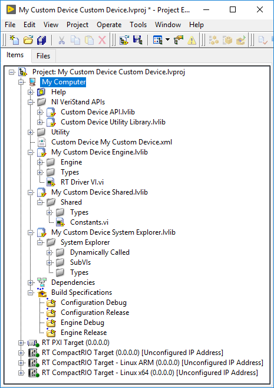
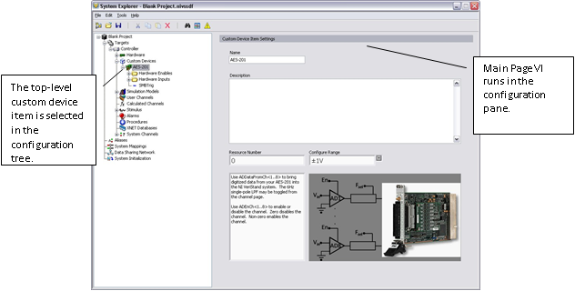

## Custom Device Classic Framework Overview

Classic framework provides the LabVIEW source project that contains the following.
* An NI VeriStand APIs virtual folder containing two VI libraries called *Custom Device API.lvlib* and *Custom Device Utility Library.lvlib*.
* A *&lt;Custom Device Name&gt;* VI library.
* A *&lt;Custom Device Name&gt; Shared.lvlib* VI library.
* A *&lt;Custom Device Name&gt; System Explorer.lvlib* VI library.

The following image displays a new custom device template project.

The Custom Device API library and Custom Device Utility Library contain most of the type definitions, template VIs and LabVIEW API needed to interact with VeriStand data and timing resources. They allow the VI to behave as a native task in the VeriStand Engine.

**Note:** Some of these VIs also appear on the LabVIEW palette in **NI VeriStand** » **[Custom Device API](https://zone.ni.com/reference/en-XX/help/372846M-01/veristandmerge/vs_custom_device_api_vis_pal/)**.

The API library contains the custom device’s configuration and real-time engine VIs. These correspond to the configuration and engine VI libraries. The front panel and block diagram of these VIs are populated with objects from the Custom Device API libraries.

#### Configuration

The [configuration](../Key_Concepts.md#configuration-and-engine-rt-driver-vi) of a Classic custom device is authored from the Custom Device Template Tool, which provides the Initialization VIs. You can add more VIs, including [pages](../Key_Concepts.md#pages), during development.

#### Initialization VI

The niveristand-custom-device-wizard adds the [Initialization VI](../Key_Concepts.md#configuration-and-engine-rt-driver-vi) (*Initialization VI.vi*) inside the Dynamically Called virtual folder of the &lt;Custom Device Name&gt; System Explorer library. It does not run again unless the operator removes and re-adds the custom device.

While you may rename certain objects in the custom device’s LabVIEW Project, it’s important to understand the ramifications of doing so. For example, the Initialization VI is referenced by name in the custom device XML file.

This file is generated when you first run the niveristand-custom-device-wizard. If you rename the Initialization VI after running the wizard, you’ll need to manually change the path to the Initialization VI in the custom device XML file.

#### Main Page

The niveristand-custom-device-wizard creates the [Main Page](../Key_Concepts.md#pages) (*Main Page.vi*) inside the Dynamically Called virtual folder of the *&lt;Custom Device Name&gt;* System Explorer library. The following image displays the top-level item.

 

#### Engine

The [engine](../Key_Concepts.md#configuration-and-engine-rt-driver-vi) of a Classic custom device contains the *RT Driver.vi.*, which the niveristand-custom-device-wizard creates inside the *&lt;Custom Device Name&gt;* Engine library.

The RT Driver VI runs on the Target regardless of the operating system. VeriStand deploys the engine when the operator runs the project from VeriStand or when the system definition is deployed using the VeriStand Execution API.

You can usually add initialization, steady-state, and shutdown code to the engine template. There aren't any hard boundaries on what code you can put into the engine, but each additional code that is added can increase the size of the engine, and the time required to deploy your system.

Each of the five prebuilt custom devices has a different engine VI. Each engine VI executes at a different time with respect to other VeriStand components. The timing requirements of a custom device, and thus the type of device selected, are functions of when the device needs to execute with respect to other VeriStand Engine components.

Not all requirements can be satisfied by one of the five types of prebuilt custom devices. Some custom devices will require multiple engine libraries. For example, a device may need to support different real-time operating systems. The [NI VeriStand – Set Custom Device Driver VI](https://zone.ni.com/reference/en-XX/help/372846M-01/veristandmerge/vs_set_custom_device_drivers/) allows you to programmatically change the driver library for a custom device.

Some custom devices use the prebuilt template as a launching pad for multiple parallel processes or complex frameworks. For more information, refer to **Beyond the Template Frameworks**.
