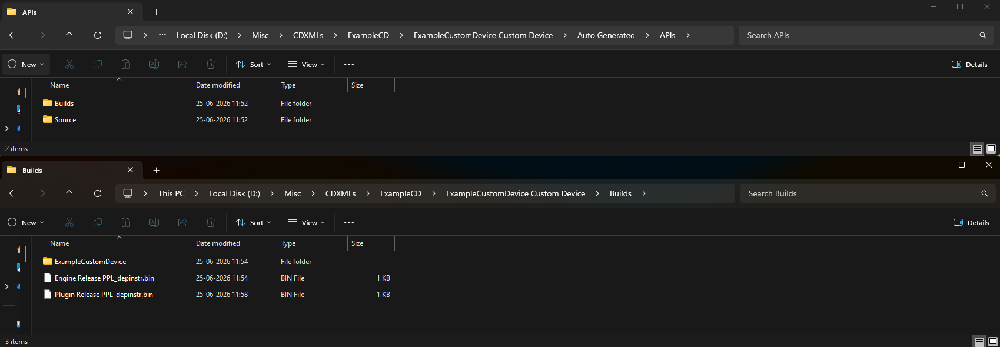
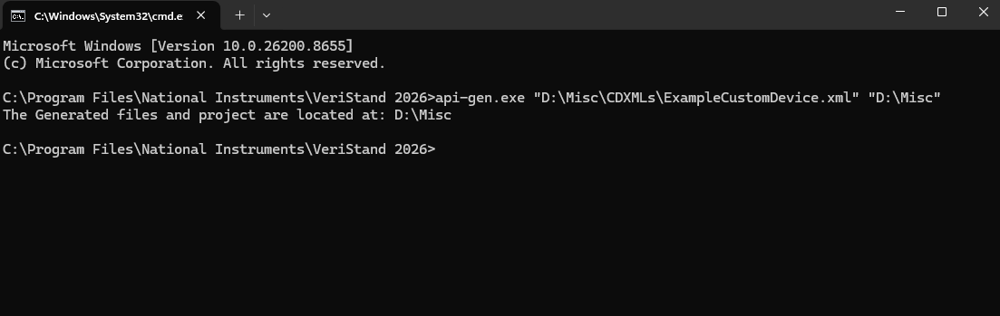

## Auto-Generated Scripting API

The Express framework turns a [Custom Device XML Definition](XML_Definition_Schema.md) into a fully built Custom Device. Part of what it produces is a **.NET scripting API** — a set of strongly typed classes you can use to create and configure the Custom Device programmatically in a VeriStand system definition.

This page explains how the API is generated, where the generated files and the finished Custom Device end up, what the API looks like, and how to run the generator yourself if you ever need to.

---

### Where the scripting API comes from

When you finish the Express wizard, the Custom Device is created end-to-end:

```
Definition XML  ──►  api-gen.exe  ──►  C# project (Auto Generated\APIs\Source)
                                          │
                                          ▼  build
                                 Scripting API .dll (Auto Generated\APIs\Builds)
                                          │
                  wizard opens the LabVIEW project on Finish ──► you build it
                                          │
                                          ▼
                       Finished Custom Device folder (Builds\<CustomDeviceName>)
                                          │  (+ optional GUI Layout.yaml)
                                          ▼
                          Custom Devices folder in Public Documents
```

1. The wizard runs the VeriStand **API generator** (`api-gen.exe`) on your definition XML to produce a ready-to-build C# project, then compiles it into the scripting API assembly.
2. On **Finish**, the wizard opens the generated LabVIEW project. When you build it, LabVIEW packages the configuration/engine/System Explorer libraries together with the scripting API assembly into the finished Custom Device folder.
3. You copy that finished folder into the VeriStand **Custom Devices** directory to use it. See [Distributing the Custom Device](../Distributing_the_Custom_Device.md).

> **Note:** The generated C# project *source* is a build artifact kept under `Auto Generated\APIs\Source`. It is not copied into the finished Custom Device — only the *built* scripting API DLL is included in the final folder along with the LabVIEW components.

---

### Where things are kept

When you point the wizard at a folder, it creates a `<CustomDeviceName> Custom Device` subfolder and generates everything inside it. For the full layout of that folder, see [Custom Device folder hierarchy](Implementing_the_Custom_Device.md#custom-device-folder-hierarchy). The locations that matter for the scripting API are:

| Item | Location |
|---|---|
| The definition XML (input) | Wherever you (or the wizard) saved it. The wizard records this path. |
| The generated C# project (source) | `…\Auto Generated\APIs\Source\GeneratedCode\<CustomDeviceName>\` |
| The built scripting API assembly | `…\Auto Generated\APIs\Builds\<NameSpace>.<CustomDeviceName>.dll` |

The built scripting API assembly (`<NameSpace>.<CustomDeviceName>.dll`) is also copied into the `Windows\` folder of the finished Custom Device (`…\<CustomDeviceName> Custom Device\Builds\<CustomDeviceName>\Windows\`).



---

### The generated C# project

The scripting API project lives at `Auto Generated\APIs\Source\GeneratedCode\<CustomDeviceName>\`. For a Custom Device whose `TypeName` is `ExampleCustomDevice`, it contains:

```
ExampleCustomDevice\
    ExampleCustomDevice.csproj
    nuget.config
    GeneratedCode\
        ExampleCustomDevice.cs          (the Custom Device class)
        ExampleCustomDeviceFactory.cs   (factory used by System Explorer)
        <Channel>.cs / <Channel>Factory.cs
        <Waveform>.cs / <Waveform>Factory.cs
        <Section>.cs / <Section>Factory.cs
        EnumDefinitions.cs              (only if the XML declares enums)
        TypeGuids.cs
        BaseNodeUtilities.cs
        GroupNameExpressionEvaluator.cs
        DependentNodeJsonSerializer.cs
```

* A class is generated for the Custom Device and for each `Channel`, `Waveform`, and `Section` type, plus a matching **factory** class for each. The factory is what System Explorer uses to create the node when an user adds it.
* `EnumDefinitions.cs` is generated only when your XML declares an `<EnumDefinitions>` block.
* Building this project produces `<NameSpace>.<CustomDeviceName>.dll` (for example, `CompanyName.Product.ExampleCustomDevice.dll`), the scripting API assembly that the finished Custom Device includes.
* The project targets the .NET Framework and references the VeriStand system-definition assemblies. It is a standard project that builds with the LabVIEW Express plugin (during the automated build) or with the .NET build tools.

---

### What the scripting API gives you

The generated API mirrors the structure you described in the XML. Using the `ExampleCustomDevice` from the handbook examples, the API surface looks like the following.

#### Constructors

```csharp
// Create a new, fully initialized Custom Device (adds default channels, waveforms, sections,
// and applies default property values from the XML).
var device = new ExampleCustomDevice("My Device");
```

There is also a constructor that wraps an existing node, which VeriStand uses internally when loading a system definition.

#### Properties

Every `<Property>` becomes a strongly typed .NET property whose type matches the [property type](XML_Definition_Schema.md#property-types) from the XML.

```csharp
device.OperationMode = OperationMode.Running;   // an enum property
device.HighFrequencyHz = 1000;                  // a numeric property
device.StringArrayPropertyExample = new[] { "Windows", "Linux" };
```

| XML property type | Generated .NET type |
|---|---|
| `String` | `string` |
| `BinaryString` | `byte[]` |
| `Boolean` | `bool` |
| `I16` / `I32` / `I64` | `short` / `int` / `long` |
| `U16` / `U32` / `U64` | `ushort` / `uint` / `ulong` |
| `Double` | `double` |
| `*Array` types | the corresponding array (`string[]`, `double[]`, `int[]`, ...) |
| `Enum` | the generated enum type |
| `DependentFile` | `DependentFile` |
| `DependentNode` | `DependentNode` |
| `Variant` | `Variant` |

#### Channels, waveforms, and sections

For each child node type, the API generates methods to add and retrieve nodes:

```csharp
// Add a new child by name (returns the existing one if a node with that name already exists).
TimeChannel time = device.AddTimeChannel("CD Time", out bool isNew, out Error error);

// Add a pre-built child node.
device.AddAnalogInput(new AnalogInput("CD Analog Input 1"));

// Retrieve children.
TimeChannel[] times       = device.GetTimeChannels();   // by specific type
CustomDeviceChannel[] all = device.GetChannels();        // all channels

SectionA0[] sections    = device.GetSectionA0s();
AnalogInput[] waveforms = device.GetAnalogInputs();
```

The `Default` node lists in the XML are created for you automatically when you construct a new Custom Device. The `Dynamic` node lists determine which `Add...` methods exist for user-addable types.

#### Configuration import and export

Every generated Custom Device supports round-tripping its configuration to and from JSON and XML:

```csharp
device.ExportToJson(@"C:\configs\device.json");   // write configuration to a JSON file
device.ExportToJson(out string json);             // or to a string

device.ImportFromJson(@"C:\configs\device.json"); // load configuration from JSON
device.ImportFromXml(@"C:\configs\device.xml");   // load configuration from a definition XML
device.ExportToXml(@"C:\configs\device.xml");     // write configuration to XML
```

Below is an example json representation of Custom Device from ExportToJson
<div style="max-height: 300px; overflow-y: auto; overflow-x: auto; border: 1px solid #ccc; padding: 10px; border-radius: 5px;">

```json
{
  "SystemMonitor": {
    "Name": "SystemMonitor",
    "Properties": {
      "TargetOS": "Windows",
      "TargetRate": 100.0,
      "Update Rate (Hz)": 10.0
    },
    "Sections": {
      "CPUOverall[]": [
        {
          "Name": "CPU Overall",
          "Channels": {
            "Average[]": [
              {
                "GroupName": "Incoming",
                "Name": "Average",
                "Type": "Output",
                "Units": "%",
                "Faultable": false,
                "Scalable": false,
                "DefaultValue": 0.0,
                "ChannelDataReference": -8
              }
            ],
            "Maximum[]": [
              {
                "GroupName": "Incoming",
                "Name": "Maximum",
                "Type": "Output",
                "Units": "%",
                "Faultable": false,
                "Scalable": false,
                "DefaultValue": 0.0,
                "ChannelDataReference": -8
              }
            ]
          }
        }
      ],
      "MemoryUsage[]": [
        {
          "Name": "Memory Usage",
          "Channels": {
            "TotalMemory[]": [
              {
                "GroupName": "Incoming",
                "Name": "Total Memory",
                "Type": "Output",
                "Units": "kB",
                "Faultable": false,
                "Scalable": false,
                "DefaultValue": 0.0,
                "ChannelDataReference": -8
              }
            ],
            "Available[]": [
              {
                "GroupName": "Incoming",
                "Name": "Available",
                "Type": "Output",
                "Units": "kB",
                "Faultable": false,
                "Scalable": false,
                "DefaultValue": 0.0,
                "ChannelDataReference": -8
              }
            ]
          }
        }
      ],
      "CPU[]": []
    }
  }
}
```
</div>
<br>

Below is an example XML representation of Custom Device from ExportToXml
<div style="max-height: 300px; overflow-y: auto; overflow-x: auto; border: 1px solid #ccc; padding: 10px; border-radius: 5px;">

```xml
<?xml version="1.0" encoding="utf-8"?>
<SectionDocument xmlns:xsi="http://www.w3.org/2001/XMLSchema-instance" xsi:noNamespaceSchemaLocation="SectionDocument.xsd">
	<Version Major="2020" Minor="0" Fix="0" Build="0" />
	<Section Name="SystemMonitor" TypeGUID="83C5DD7A-68C5-4260-8FC3-8ECCA1D25122" Identifier="d8b416cb-c9fb-42ce-9e1a-c5068cfc02f9">
		<Description />
		<Properties>
			<Property Name="CD Status">
				<U32>1</U32>
			</Property>
			<Property Name="Driver VI Exec Mode">
				<U32>1</U32>
			</Property>
			<Property Name="Version">
				<String>1.0</String>
			</Property>
			<Property Name="Dependency_1">
				<DependentFile Type="To Common Doc Dir" Path="Custom Devices\SystemMonitor\Linux_x64\Adapter\Custom Device Interfaces_v1.lvlibp">
					<Version />
					<ForceDownload>false</ForceDownload>
					<RTDestination>c:\ni-rt\VeriStand\Custom Devices\SystemMonitor\Adapter\Custom Device Interfaces_v1.lvlibp</RTDestination>
					<SupportedTarget>Linux_x64</SupportedTarget>
					<MD5>f27295ff79e82fc196523d6f47cad98d</MD5>
				</DependentFile>
			</Property>
			<Property Name="Dependency_2">
				<DependentFile Type="To Common Doc Dir" Path="Custom Devices\SystemMonitor\Linux_x64\SystemMonitor.lvlibp">
					<Version />
					<ForceDownload>false</ForceDownload>
					<RTDestination>c:\ni-rt\VeriStand\Custom Devices\SystemMonitor\SystemMonitor.lvlibp</RTDestination>
					<SupportedTarget>Linux_x64</SupportedTarget>
					<MD5>07b8ca4ebad8962d70f7d3ea0edf67aa</MD5>
				</DependentFile>
			</Property>
			<Property Name="Dependency_3">
				<DependentFile Type="To Common Doc Dir" Path="Custom Devices\SystemMonitor\Linux_x64\Adapter\SystemMonitor Engine Linux64.lvlibp">
					<Version />
					<ForceDownload>false</ForceDownload>
					<RTDestination>c:\ni-rt\VeriStand\Custom Devices\SystemMonitor\Adapter\SystemMonitor Engine Linux64.lvlibp</RTDestination>
					<SupportedTarget>Linux_x64</SupportedTarget>
					<MD5>87e3c45cc9a8e60d568cc07dae650e51</MD5>
				</DependentFile>
			</Property>
			<Property Name="user.CD.Update Rate (Hz)">
				<Double>10</Double>
			</Property>
			<Property Name="user.CD.IsInstanceOfGeneratedCustomDeviceClass">
				<Boolean>true</Boolean>
			</Property>
			<Property Name="user.CD.Async Init Timeout">
				<U16>5000</U16>
			</Property>
		</Properties>
		<Errors />
		<Section Name="CPU Overall" TypeGUID="B1AD58B7-82B2-4510-985C-757166E6253C" Identifier="be9ab4a7-4663-4df9-8b14-2660edbfe623">
			<Description />
			<Properties />
			<Errors />
			<Channel Name="Average" TypeGUID="75DCE586-A85C-4195-B00F-BDB2A0B00C2A" Identifier="ba971187-bc2c-4d7d-8a60-341e6ff01ed5" RowDim="1" ColDim="1" Units="%" BitFields="1">
				<Description />
				<Properties>
					<Property Name="user.CD.Group Name">
						<String>Incoming</String>
					</Property>
				</Properties>
				<Errors />
				<DefaultValue>
					<Elem>0</Elem>
				</DefaultValue>
			</Channel>
			<Channel Name="Maximum" TypeGUID="5DD58C29-A344-44F7-9F33-268CF7DD13DE" Identifier="b6929616-c65b-4e18-886a-8d7c1623c5d2" RowDim="1" ColDim="1" Units="%" BitFields="1">
				<Description />
				<Properties>
					<Property Name="user.CD.Group Name">
						<String>Incoming</String>
					</Property>
				</Properties>
				<Errors />
				<DefaultValue>
					<Elem>0</Elem>
				</DefaultValue>
			</Channel>
		</Section>
		<Section Name="Memory Usage" TypeGUID="108C37EA-BB68-4392-BEE4-1A2ECD32F472" Identifier="449d9973-0f17-4ccb-a401-0336230a8a9a">
			<Description />
			<Properties />
			<Errors />
			<Channel Name="Total Memory" TypeGUID="8E28A37F-542A-41F5-B1B7-E5911C12A98B" Identifier="62848338-164a-445e-aa7c-d8e32a3967a7" RowDim="1" ColDim="1" Units="kB" BitFields="1">
				<Description />
				<Properties>
					<Property Name="user.CD.Group Name">
						<String>Incoming</String>
					</Property>
				</Properties>
				<Errors />
				<DefaultValue>
					<Elem>0</Elem>
				</DefaultValue>
			</Channel>
			<Channel Name="Available" TypeGUID="D3DF01A4-948E-402D-BB20-EE63EE952155" Identifier="834991e4-dfd4-43f8-8f4c-7cad8973a13a" RowDim="1" ColDim="1" Units="kB" BitFields="1">
				<Description />
				<Properties>
					<Property Name="user.CD.Group Name">
						<String>Incoming</String>
					</Property>
				</Properties>
				<Errors />
				<DefaultValue>
					<Elem>0</Elem>
				</DefaultValue>
			</Channel>
		</Section>
	</Section>
</SectionDocument>
```
</div>
<br>

These same operations are available to operators as right-click actions in System Explorer. See [Importing and exporting a configuration](Auto_Generated_UI.md#importing-and-exporting-a-configuration).

---

### How property names map to API members

Property and enum-member *display names* in the XML can contain spaces and special characters. The generator keeps the original display name for the UI and the configuration data, and derives a clean API member name from it using these rules:

* If the name contains a `:` or `.`, only the part after the **last** one is used. For example, `Frequency.High frequency` becomes `HighFrequency`.
* The characters `( ) [ ] { } : . -` and spaces are treated as word separators.
* Each word is capitalized and the words are joined (PascalCase).

| XML `PropertyName` | Generated API member |
|---|---|
| `High frequency [Hz]` | `HighFrequencyHz` |
| `Low frequency (Hz)` | `LowFrequencyHz` |
| `Frequency : Low Level frequency` | `LowLevelFrequency` |
| `Frequency.High frequency` | `HighFrequency` |
| `I16_PropertyExample` | `I16PropertyExample` |

When you reference a property elsewhere — for example in a [GUI Layout.yaml](Auto_Generated_UI.md#gui-layoutyaml-reference) file — you use the **original** display name from the XML, not the PascalCase API name.

---

### Generating the API manually with api-gen.exe

The full build is automated by the Express wizard. You normally never run the generator yourself. However, if you already have a definition XML and only want the intermediate C# project — for example, to inspect the generated API or to build it with your own tooling — you can run the generator directly. It installs with VeriStand.

```
api-gen.exe "<PathToDefinitionXml>" "<OutputDirectory>"
```

| Argument | Required? | Description |
|---|---|---|
| `<PathToDefinitionXml>` | Yes | Path to your Custom Device Definition XML. |
| `<OutputDirectory>` | No | Where to write the generated project. Defaults to the current working directory. |

Behavior to be aware of:

* On success, it prints `The Generated files and project are located at: <dir>` and writes the project described in [The generated C# project](#the-generated-c-project).
* `api-gen.exe` **only generates source and a project file. It does not compile the Custom Device DLL.** Build the generated `.csproj` yourself to produce the assembly.
* It validates the XML first. On a validation error it prints `ERROR: <message>` describing the problem (missing attribute, invalid `TypeName`, wrong child order, unsupported type, invalid group-name expression, and so on).
* `api-gen.exe` does **not** generate or read a `GUI Layout.yaml` file — that file is UI-only and is added separately. See [Auto-Generated System Explorer UI](Auto_Generated_UI.md).

> **Note:** Running the generator manually is an optional shortcut for the C# project step only. The recommended path for building a complete, distributable Custom Device is the Express wizard, which runs the generator, builds the assembly, and assembles the final Custom Device folder for you.



---

### Customizing the API by modifying the source

The generated C# project under `Auto Generated\APIs\Source\GeneratedCode\<CustomDeviceName>\` is a standard .NET project, so you can open it, edit the generated classes, and rebuild `<NameSpace>.<CustomDeviceName>.dll` with the LabVIEW Express plugin or the .NET build tools. This is useful when you need behaviour the XML cannot express — for example, custom validation in a property setter, a convenience method on the device class, or additional import/export logic.

> **Warning:** The source and the built assembly under `Auto Generated\` are regenerated from the XML every time the wizard runs, so hand edits are overwritten. Prefer changing the [XML definition](XML_Definition_Schema.md) whenever it can express what you need. Reserve source edits for cases the XML cannot cover, keep them minimal, and back them up so you can reapply them after a regenerate.

When your customization is structural (channels, properties, sections, enums), always edit the XML and regenerate rather than modifying the source.

