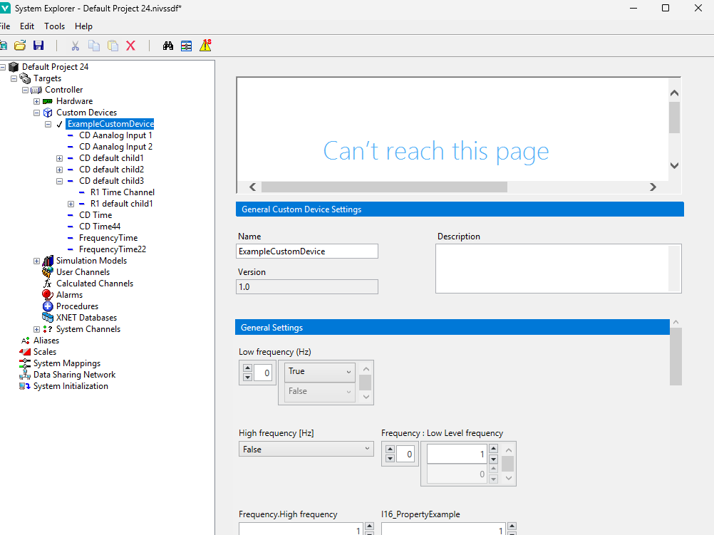
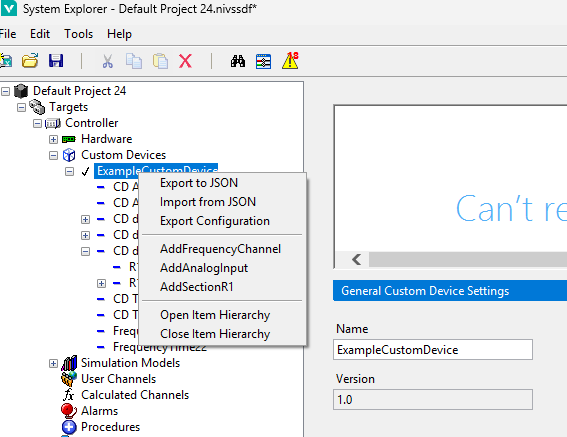
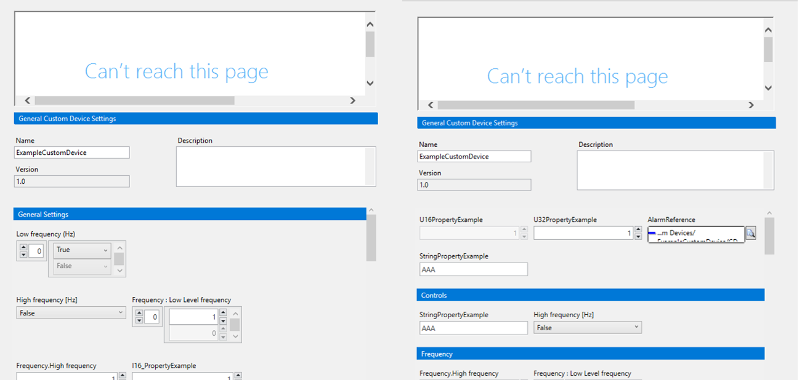

## Auto-Generated System Explorer UI

When you add an Express custom device to a system definition, VeriStand builds the configuration UI for you automatically from the device's [definition](XML_Definition_Schema.md). Every property you defined becomes an editable control in the System Explorer **right-hand configuration pane** — no UI code required.

This page describes what UI you get out of the box, the controls each property type produces, the import/export actions available on a device, and the optional `GUI Layout.yaml` file you can use to arrange and conditionally show the controls exactly how you want.

---

### Launching the UI

1. Build and place the finished custom device folder in the VeriStand Custom Devices directory (see [Distributing the Custom Device](Distributing_the_Custom_Device.md)).
2. Launch VeriStand and open (or create) a system definition in **System Explorer**.
3. Right-click the **Custom Devices** node, and add your device from the menu. The device, along with its default channels, waveforms, and sections, appears in the configuration tree.
4. Select the device node (or any of its child nodes). The right-hand pane shows the auto-generated configuration controls for that node's properties.



---

### What the default UI looks like

If you do not provide a [GUI Layout.yaml](#gui-layoutyaml-reference) file, every node renders a **default layout**: all of the node's properties appear in a single ungrouped section, two controls per row, in definition order. This works immediately and requires nothing extra from you.

Each property is rendered with a control appropriate to its [type](XML_Definition_Schema.md#property-types):

| Property type | Control in the configuration pane |
|---|---|
| `String` | Single-line text box |
| `Boolean` | Checkbox / toggle |
| `I16`/`I32`/`I64`, `U16`/`U32`/`U64`, `Double` | Numeric entry |
| Enum | Drop-down list of the enum members |
| `StringArray` | Editable list of text values (add/remove rows) |
| `BooleanArray` | Editable list of Boolean values |
| Numeric array types | Editable list of numeric values |
| `DependentFile` | File-path control with the file's sub-fields |
| `DependentNode` | Node-reference control |
| `Variant` | Shown as a value control where applicable |

Read-only properties (those without a public setter) are displayed but not editable.

---

### Importing and exporting a configuration

A device node in System Explorer exposes right-click actions to move its configuration in and out of files. These mirror the [scripting API](Auto_Generated_Scripting_API.md#configuration-import-and-export) methods.

| Action | What it does |
|---|---|
| **Export to JSON** | Writes the device's current configuration (properties and child nodes) to a JSON file. |
| **Import from JSON** | Loads a previously exported JSON configuration into the selected device, updating its properties and children in place. |
| **Export to XML** | Writes the device's current configuration to an XML file. |
| **Import from XML** | Loads a configuration from an XML file into the selected device. |

You can also create a device directly from a saved configuration: instead of adding a blank device and editing it, use the **Import from XML** entry point on the Custom Devices node to add a device pre-populated from an XML file.

Import operations are non-destructive to identity: matching child nodes (same name and type) are updated in place, new children are added, and children no longer present are removed, so references elsewhere in the system stay valid where possible.



---

### GUI Layout.yaml reference

To control how the configuration pane is organized — grouping properties into named sections, placing multiple controls on one row, and showing or enabling controls based on other property values — add a file named **`GUI Layout.yaml`** next to the custom device DLL.

#### Placement and loading

* The file must be named exactly **`GUI Layout.yaml`** and sit in the **same folder as the generated scripting API assembly** (`<NameSpace>.<TypeName>.dll`, for example `CompanyName.Product.ExampleCustomDevice.dll`). In a finished device this assembly is in the device's `Windows\Plugins` folder, so place `GUI Layout.yaml` next to it there.
* It is **GUI-only**. The API generator neither creates nor reads it; you add it to the device folder yourself (or distribute it with the device).
* The layout is **read once per node type per VeriStand session** and cached. After editing the file, **restart VeriStand** (or reopen the system definition) to see changes.
* If no file is present, or a node type has no entry, that node uses the [default layout](#what-the-default-ui-looks-like).

#### Formatting rules (the parser is strict)

The reader is an indentation-based parser, not a full YAML engine. Follow these rules exactly:

* **Use spaces, never tabs**, for indentation.
* Use these exact indent levels:
  * Node-type header: **0 spaces**
  * Section label, top-level rows, `Visibility:` / `Editability:` headers: **2 spaces**
  * Property rows (`- [...]`), and `- Property:` / `- Section:` rule lines: **4 spaces**
  * `Expression:` on the line **immediately after** its `- Property:` / `- Section:` line.
* Property names in a row are comma-separated inside `[ ]`.
* In expressions, **property names must be in double quotes** (for example, `"Channel Count" >= 2`).
* Property names refer to the **original XML display names**, not the PascalCase API names.

> **Note:** Save the file with the encoding and line endings your editor produces for the platform. If the whole file appears to fall back to the default layout, the most common causes are tabs used for indentation or incorrect indent levels.

#### Sections, rows, and columns

A layout is keyed by node-type name. Under it, each named section contains rows. The number of controls in a row determines how many columns that row has.

```yaml
ExampleCustomDevice:

  Device Settings:
    - [Operation Mode, Trigger Config]
    - [Enabled, Channel Count]

  Acquisition:
    - [Frequency, Amplitude, Gain]
    - [Offset]
```

* Sections render in the order they are listed; controls render in the order within each row.
* A row like `- [Frequency, Amplitude, Gain]` renders three columns side by side; `- [Offset]` renders a single column.
* Any properties you do not place explicitly still render, in a trailing ungrouped section, so nothing is lost.

#### Top-level (ungrouped) rows

Rows placed at the section-indent level (2 spaces) *before* any named section render at the top of the pane, with no section header:

```yaml
ExampleCustomDevice:

  - [U16PropertyExample, U32PropertyExample, AlarmReference]
  - [StringPropertyExample]

  Controls:
    - [StringPropertyExample, "High frequency [Hz]"]
```

Property names that contain spaces or special characters must be quoted inside a row, for example `"High frequency [Hz]"`.

#### Visibility and editability rules

Two optional blocks, `Visibility:` and `Editability:`, let you show/hide or enable/disable a property — or an entire section — based on the value of other properties. Each rule is a `- Property:` or `- Section:` line followed by an `Expression:` line.

```yaml
ExampleCustomDevice:

  Acquisition:
    - [Frequency, Amplitude, Gain]

  Visibility:
    - Property: Amplitude
      Expression: "Enabled" == true
    - Section: Acquisition
      Expression: "Enabled" == true

  Editability:
    - Property: Device Name
      Expression: "Channel Count" >= 2
```

* A **Visibility** rule that evaluates to `false` hides the property (or section).
* An **Editability** rule that evaluates to `false` makes the property (or section) read-only/disabled.
* Rules update **live** as the operator changes the controlling property values.

#### Expression syntax

Expressions compare property values against literals and combine the results with logical operators.

| Category | Supported |
|---|---|
| Property reference | `"PropertyName"` (always double-quoted) |
| Numbers | integers and decimals, for example `10`, `2.5`, `-3` |
| Booleans | `true`, `false` |
| Text values | single-quoted strings, for example `'Device A'`, or bare identifiers (treated as names) |
| Comparison | `==`, `!=`, `<`, `<=`, `>`, `>=` |
| Logical | `&&` (AND), `||` (OR), `!` (NOT) |
| Grouping | parentheses `( ... )` |

Evaluation notes:

* String and name comparisons with `==` / `!=` are **case-insensitive**.
* Relational operators (`<`, `<=`, `>`, `>=`) require **numeric** operands.
* `&&` and `||` short-circuit.

Examples:

```text
"StringPropertyExample" == AAA
"StringPropertyExample" != Disabled && "I32PropertyExample" >= 0
("StringPropertyExample" == AAA || "StringPropertyExample" == BBB) && "I32PropertyExample" > 5
!("StringPropertyExample" == BBB)
```

**Comparing enum properties:** compare an enum property against its **integer value** for reliable results, for example `"Operation Mode" == 1`. Comparing against the member name (for example `"Operation Mode" == Running`) may not match, because the stored value is the underlying integer.

#### Defining a layout for multiple node types

A single `GUI Layout.yaml` can describe layouts for the device and for its section/channel/waveform types. Add one top-level header per node type; VeriStand applies the matching layout to whichever node the operator selects.

```yaml
ExampleCustomDevice:
  Device Settings:
    - [Operation Mode, Trigger Config]

SectionA0:
  Config:
    - [Operation Mode, Trigger Config]
    - [Enabled, Label, Count]
```

A node type with no header in the file uses the default layout.

#### Warnings and graceful fallbacks

The parser is forgiving: a problem in one place does not break the rest of the pane. Issues are collected and surfaced in a single **"Layout Warnings"** message shown once per node type per session, while valid content still renders.

| Situation | Behavior |
|---|---|
| Unknown property name in a row | A warning lists it; the other properties in the row still render. |
| Malformed row (for example, a missing bracket, or values not wrapped in `[ ]`) | A warning is shown; the row falls back to single-column rendering of its values. |
| Expression references an undefined property | A warning is shown; that rule is ignored. |
| Property name in an expression not in double quotes | A warning is shown; that rule is ignored. |
| A node type's layout cannot be parsed at all | That node falls back to the default layout. |



