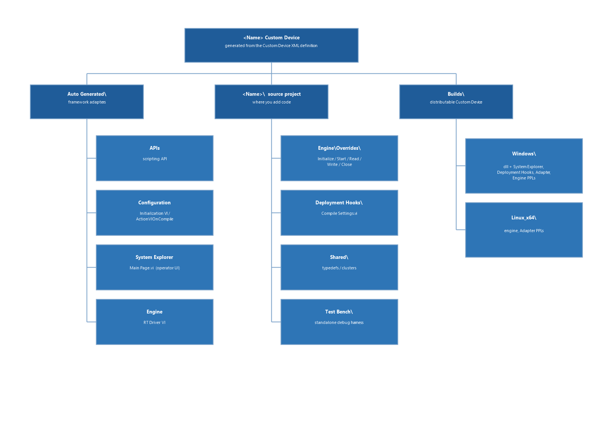
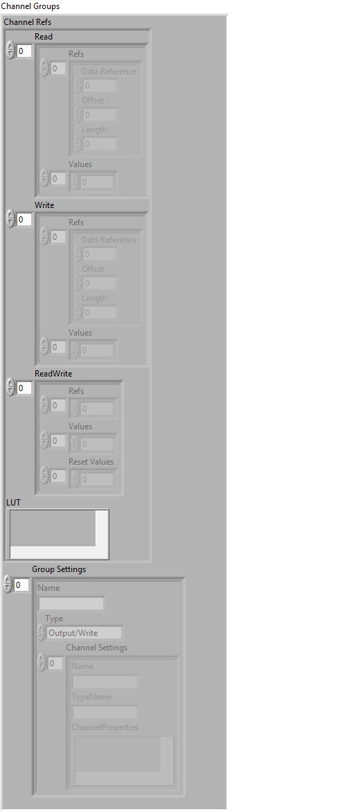

## Implementing Custom Logic in Express

---

### Custom Device folder hierarchy

When you finish the wizard, it creates a `<CustomDeviceName> Custom Device` folder that holds everything for the Custom Device. The structure is as follows:



```
<CustomDeviceName> Custom Device\
  Custom Device <CustomDeviceName>.xml     ← read by VeriStand System Explorer
  Auto Generated\                          ← generated from the input XML
    APIs\
      Source\                              ← generated C# scripting API project
      Builds\                              ← built scripting API .dll
    Configuration\                         ← System Explorer configuration library (adapter) 
    Engine\                                ← engine library (adapter) containing RT Driver VI.vi
    System Explorer\                       ← System Explorer UI library containing Main Page.vi and Action VIs
  <CustomDeviceName>\                      ← the LabVIEW template you open and edit
    Deployment Hooks\                      ← compiles settings/channel groups on the host during deployment
    Engine\
      Overrides\                           ← the lifecycle VIs you implement
      Types\                               ← engine specific typedefs
      Utilities\                           ← channel-group and settings helper VIs
      Logging\
      BuildVIs\
      <CustomDeviceName> Engine.lvclass    ← your Custom Device class
    Shared\                                ← generated typedefs / clusters
    Test Bench\                            ← standalone debug harness
  Builds\                                  ← the finished distributable Custom Device
```

The folder has three top-level areas:

* **`Auto Generated\`** — everything the framework produces from the XML. Regenerated on every run; no need to edit for most use cases.
* **`<CustomDeviceName>\`** — the LabVIEW source project the wizard opens on **Finish**. This is where you add your custom code.
* **`Builds\`** — deployable Custom Device. See [Distributing the Custom Device](../Distributing_the_Custom_Device.md).

---

### `Auto Generated`

Every time the wizard runs, it regenerates these components from the [XML definition](XML_Definition_Schema.md), overwriting whatever was there before.

**In most cases, you won't need to edit or update the generated code in this folder**. If you do modify it to edit or extend functionality, back up your changes first—otherwise they are lost on the next regeneration from wizard.

#### APIs

The wizard produces the scripting API in two steps. First, it generates the C# source (under the `APIs\Source\` folder) by internally calling the **API auto-generation executable** (`api-gen.exe`), which is installed with VeriStand. Second, it compiles that source into the scripting API assembly (`APIs\Builds\<NameSpace>.<CustomDeviceName>.dll`).

For a full walkthrough of how the API is generated, how to run the generator yourself, and how to customize the API by modifying the generated source, see [Auto-Generated Scripting API](Auto_Generated_Scripting_API.md).

**Using the API for configuration.** The System Explorer library consumes this `.dll` to create and configure the Custom Device: it constructs the strongly typed Custom Device, channel, waveform, and section nodes, applies property values, and writes them into the VeriStand system definition. Because the same API is available to any .NET client, you can also use it to create or configure the Custom Device programmatically outside System Explorer.

#### Configuration

The Configuration library (`<CustomDeviceName> Configuration.lvlibp`) runs on Windows inside System Explorer. This library contains the code that is common to all Custom Devices and acts as an adapter between your custom code and VeriStand. Custom code specific to your Custom Device belongs in the System Explorer library, which holds the Custom Device–specific GUI and Action VIs.

The Configuration library contains two VIs that VeriStand calls directly: `Initialization VI.vi` and `ActionVIOnCompile.vi`.

`Initialization VI.vi` runs when VeriStand loads the Custom Device. System Explorer calls this VI the same way in both the Classic and Express frameworks. In the Express framework, it reads the hierarchy defined in the XML definition file and adds the default nodes to the Custom Device tree in System Explorer.

`ActionVIOnCompile.vi` runs when the operator deploys the project, which compiles the system definition. It sets the RT driver file paths so VeriStand knows where to find the engine PPL on the target, and calls into the deployment hooks to retrieve the compiled settings.

You can customize the functionality `Initialization VI.vi` and `ActionVIOnCompile.vi` provide, but it is your responsibility to ensure your changes do not break the overall architecture.

#### Engine

The Engine library (`<CustomDeviceName> Engine.lvlibp`) runs on the target. Like the Configuration library, it contains the code that is common to all Custom Devices and acts as an adapter between your custom engine code and VeriStand.
Custom code specific to your Custom Device belongs in the `<CustomDeviceName>` PPL, where you override the lifecycle methods to implement custom behaviour.

The Engine library contains `RT Driver VI.vi`, the entry point VeriStand calls on the target. RT Driver VI loads `<CustomDeviceName>` PPL that contains custom code and executes override methods Initialize/Start/Read/Write/Close.

Engine library also has the generated Custom Device API class that contains wrappers for VeriStand specific APIs. The generated Custom Device API class (`NIVS Custom Device API.lvclass`) exposes the following VIs:

| API VI | Purpose |
|---|---|
| `Get Channel Value by Data Reference.vi` | Reads a single channel value using its data reference |
| `Get Channel Values by Block Data Ref.vi` | Reads all channel values in a group at once using a block data reference |
| `Set Channel Value by Data Reference.vi` | Writes a single channel value using its data reference |
| `Set Channel Values by Block Data Ref.vi` | Writes all channel values in a group at once using a block data reference |
| `Print Debug Line.vi` | Prints a debug message to the VeriStand log |

Use these APIs in your custom code instead of using traditional Custom Device APIs. This decouples the custom code in `<CustomDeviceName>` PPL from VeriStand and helps in testing the code in standalone mode outside of VeriStand with the help of Custom Device Test Bench.
Any additional APIs you need to use in the custom code, you can add to `NIVS Custom Device API.lvclass`

#### System Explorer

The System Explorer UI library contains `Main Page.vi`(UI for Custom Device in System Explorer tree), along with the Page VIs(for specific section/channel/waveform types), Runtime Menu VIs, and Action VIs generated for each type definition in the input XML file. VeriStand System Explorer renders the Custom Device pages an operator sees from this library.

The Page VIs and Runtime Menu VIs call into the generated APIs in `<NameSpace>.<CustomDeviceName>.dll`. The pages also include the auto-generated GUI for the configurations/properties defined by the type definitions and hierarchies in the input XML file. For details on the auto-generated UI and how to customize it (for example with a `GUI Layout.yaml` file), see [Auto-Generated System Explorer UI](Auto_Generated_UI.md).

As in the Classic framework, you can add your own Action VIs to the System Explorer library. `ActionVIOnCompile` is the exception: it is added to the Configuration library by default and contains the generated code that runs when the project is deployed. Add all other Action VIs to the System Explorer library.

---

### `<CustomDeviceName>` folder — where you add your custom code

This is the code the wizard opens when you click `Finish`. **It contains the class and VIs you fill in with your custom code.**

#### Deployment Hooks

The wizard generates a **Deployment Hooks** library (`<CustomDeviceName> Deployment Hooks.lvlibp`). This runs on the **host** (Windows) when the operator compiles the system definition and produces the compiled channel group data and Custom Device settings that the engine reads at run time.

| Deployment Hooks VI | Purpose |
|---|---|
| `Compile Settings.vi` | Entry point; called by ActionVIOnCompile and Test Bench |

You do not normally need to edit the Deployment Hooks library — it is generated from the XML and handles Custom Device settings and channel compilation automatically. Edit it only when you need to transform or supplement the compiled settings before they reach the engine.

The compilation code lives in the Deployment Hooks library rather than in the Configuration or System Explorer library. This keeps it decoupled from the VeriStand-specific libraries, so the Test Bench can call it for standalone testing.

#### Shared

 The `Shared\` folder holds the generated typedefs and clusters for Custom Device settings, channel groups, and per-channel-type property controls. The wizard generates them from the type definitions in the input XML file and regenerates them on every run.

 You do not normally need to edit the typedefs. If you want to transform the clusters to include additional settings, you can edit the typedefs. When you do, make sure your changes do not break the compilation in the Deployment Hooks library.

#### RT Driver state override methods

The Express wizard generates the engine scaffolding using a **LabVIEW class-based design**. The engine is built around a LabVIEW class (`<CustomDeviceName> Engine.lvclass`) that inherits from the base class from Custom Device Interfaces. You implement custom behaviour by overriding five methods in `Overrides\`.

| Override VI | When called | What to do here |
|---|---|---|
| `Initialize.vi` | Once, when the Custom Device starts | Open hardware handles, read deployed property values, allocate buffers, transform the settings from generated clusters to engine specific format |
| `Start.vi` | Once, after `Initialize.vi`, before the first PCL tick | Start hardware acquisition or arm triggers |
| `Read Data from HW.vi` | Every PCL tick | Read hardware data and write values into the **output** channel group |
| `Write Data to HW.vi` | Every PCL tick | Read values from the **input** channel group and send them to the hardware |
| `Close.vi` | Once, when the Custom Device stops or on error | Stop hardware, close handles, release all resources |

For the **Inline HW Interface (Inline-Async)** template, the wizard also generates:

| VI | Description |
|---|---|
| `<CustomDeviceName>.Async.vi` | Runs in a separate loop independently of the PCL; use for slow or background tasks (status polling, configuration reads) |

Wire the error cluster through all engine override VIs. When `Initialize.vi` or `Start.vi` returns an error, VeriStand stops the Custom Device and reports the error in the workspace. When `Read Data from HW.vi` or `Write Data to HW.vi` returns an error, the Custom Device is stopped and `Close.vi` is called. Always set the error source string to identify the Custom Device and the failing operation.

##### Logging

The wizard includes a built-in logging framework in `<CustomDeviceName>\Logging\`.

| VI | Use for |
|---|---|
| `Initialize Logging.vi` | Call once in `Initialize.vi` to set up the logger |
| `Log.Info.vi` | Informational messages |
| `Log.Warning.vi` | Non-fatal warnings |
| `Log.Error.vi` | Errors (use when you also return an error cluster) |
| `Log.Debug.vi` | Verbose messages for development; disable in release builds |

Log messages are routed to the VeriStand log and appear in the VeriStand Target Log Viewer. On a Real-Time target they are also written to the target system log.

##### Accessing Settings

The **Settings** cluster represents the Custom Device's configuration and nodes as they appear in the system definition. The wizard generates it (a typedef stored under `Shared\`) from the input [XML definition](XML_Definition_Schema.md), and it mirrors the same hierarchy defined in the system definition and the XML: it contains all of the Custom Device's Properties, Channels, Sections, and Waveforms, nested exactly as they are in the tree.

* `Properties` are type-safe controls. Each property keeps the exact name declared in the XML / system definition, and its LabVIEW data type matches the property type (`String`, `Double`, `Boolean`, the sized integers, `Path`, or a 1D array of any of these, etc).
* **Channels, Sections, and Waveforms** appear as arrays, with the type name used as the label of the array in the cluster. This lets you access all nodes of a given type as a single list and operate on the whole set at once in the engine.

Because the whole tree is type-safe and named, you can navigate to any node by its type and name and read its configuration directly, without parsing strings or tracking indices.

When the operator deploys and compiles the system definition, settings are compiled and delivered to the engine in this Settings cluster. Read the cluster once during `Initialize.vi` to transform the raw values into your engine-specific format and store as target/engine specific settings in Custom Device class. In other override methods, read the target/engine specific settings cluster from the Custom Device class

##### Accessing Channels

In Express framework, the engine does not work with individual channels one at a time. Instead, it works with **channel groups**. A channel group collects every channel that shares the same `GroupName`, so you can read or write all of their values in a single block operation.

Grouping is driven by the [XML definition](XML_Definition_Schema.md). Every `<Channel>` type declares a `GroupName` attribute, and each channel an operator adds under the Custom Device in the system definition is collected into the group named by its type. For example, given the following type definitions:

```xml
<Channel TypeName="FrequencyChannel" TypeGuid="..." GroupName="Test1"> ... </Channel>
<Channel TypeName="TimeChannel"      TypeGuid="..." GroupName="Test2"> ... </Channel>
```

every `FrequencyChannel` (for example `FrequencyTime`, `FrequencyTime1`) is collected into the **Test1** group, and every `TimeChannel` (for example `CD Time`, `CD Time1`) into the **Test2** group. When the operator deploys and compiles the system definition, the [Deployment Hooks](#deployment-hooks) library resolves these groups and hands the engine the compiled channel-group data.

At run time each group is represented by a **Channel Group** cluster. The utility VIs return and operate on this cluster, which contains everything the engine needs to move data between VeriStand and your custom code:



The cluster is organized around `Channel Refs`, which hold the data references and values for the channels in the group, split by direction/type.

`LUT` is a look-up table that maps each channel to its index in the group so a named channel can be located within the block

`Group Settings` holds the compiled metadata for the group: its name, its data direction (`Type`, for example `Output/Write`), and the per-channel settings (`Name`, `TypeName`, `ChannelProperties`) defined in the XML. When you need to iterate over the channels in a group, use these per-channel settings to identify and operate on each channel along with Channel Refs.

You rarely build this cluster by hand. Use the utility VIs below to obtain the group and to move values in and out of it.

The generated framework provides pre-built utility VIs for channel data access. Use these inside your override VIs.

| Utility VI | Purpose |
|---|---|
| `Get Channel Group.vi` | Returns the Channel Group cluster for input/output channels |
| `Get Grouped Channel Settings.vi` | Returns the compiled channel metadata from `Group Settings` |

Refer the examples from [niveristand-custom-device-wizard/Custom Device Express](https://github.com/ni/niveristand-custom-device-wizard/tree/main/Custom%20Device%20Express) for understanding more on how the channels are accessed in Custom Device Engine.

#### Test Hooks

The `Test Hooks\` folder contains the **Test Hooks** library (`Test Hooks.lvlib`) and a standalone **Test Bench** project. The Test Bench lets you test  the Custom Device engine without deploying a full VeriStand system definition, so you can run your override VIs, inject channel values, and test the behaviour during development. You can also add breakpoints, probe to your custom code, build debug PPLs and debug in standalone mode.

The Test Hooks library provides a **Before** and **After** hook VI for each engine state. The Test Bench calls these hooks around the corresponding override method, giving you a place to set up test conditions before a state runs and to inspect or assert on the results after it completes.

| Hook VI pair | Runs around |
|---|---|
| `Before Initialize.vi` / `After Initialize.vi` | `Initialize.vi` |
| `Before Start.vi` / `After Start.vi` | `Start.vi` |
| `Before Read.vi` / `After Read.vi` | `Read Data from HW.vi` |
| `Before Write.vi` / `After Write.vi` | `Write Data to HW.vi` |
| `Before Close.vi` / `After Close.vi` | `Close.vi` |

Use the **Before** hooks to seed inputs, inject channel values, and the **After** hooks to read back channel values and verify the engine produced the expected results. Because the hooks and Test Bench are decoupled from VeriStand, you can develop and debug the engine standalone.

---
