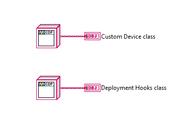
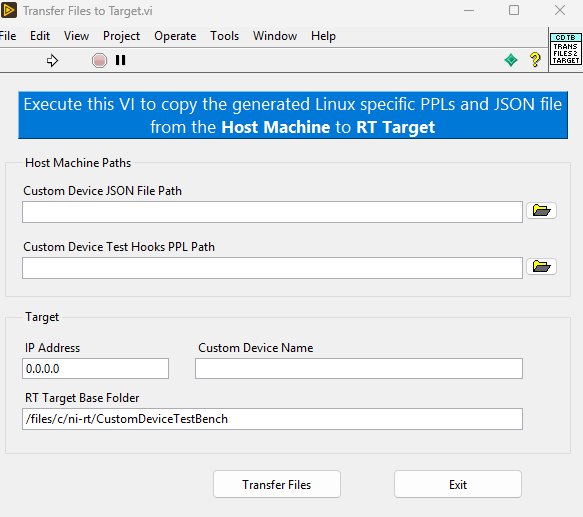
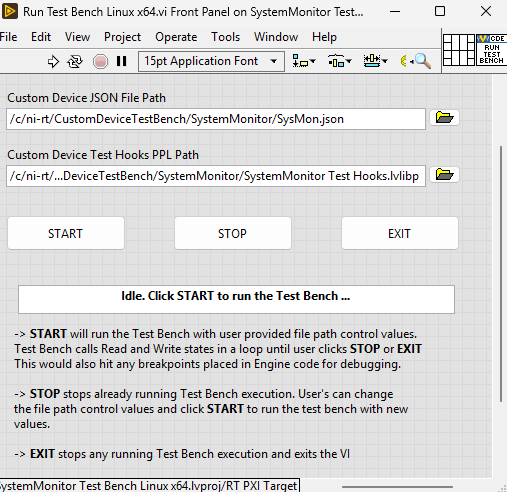

# Custom Device Test Bench

The Custom Device Test Bench includes:

- **Custom Device Test Bench.lvlib** from LVAddons, installed as part of the Custom Device development tools. It contains code common to all custom devices that sets up testing by providing a harness for calling Custom Device Engine code, similar to the VeriStand Engine
- **Run Test Bench VI** that calls into the Test Bench lvlib and passes the specific Custom Device class instances to be tested/debugged
- **Test Hooks** that help inject inputs and perform assertions

To debug the Custom Device Engine from the Test Bench, follow the steps below.

- Export the Custom Device configuration to a JSON file from VeriStand >> System Explorer. The exported JSON file contains the custom device settings and hierarchies in a format that the Test Bench understands and uses to set up Custom Device testing
- Update the Before and After state VIs in `<Custom Device> Test Hooks.lvlib` according to your test/debugging plan
- Open the Test Bench project from generated Custom Device directory
  - Windows: `<Custom Device> Test Bench.lvproj`
  - Linux RT: `<Custom Device> Test Bench Linux x64.lvproj`
- Build the Test Hooks PPL using the Build Specifications from the project. The built Test Hooks PPL is provided as an input for Test Bench to execute
- Open **Test Bench Constants.vi** in the Test Bench lvproj. For the Test Bench to allow debugging Engine code, you need to replace the Deployment Hooks and Custom Device Engine class constants here. Providing these class constants lets the Test Bench load the specified classes and call their override methods, which contain your custom code and breakpoints
  - Replace the `<Custom Device Class>` constant with `<Custom Device> Engine.lvlib >> <Custom Device> Engine.lvclass`
  - Replace the `Deployment Hooks Class` constant with `<Custom Device> Deployment Hooks.lvlib >> <Custom Device> Deployment Hooks.lvclass`. The Deployment Hooks take the JSON as input and compile the settings into the format the Custom Device Engine expects. Since the Test Bench calls both the Deployment Hooks and the Engine, the custom code developers write to transform settings in the VeriStand context remains valid when testing
  - Save the VI  
  
- Transfer the required files to the target (**Linux RT only**)
  - Open **Transfer Files to Target.vi**
  - Fill in all required inputs on the front panel
  - Click the **Transfer Files** button
    - The files are copied from the host machine to the RT target
  - Once the transfer completes, the VI closes automatically  
  
  - Connect to the RT Target in the LabVIEW project (by entering the target's IP address)
- Open the Run Test Bench VI
  - Windows: **Run Test Bench.vi**, and provide the file paths for the JSON file and Test Hooks PPL
  - Linux RT: **Run Test Bench Linux x64.vi**, and provide the RT target file paths (copied during the file transfer step) for the JSON file and Test Hooks PPL
  - Click **START**
    - The Test Bench begins execution, looping through Read and Write States until the user clicks **STOP** or **EXIT**
    - During execution, any breakpoints previously set in the Custom Device Engine code will be hit. From there, developers can debug their code using standard LabVIEW debugging tools such as Probe and Highlight Execution 
  - Breakpoints are hit only when placed in a **non-reentrant** VI with debugging enabled. LabVIEW imposes limitations on breakpoints for other execution settings
  - You can read and write channel values the same way you would with VeriStand, using the Custom Device API class implementation provided by the Test Bench library. The library's APIs internally get and set channel values from the Test Bench's own channel storage, ensuring that Channel Data References work as expected  

  
