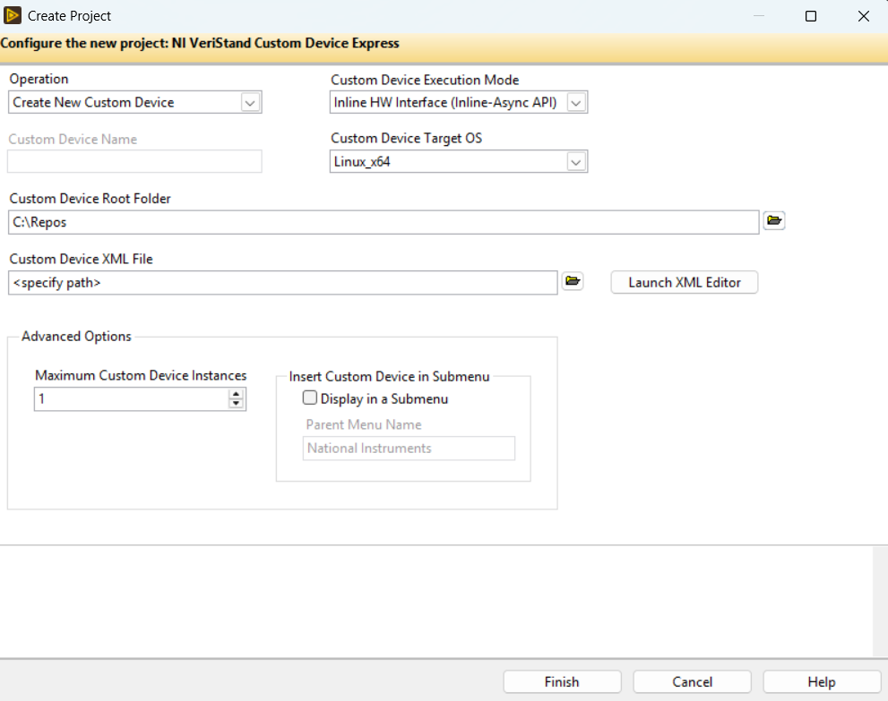

## Using the Custom Device Express Wizard

The **NI VeriStand Custom Device Wizard** is an open-source LabVIEW project template tool that provides a complete Custom Device project from a device definition you provide. It is hosted on GitHub and is the recommended starting point for all new Express Custom Device projects.

**Repository:** [https://github.com/ni/niveristand-custom-device-wizard](https://github.com/ni/niveristand-custom-device-wizard)

---

### Prerequisites

Before using the Express wizard, install the following:

| Dependency | Minimum Version |
|---|---|
| [NI VeriStand](https://www.ni.com/en-us/support/downloads/software-products/download.veristand.html) | 2026 Q3 onwards |
| [LabVIEW](https://www.ni.com/en-us/support/downloads/software-products/download.labview.html) | 2026 Q3 onwards |
| [LabVIEW Real-Time Module](https://www.ni.com/en-us/support/downloads/software-products/download.labview-real-time-module.html) | 2026 onwards |
| [VeriStand Custom Device Development Tools](https://github.com/ni/niveristand-custom-device-development-tools/releases/latest) | 2026 Q3 onwards |
| [JSONtext](https://www.vipm.io/package/jdp_science_jsontext) | Latest |
| [.NET SDK](https://dotnet.microsoft.com/en-us/download/dotnet/8.0) | 8.0 or later |

#### Custom Device Express development tools

Custom Device development using Express framework relies on three framework specific components installed as part of Custom Device Development Tools.

LabVIEW add-on installed at `C:\Program Files\NI\LVAddons\nivscustomdeviceexpress\` contains these Express framework specific components. Because it is installed under `LVAddons`, its shared libraries and support VIs are available to LabVIEW automatically without being copied into each project. It provides the per-target components the Express framework builds on.

**`Custom Device Interfaces_v1.lvlibp`** — a library of abstract LabVIEW interfaces that define the contract every Express Custom Device must fulfill. It is built as a Packed Project Library (PPL) and installed for both the Windows x64 and NI Linux Real-Time (PXI) targets.
  
The library exposes three interface classes plus an internal utility class:
- **Custom Device** — defines the engine lifecycle contract. It declares the `Initialize`, `Start`, `Read Data from HW`, `Write Data to HW`, and `Close` methods that you override in your generated `<CustomDeviceName> Engine.lvclass`.
- **Custom Device API** — defines the VeriStand API wrappers you call from your custom code, including `Get Channel Value by Data Reference`, `Set Channel Value by Data Reference`, the block-data-reference variants, and `Print Debug Line`.
- **Custom Device Deployment Hooks** — defines the host-side contract for compiling settings and channel-group data before they reach the engine.
- **Custom Device Utility** — internal helper class used by the framework; you do not implement against it directly.

**`NIVS Inline Async API (Express)`** — the framework that lets an inline Custom Device run one or more asynchronous processes alongside the Primary Control Loop (PCL). It handles initializing, launching, and cleaning up the asynchronous VIs, error handling and reporting, and data transfer between the inline and asynchronous VIs. This is the same framework used by the standard [NIVS Inline Async API](https://github.com/ni/niveristand-custom-device-development-tools/tree/main/inline-async-api), and its APIs and how you use them are unchanged.

The only difference in the Express variant is that the VeriStand-specific APIs are decoupled from it. Instead of calling VeriStand channel APIs directly, it calls the **Custom Device API** interface from Custom Device Interfaces. Because the API is an interface, the engine code has no direct dependency on VeriStand, so the same Custom Device can be run and debugged standalone with the Custom Device Test Bench.

**`Custom Device Test Bench`** — a standalone harness that lets you run, test, and debug the Custom Device engine and your custom code without deploying a full VeriStand system definition. Because it is decoupled from VeriStand, you can execute your override VIs, inject channel values, set breakpoints, and probe your code on the development PC. For more details, refer to [Test Bench](Test_Bench.md).

---

### Getting the Wizard

1. Go to the [Releases page](https://github.com/ni/niveristand-custom-device-wizard/releases/latest) of the wizard repository.
2. Download the latest **`.nipkg`** file for the Express wizard (the package labelled `Custom Device Express`).
3. Double-click the `.nipkg` to open it in **NI Package Manager**, then click **Install**.
   - The package installs the project template into the LabVIEW 2026 64-bit `ProjectTemplates` directory automatically.

After installation, the project template becomes available inside LabVIEW's **Create Project** dialog under the **NI VeriStand** filter.

---

### Available Express Templates

The wizard provides the following Express project templates:

| Template | Description |
|---|---|
| **Inline HW Interface** | Runs inline with the VeriStand Primary Control Loop (PCL). Use when the Custom Device must exchange data synchronously on every PCL tick. |
| **Inline HW Interface (Inline-Async)** | An inline HW interface template that also includes an asynchronous loop for tasks that must run independently of the PCL rate. |

---

### Creating a New Express Custom Device

The wizard generates a fully structured LabVIEW project along with Scripting APIs DLL.

1. In LabVIEW, select **File → Create Project**.
2. In the **Create Project** dialog, choose **NI VeriStand Custom Device Express** and click **Next**.
3. Select **Execution Mode** and **Target Operating System**
4. In the **XML Editor**, define your Custom Device hierarchy and type definitions
   - Add **Properties**, **Channels**, **Waveforms**, and **Sections** as needed
   - XML Editor creates XML file based on [XML Schema](XML_Definition_Schema.md). While adding type definitions, follow [Configuration Rules](Configuration_Rules.md)
5. Save the XML definition file (`.xml`) to a location inside your project folder.
6. Click **Finish** to generate the project.

> **Tip:** Click the **Launch XML Editor** button to create a new XML file or edit an existing one. Always use this tool and avoid editing the XML manually.

> **Tip:** Keep the XML definition file under source control alongside your project. You can re-open it in the XML Editor at any time to add or modify device nodes, then regenerate the code.

To add new sections, channels, waveforms, or property types to a Custom Device you have already generated, use the wizard's **Edit** workflow. Select the **Edit an Existing Custom Device** operation, then point the wizard at the existing Custom Device folder and the updated XML definition file. The wizard backs up your existing code to a `.edit.backup` folder and then regenerates the Custom Device code from the updated configuration.

---

### Contributing and Reporting Issues

The wizard is open-source under an MIT-style license. Contributions and bug reports are welcome:

- **Issues:** [https://github.com/ni/niveristand-custom-device-wizard/issues](https://github.com/ni/niveristand-custom-device-wizard/issues)
- **Pull requests:** Fork the repository, create a branch, and open a pull request against `main`
