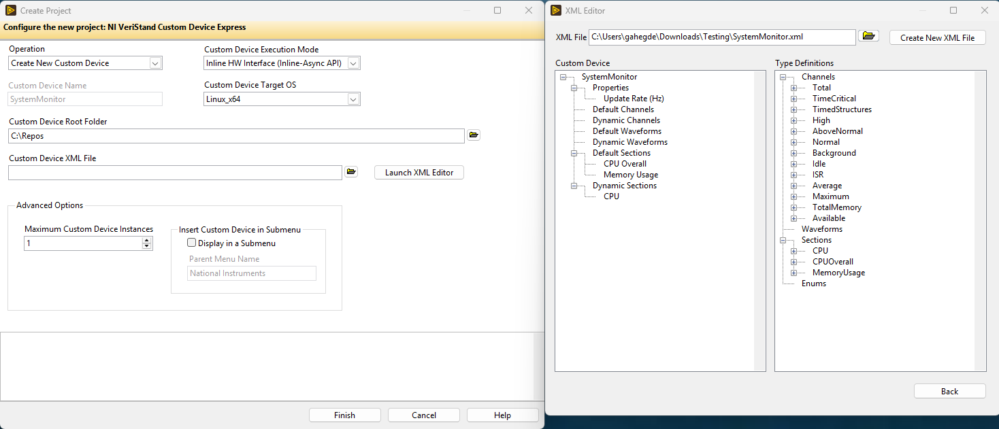
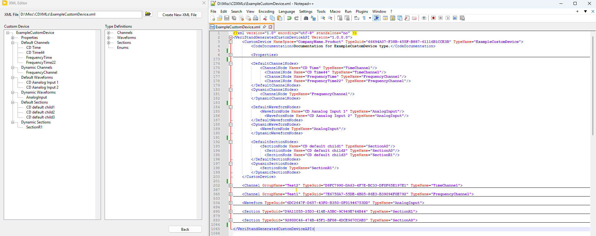

## Custom Device XML Definition

The Express framework builds a complete Custom Device from a single **Custom Device Definition XML** file. This file describes the Custom Device, its properties, and its child nodes (channels, waveforms, and sections). The Express wizard has an XML Editor tool that can help you generate this XML



This page documents every tag and type the definition XML supports, so you know exactly what you can describe in a Custom Device. The structure and rules on this page are enforced by the schema that ships with VeriStand (`GeneratedCustomDeviceAPI.xsd`). The [api-gen.exe](Auto_Generated_Scripting_API.md#generating-the-api-manually-with-api-genexe) tool validates your XML against this schema before it generates any code.

> **Note:** This is the *definition* XML used by the Express framework to generate a Custom Device. It is different from the Classic [Custom Device XML](https://www.ni.com/docs/en-US/bundle/veristand/page/custom-device-xml.html) that VeriStand reads at run time to load a finished Custom Device.

---

### Document structure

A definition XML has a single root element, `<VeriStandGeneratedCustomDeviceAPI>`, that contains exactly one `<CustomDevice>` followed by the type definitions it references.

```xml
<?xml version="1.0" encoding="utf-8"?>
<VeriStandGeneratedCustomDeviceAPI Version="1.0.0.0">
    <CustomDevice TypeName="..." TypeGuid="..." NameSpace="...">
        <!-- properties and child node references -->
    </CustomDevice>

    <!-- Reusable child-node type definitions -->
    <Channel  TypeName="..." TypeGuid="..."> ... </Channel>
    <Waveform TypeName="..." TypeGuid="..."> ... </Waveform>
    <Section  TypeName="..." TypeGuid="..."> ... </Section>

    <!-- Optional shared enum definitions -->
    <EnumDefinitions> ... </EnumDefinitions>
</VeriStandGeneratedCustomDeviceAPI>
```

The child elements must appear in this order: `CustomDevice`, then any `Channel`, `Waveform`, and `Section` definitions, then an optional `EnumDefinitions`. If elements appear out of order or an unsupported element is used, generation fails with an error that identifies the problem line.

| Element | Required? | Occurrences | Description |
|---|---|---|---|
| `VeriStandGeneratedCustomDeviceAPI` | Yes | 1 | Root element. Requires a `Version` attribute. |
| `CustomDevice` | Yes | 1 | The top-level Custom Device definition. |
| `Channel` | No | 0 or more | A reusable channel type definition. |
| `Waveform` | No | 0 or more | A reusable waveform type definition. |
| `Section` | No | 0 or more | A reusable section (sub-node) type definition. |
| `EnumDefinitions` | No | 0 or 1 | Shared enum type definitions referenced by `Enum` properties. |

---

### Naming rules for type names

`TypeName` attributes (on `CustomDevice`, `Channel`, `Waveform`, `Section`, and enum types) become class and type names in the generated API. They must **not contain spaces or dots**. Names such as `Analog Input` or `My.Device` are rejected; use `AnalogInput` or `MyDevice` instead.

Property names (the `PropertyName` attribute) are *not* restricted in this way — they may contain spaces, dots, brackets, and other characters. The display name you give a property is preserved exactly for the UI, while the generated API member name is a cleaned-up version. See [Property name mapping](Auto_Generated_Scripting_API.md#how-property-names-map-to-api-members).

---

### `<CustomDevice>`

The top-level Custom Device. Exactly one is required.

| Attribute | Required? | Description |
|---|---|---|
| `TypeName` | Yes | The Custom Device type name. Becomes the generated class name. No spaces or dots. |
| `TypeGuid` | Yes | A unique GUID that identifies this Custom Device type. |
| `NameSpace` | Yes | The .NET namespace for the generated code (for example, `CompanyName.Product`). |

The `<CustomDevice>` element contains the following children, in order:

| Element | Description |
|---|---|
| `CodeDocumentation` | *(Optional)* Summary text used as documentation in the generated API. |
| `Properties` | The Custom Device's configuration properties. See [Properties](#properties). |
| `DefaultChannelNodes` | Channels created automatically on every new Custom Device instance. |
| `DynamicChannelNodes` | Channel types a user can add at run time. |
| `DefaultWaveformNodes` | Waveforms created automatically on every new Custom Device instance. |
| `DynamicWaveformNodes` | Waveform types a user can add at run time. |
| `DefaultSectionNodes` | Sections created automatically on every new Custom Device instance. |
| `DynamicSectionNodes` | Section types a user can add at run time. |

---

### `<Section>`, `<Channel>`, and `<Waveform>` type definitions

These elements define reusable child-node *types*. A Custom Device (or a section) references them by `TypeName` in its `DefaultXNodes`/`DynamicXNodes` lists. The same type can be referenced from multiple places.

#### `<Section>`

A section is a sub-node that can hold its own properties and its own children (channels, waveforms, and even nested sections). Sections let you build hierarchies.

| Attribute | Required? | Description |
|---|---|---|
| `TypeName` | Yes | The section type name. No spaces or dots. |
| `TypeGuid` | Yes | Unique GUID for this section type. |

A `<Section>` contains the same children as `<CustomDevice>` (optional `CodeDocumentation`, `Properties`, and the six `Default`/`Dynamic` node lists), allowing arbitrarily nested hierarchies.

#### `<Channel>`

A channel exchanges single-point `double` data with the rest of the VeriStand system.

| Attribute | Required? | Description |
|---|---|---|
| `TypeName` | Yes | The channel type name. No spaces or dots. |
| `TypeGuid` | Yes | Unique GUID for this channel type. |
| `GroupName` | No | Groups channels of this type in System Explorer. Supports `{PropertyName}` tokens. See [Group names](#group-names). |

A `<Channel>` contains, in order:

| Element | Description |
|---|---|
| `CodeDocumentation` | *(Optional)* Documentation text. |
| `Properties` | Channel properties. See [Properties](#properties). |
| `DefaultValue` | The default channel value. Contains a single `<Elem>` of type `double`. |
| `Units` | A string describing the channel units (for example, `Hz`). |
| `Type` | `Input` or `Output`. |
| `Scalable` | `true` or `false`. Whether the channel supports scaling. |
| `Faultable` | `true` or `false`. Whether the channel supports faulting. |

#### `<Waveform>`

A waveform exchanges array/waveform data.

| Attribute | Required? | Description |
|---|---|---|
| `TypeName` | Yes | The waveform type name. No spaces or dots. |
| `TypeGuid` | Yes | Unique GUID for this waveform type. |

A `<Waveform>` contains, in order:

| Element | Description |
|---|---|
| `CodeDocumentation` | *(Optional)* Documentation text. |
| `Properties` | Waveform properties. See [Properties](#properties). |
| `DataType` | `Double` or `ComplexDouble`. |
| `Units` | A string describing the waveform units. |

---

### Child-node reference lists

Inside a `<CustomDevice>` or `<Section>`, six lists declare which child nodes the node has. **Default** lists create named instances automatically. **Dynamic** lists declare which types a user can add later.

```xml
<DefaultChannelNodes>
    <ChannelNode Name="CD Time" TypeName="TimeChannel" />
</DefaultChannelNodes>
<DynamicChannelNodes>
    <ChannelNode TypeName="FrequencyChannel" />
</DynamicChannelNodes>
```

| List | Item element | Item attributes |
|---|---|---|
| `DefaultChannelNodes` | `ChannelNode` | `Name` (required), `TypeName` (required) |
| `DynamicChannelNodes` | `ChannelNode` | `TypeName` (required) |
| `DefaultWaveformNodes` | `WaveformNode` | `Name` (required), `TypeName` (required) |
| `DynamicWaveformNodes` | `WaveformNode` | `TypeName` (required) |
| `DefaultSectionNodes` | `SectionNode` | `Name` (required), `TypeName` (required) |
| `DynamicSectionNodes` | `SectionNode` | `TypeName` (required) |

A `TypeName` referenced in any of these lists must match the `TypeName` of a `<Channel>`, `<Waveform>`, or `<Section>` definition in the same document. Empty lists are allowed and can be written as `<DefaultChannelNodes />`.

---

### Properties

A `<Properties>` collection holds any number of `<Property>` elements. Each property has a name, optional documentation, and a typed default value.

```xml
<Property PropertyName="High frequency [Hz]">
    <CodeDocumentation>Documentation for High frequency.</CodeDocumentation>
    <DefaultValue>
        <Double>1000</Double>
    </DefaultValue>
</Property>
```

| Element/Attribute | Required? | Description |
|---|---|---|
| `PropertyName` (attribute) | Yes | The display name. May contain spaces and special characters. |
| `CodeDocumentation` | No | Documentation text used in the generated API. |
| `DefaultValue` | Yes | A single typed value element that also sets the property's data type. |

#### Property types

The element you place inside `<DefaultValue>` determines the property's data type. Each supported type is listed below.

| `DefaultValue` element | Data type | Example |
|---|---|---|
| `String` | Text | `<String>AAA</String>` |
| `BinaryString` | Binary (base64-encoded) | `<BinaryString>SGVsbG8=</BinaryString>` |
| `Boolean` | Boolean | `<Boolean>false</Boolean>` |
| `I16` | 16-bit signed integer | `<I16>1</I16>` |
| `I32` | 32-bit signed integer | `<I32>1</I32>` |
| `I64` | 64-bit signed integer | `<I64>1</I64>` |
| `U16` | 16-bit unsigned integer | `<U16>1</U16>` |
| `U32` | 32-bit unsigned integer | `<U32>1</U32>` |
| `U64` | 64-bit unsigned integer | `<U64>1</U64>` |
| `Double` | Double-precision float | `<Double>1.5</Double>` |
| `StringArray` | Array of text | see below |
| `BooleanArray` | Array of Boolean | see below |
| `DoubleArray` | Array of double | see below |
| `I16Array` / `I32Array` / `I64Array` | Arrays of signed integers | see below |
| `U16Array` / `U32Array` / `U64Array` | Arrays of unsigned integers | see below |
| `Enum` | A named enumeration | see [Enum properties](#enum-properties) |
| `DependentFile` | A reference to a file dependency | see [DependentFile](#dependentfile-properties) |
| `DependentNode` | A reference to another node in the system definition | see [DependentNode](#dependentnode-properties) |
| `Variant` | An arbitrary binary value (LabVIEW variant) | see [Variant](#variant-properties) |

#### Array properties

Array values list each element with an `<Elem>` tag.

```xml
<DefaultValue>
    <StringArray>
        <Elem>Windows</Elem>
        <Elem>Linux</Elem>
    </StringArray>
</DefaultValue>
```

The numeric array types (`DoubleArray`, `I16Array`, `I32Array`, `I64Array`, `U16Array`, `U32Array`, `U64Array`) and `BooleanArray` follow the same `<Elem>` pattern.

#### Enum properties

An enum property references a named enumeration and sets its default member.

```xml
<Property PropertyName="Operation Mode">
    <DefaultValue>
        <Enum TypeName="OperationMode">Running</Enum>
    </DefaultValue>
</Property>
```

The `TypeName` must match an `<EnumDefinition>` declared in the document's `<EnumDefinitions>` block. Enum type names follow the no-spaces/no-dots rule.

```xml
<EnumDefinitions>
    <EnumDefinition TypeName="OperationMode">
        <CodeDocumentation>Defines the operation mode of the Custom Device.</CodeDocumentation>
        <EnumMember Name="Idle" Value="0">
            <CodeDocumentation>Custom Device is idle.</CodeDocumentation>
        </EnumMember>
        <EnumMember Name="Running" Value="1" />
        <EnumMember Name="Stopped" Value="2" />
        <EnumMember Name="Error" Value="3" />
    </EnumDefinition>
</EnumDefinitions>
```

| Element/Attribute | Required? | Description |
|---|---|---|
| `EnumDefinition` / `TypeName` | Yes | The enum type name. No spaces or dots. |
| `EnumMember` / `Name` | Yes | The member name. If the name contains spaces, the generated API keeps a clean identifier and preserves the original display name. |
| `EnumMember` / `Value` | Yes | The integer value of the member. |
| `CodeDocumentation` | No | Documentation text for the enum or a member. |

#### DependentFile properties

A dependent file property references a file the Custom Device depends on.

```xml
<DefaultValue>
    <DependentFile Type="Absolute" Path="D:\Configs\SomeFile.json">
        <Version></Version>
        <ForceDownload>false</ForceDownload>
        <RTDestination>C:\ni-rt\NIVeriStand\SomeFile.json</RTDestination>
        <SupportedTarget>All</SupportedTarget>
    </DependentFile>
</DefaultValue>
```

| Attribute/Element | Description |
|---|---|
| `Type` (attribute) | One of `Absolute`, `Relative`, `To Common Doc Dir`, or `To Application Data Dir`. |
| `Path` (attribute) | The path to the file, interpreted relative to `Type`. |
| `Version` | Version string for the dependency. |
| `ForceDownload` | `true` or `false`. Whether to always re-deploy the file. |
| `RTDestination` | The deployment path on a real-time target. |
| `SupportedTarget` | The targets the file applies to (for example, `All`). |

#### DependentNode properties

A dependent node property references another node in the system definition by its path.

```xml
<DefaultValue>
    <DependentNode Path="Targets/Controller/Custom Devices/ExampleCustomDevice/CD Time" />
</DefaultValue>
```

A dependent node may also declare expected sub-properties:

```xml
<DependentNode Path="Targets/Controller/Custom Devices/TestDevice/CD Time">
    <Property PropertyName="VariantPropertyExample" PropertyType="Variant" />
</DependentNode>
```

#### Variant properties

A variant property stores an arbitrary binary value as two base64-encoded parts (a type descriptor and the data).

```xml
<DefaultValue>
    <Variant>
        <Type>SGVsbG8=</Type>
        <Data>Ag==</Data>
    </Variant>
</DefaultValue>
```

---

### Group names

The `GroupName` attribute on a `<Channel>` groups channels of that type in System Explorer. A group name can be a literal string, or it can include `{PropertyName}` tokens that are substituted with the value of a property at run time.

```xml
<Channel TypeName="AnalogChannel" TypeGuid="..." GroupName="Ch_{ChannelID}_Inputs">
    ...
</Channel>
```

Group name expressions are validated during generation. The braces must be balanced, and the property name inside the braces cannot be empty. The following mistakes cause a generation error:

* An unmatched opening brace, for example `Ch_{ChannelID`.
* An empty property reference, for example `Ch_{}`.
* Mismatched brace counts, for example `Ch_{{ChannelID}`.

---

### Validation and errors

Before generating any code, the tool validates your XML against the schema and the group-name rules. Common errors include:

* A required attribute is missing (for example, `TypeGuid`).
* A `TypeName` contains a space or a dot.
* Child elements appear in the wrong order, or an unsupported element is used (the message includes a note to check the element sequence).
* An unsupported type is used inside `<DefaultValue>`.
* An invalid group-name expression.

When you use the Express wizard's editor, the generated XML is always schema-valid.


